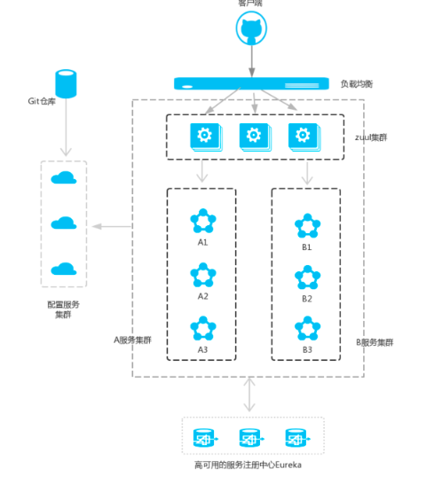
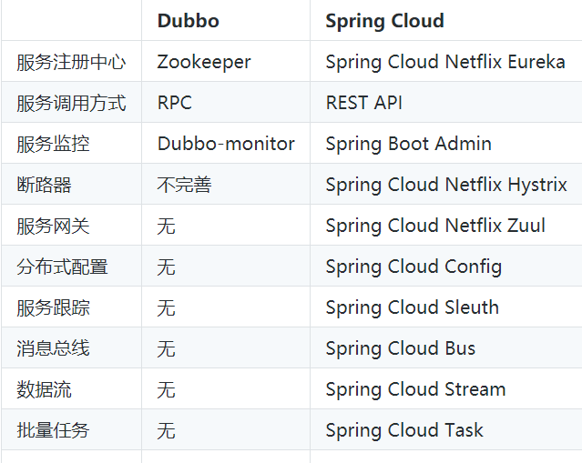
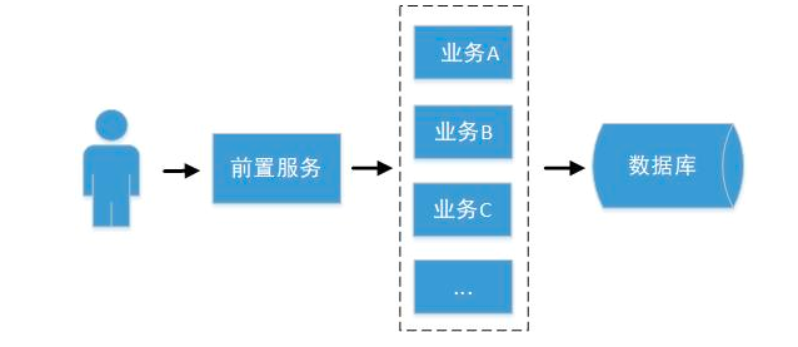
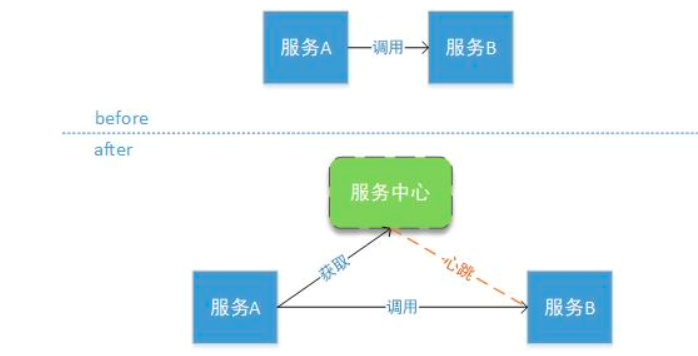
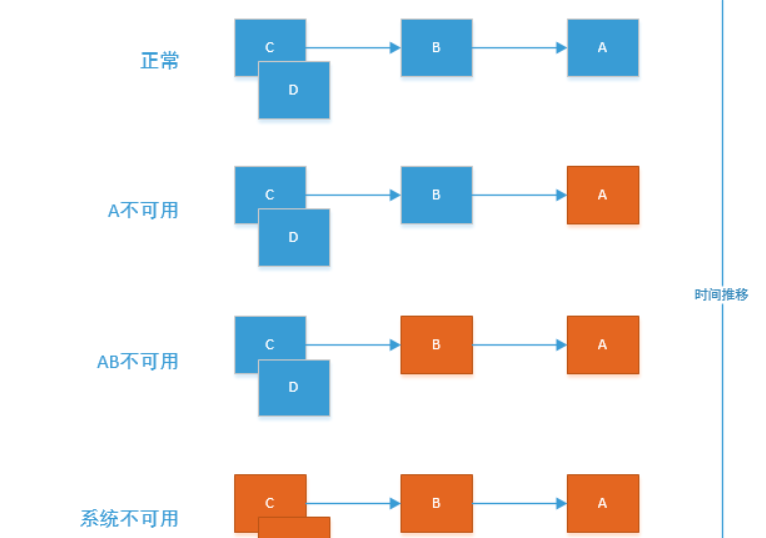
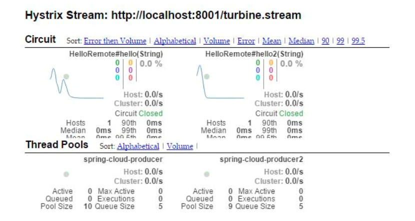
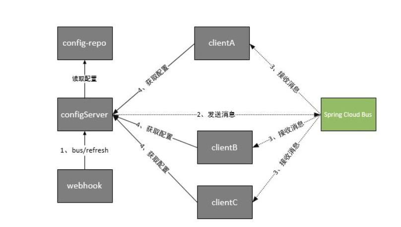

# micro-service
在微服务架构中，需要几个基础的服务治理组件，包括服务注册与发现、服务消费、负载均衡、断路器、智能路由、配置管理等，由这几个基础组件相互协作，共同组建了一个简单的微服务系统。一个简答的微服务系统如下图：  

 

在Spring Cloud微服务系统中，一种常见的负载均衡方式是客户端的请求首先经过负载均衡（zuul、Ngnix），再到达服务网关（zuul集群），然后再到具体的服务，
服务统一注册到高可用的服务注册中心集群，服务的所有的配置文件由配置服务管理，配置服务的配置文件放在git仓库，方便开发人员随时改配置。  

Use of Simple Micro Services  
结合网上开源的分布式事务框架LCN去实现分布式事务，相关实现代码请您查看fukun-distribute-transaction这个模块。  
此项目使用spring-boot的2.0.5.RELEASE版本，单表crud通用mapper，实现了全局异常处理，登录验证、统一响应返回码、  
动态为数据库中的某张表添加扩展字段等功能，详情请查看相关模块的源代码。

# Dubbo和Spring Cloud有何不同
国内技术人喜欢拿 Dubbo 和 Spring Cloud 进行对比，是因为两者都是服务治理非常优秀的开源框架。   
但它们两者的出发点是不一样的，Dubbo 关注于服务治理这块并且以后也会继续往这个方向去发展。
Spring Cloud 关注的是微服务治理的生态。 因为微服务治理的方方面面都是它所关注的内容，
服务治理也只是微服务生态的一部分而已。因此可以大胆的断定，
Dubbo 未来会在服务治理方面更为出色，而 Spring Cloud 在微服务治理上面无人能敌。  
## 如何选择两个服务框架
可能很多人正在犹豫，在服务治理的时候应该选择那个框架呢？如果公司对效率有极高的要求建议使用 Dubbo，
相对比 RPC 的效率会比 HTTP 高很多；如果团队不想对技术架构做大的改造建议使用 Dubbo，
Dubbo 仅仅需要少量的修改就可以融入到内部系统的架构中。但如果技术团队喜欢挑战新技术，
建议选择 Spring Cloud，Spring Cloud 架构体系有有趣很酷的技术。如果公司选择微服务架构去重构整个技术体系，
那么 Spring Cloud 是当仁不让之选，它可以说是目前最好的微服务框架没有之一。   
 
   

从上图可以看出其实Dubbo的功能只是Spring Cloud体系的一部分。  
这样对比是不够公平的，首先 Dubbo 是 SOA 时代的产物，它的关注点主要在于服务的调用，流量分发、流量监控和熔断。
而 Spring Cloud 诞生于微服务架构时代，考虑的是微服务治理的方方面面，另外由于依托了 Spring、Spring Boot 的优势之上，
两个框架在开始目标就不一致，Dubbo 定位服务治理、Spring Cloud 是一个生态。    
如果仅仅关注于服务治理的这个层面，Dubbo其实还优于Spring Cloud很多：  
Dubbo 支持更多的协议，如：rmi、hessian、http、webservice、thrift、memcached、redis 等。  
Dubbo 使用 RPC 协议效率更高，在极端压力测试下，Dubbo 的效率会高于 Spring Cloud 效率一倍多。  
Dubbo 有更强大的后台管理，Dubbo 提供的后台管理 Dubbo Admin 功能强大，提供了路由规则、动态配置、
访问控制、权重调节、均衡负载等诸多强大的功能。  
可以限制某个 IP 流量的访问权限，设置不同服务器分发不同的流量权重，并且支持多种算法，
利用这些功能我们可以在线上做灰度发布、故障转移等，Spring Cloud 到现在还不支持灰度发布、流量权重等功能。  
所以Dubbo专注于服务治理；Spring Cloud关注于微服务架构生态。  

# 传统架构发展史

## 单体架构
单体架构在小微企业比较常见，典型代表就是一个应用、一个数据库、一个web容器就可以跑起来。  
在两种情况下可能会选择单体架构：一是在企业发展的初期，为了保证快速上线，采用此种方案较为简单灵活；二是传统企业中垂直度较高，
访问压力较小的业务。在这种模式下对技术要求较低，方便各层次开发人员接手，也能满足客户需求。  
下面是单体架构的架构图：  

在单体架构中，技术选型非常灵活，优先满足快速上线的要求，也便于快速跟进市场。
  
   

## 垂直架构
在单体架构发展一段时间后，公司的业务模式得到了认可，交易量也慢慢的大起来，这时候有些企业为了应对更大的流量，
就会对原有的业务进行拆分，比如说：后台系统、前端系统、交易系统等。  
在这一阶段往往会将系统分为不同的层级，每个层级有对应的职责，
UI层负责和用户进行交互、业务逻辑层负责具体的业务功能、数据库层负责和上层进行数据交换和存储。   
下面是垂直架构的架构图：  
 
  

在这个阶段SSH（struts+spring+hibernate）是项目的关键技术，Struts负责web层逻辑控制、
Spring负责业务层管理Bean、Hibernate负责数据库操作进行封装，持久化数据。  

## 服务化架构
如果公司进一步的做大，垂直子系统会变的越来越多，系统和系统之间的调用关系呈指数上升的趋势。
在这样的背景下，很多公司都会考虑服务的SOA化。SOA代表面向服务的架构，将应用程序根据不同的职责划分为不同的模块，
不同的模块直接通过特定的协议和接口进行交互。这样使整个系统切分成很多单个组件服务来完成请求，
当流量过大时通过水平扩展相应的组件来支撑，所有的组件通过交互来满足整体的业务需求。  

SOA服务化的优点是，它可以根据需求通过网络对松散耦合的粗粒度应用组件进行分布式部署、组合和使用。
服务层是SOA的基础，可以直接被应用调用，从而有效控制系统中与软件代理交互的人为依赖性。 
服务化架构是一套松耦合的架构，`服务的拆分原则是服务内部高内聚，服务之间低耦合`。  
下面是服务化架构图：  

     

在这个阶段可以使用WebService或者dubbo来服务治理。  
我们发现从单体架构到服务化架构，应用数量都在不断的增加，慢慢的下沉的就成了基础组件，
上浮的就成为业务系统。从上述也可以看出架构的本质就是不断的拆分重构：
分的过程是把系统拆分为各个子系统/模块/组件，拆的时候，首先要解决每个组件的定位问题，
然后才能划分彼此的边界，实现合理的拆分。合就是根据最终要求，把各个分离的组件有机整合在一起。
拆分的结果使开发人员能够做到业务聚焦、技能聚焦，实现开发敏捷，合的结果是系统变得柔性，可以因需而变，实现业务敏捷。  

## SOA和微服务架构
### SOA和微服务的区别
其实服务化架构已经可以解决大部分企业的需求了，那么我们为什么要研究微服务呢？先说说它们的区别；  
1、微服务架构强调业务系统需要彻底的组件化和服务化，一个组件就是一个产品，可以独立对外提供服务。  
2、微服务不再强调传统SOA架构里面比较重的ESB企业服务总线  
3、微服务强调每个微服务都有自己独立的运行空间，包括数据库资源，JVM的运行资源等，每个服务运行在其独立的进程中，服务与服务间采用轻量级的通信机制互相沟通（通常是基于HTTP的RESTful API）。      
4、微服务架构本身来源于互联网的思路，因此组件对外发布的服务强调了采用HTTP Rest API的方式来进行。   
5、微服务的切分粒度会更小   

总结:`微服务架构是 SOA 架构思想的一种扩展，更加强调服务个体的独立性、拆分粒度更小`。   

### 为什么考虑Spring Cloud
1、Spring Cloud来源于Spring，质量、稳定性、持续性都可以得到保证。  
2、Spring Cloud天然支持Spring Boot，更加便于业务落地。  
3、Spring Cloud发展非常的快，从16年开始接触的时候相关组件版本为1.x，到现在将要发布2.x系列  
4、Spring Cloud是Java领域最适合做微服务的框架。  
5、相比于其它框架,Spring Cloud对微服务周边环境的支持力度最大。  
6、对于中小企业来讲，使用门槛较低。  

Spring Cloud　是微服务架构的最佳落地方案  

#### Spring Cloud的特性
1、分布式/版本化配置    
2、服务注册和发现 （eureka）  
3、路由（zuul和2.x版本的GateWay）
4、服务和服务之间的调用  
5、负载均衡  
6、断路器  
7、分布式消息传递  

这些特性都是由不同的组件来完成，在架构的演进过程中扮演着重要的角色。  

### 微服务架构

#### 微服务拆分的原则
横向拆分。按照不同的业务域进行拆分，例如订单、营销、风控、积分资源等。形成独立的业务领域微服务集群。  

纵向拆分。把一个业务功能里的不同模块或者组件进行拆分。例如把公共组件拆分成独立的原子服务，下沉到底层，形成相对独立的原子服务层。这样一纵一横，就可以实现业务的服务化拆分。  

要做好微服务的分层：梳理和抽取核心应用、公共应用，作为独立的服务下沉到核心和公共能力层，逐渐形成稳定的服务中心，使前端应用能更快速的响应多变的市场需求。   

服务拆分是越小越好吗？微服务的大与小是相对的。比如在初期，我们把交易拆分为一个微服务，但是随着业务量的增大，可能一个交易系统已经慢慢变得很大，并且并发流量也不小，
为了支撑更多的交易量，我会把交易系统，拆分为订单服务、投标服务、转让服务等。因此微服务的拆分力度需与具体业务相结合，总的原则是服务内部高内聚，服务之间低耦合。  
Spring Cloud解决的第一个问题就是：服务与服务之间的解耦。很多公司在业务高速发展的时候，服务组件也会相应的不断增加。服务和服务之间有着复杂的相互调用关系，
经常有服务A调用服务B，服务B调用服务C和服务D …，随着服务化组件的不断增多，服务之间的调用关系成指数级别的增长。  

这样最容易导致的情况就是牵一发而动全身。经常出现由于某个服务更新而没有通知到其它服务，导致上线后惨案频发。
这时候就应该进行服务治理，将服务之间的直接依赖转化为服务对服务中心的依赖。Spring Cloud 核心组件Eureka就是解决这类问题。 
微服务是可以独立部署、水平扩展、独立访问（或者有独立的数据库）的服务单元，Spring Cloud就是这些微服务的大管家，
采用了微服务这种架构之后，项目的数量会非常多，Spring Cloud做为大管家就需要提供各种方案来维护整个生态。   

Spring Boot专注于快速、方便集成的单个微服务个体，Spring Cloud关注全局的服务治理框架。

#### 给数据库带来的挑战
每个微服务都有自己独立的数据库，那么后台管理的联合查询怎么处理？这应该是大家会普遍遇到的一个问题，有三种处理方案。  
1、严格按照微服务的划分来做，微服务相互独立，各微服务数据库也独立，后台需要展示数据时，调用各微服务的接口来获取对应的数据，
再进行数据处理后展示出来，这是标准的用法，也是最麻烦的用法。    
2、将业务高度相关的表放到一个库中，将业务关系不是很紧密的表严格按照微服务模式来拆分，这样既可以使用微服务，也避免了数据库分散导致后台系统统计功能难以实现，是一个折中的方案。  
3、数据库严格按照微服务的要求来切分，以满足业务高并发，实时或者准实时将各微服务数据库数据同步到NoSQL数据库中，在同步的过程中进行数据清洗，用来满足后台业务系统的使用，推荐使用MongoDB、HBase等。  
第一种方案适合业务较为简单的小公司；第二种方案，适合在原有系统之上，慢慢演化为微服务架构的公司；第三种适合大型高并发的互联网公司。  

#### Eureka
Eureka是Netflix开源的一款提供服务注册和发现的产品，它提供了完整的Service Registry和Service Discovery实现。也是Spring Cloud体系中最重要最核心的组件之一。  
用大白话讲，Eureka就是一个服务中心，将所有的可以提供的服务都注册到它这里来管理，其它各调用者需要的时候去注册中心获取，然后再进行调用，
避免了服务之间的直接调用，方便后续的水平扩展、故障转移等。如下图：  

   
 
 当然服务中心这么重要的组件一但挂掉将会影响全部服务，因此需要搭建Eureka集群来保持高可用性，生产中建议最少两台。  
 随着系统的流量不断增加，需要根据情况来扩展某个服务，Eureka内部已经提供均衡负载的功能，只需要增加相应的服务端实例既可。
 那么在系统的运行期间某个实例挂了怎么办？Eureka内部有一个心跳检测机制，如果某个实例在规定的时间内没有进行通讯则会自动被剔除掉，
 避免了某个实例挂掉而影响服务。  
 因此使用了Eureka就自动具有了注册中心、负载均衡、故障转移的功能  

#### Hystrix
在微服务架构中通常会有多个服务层调用，基础服务的故障可能会导致级联故障，进而造成整个系统不可用的情况，
这种现象被称为服务雪崩效应。服务雪崩效应是一种因“服务提供者”的不可用导致“服务消费者”的不可用,
并将不可用逐渐放大的过程。  
如下图所示：A作为服务提供者，B为A的服务消费者，C和D是B的服务消费者。A不可用引起了B的不可用，并将不可用像滚雪球一样放大到C和D时，雪崩效应就形成了。  
 
   
 
在这种情况下就需要整个服务机构具有故障隔离的功能，避免某一个服务挂掉影响全局。在Spring Cloud 中Hystrix组件就扮演这个角色。    
Hystrix会在某个服务连续调用N次不响应的情况下，立即通知调用端调用失败，避免调用端持续等待而影响了整体服务。
Hystrix间隔时间会再次检查此服务，如果服务恢复将继续提供服务。   

#### Hystrix Dashboard和Turbine
当熔断发生的时候需要迅速的响应来解决问题，避免故障进一步扩散，那么对熔断的监控就变得非常重要。熔断的监控现在有两款工具：Hystrix-dashboard和Turbine。  
Hystrix-dashboard是一款针对Hystrix进行实时监控的工具，通过Hystrix Dashboard我们可以直观地看到各Hystrix Command的请求响应时间, 请求成功率等数据。
但是只使用Hystrix Dashboard的话, 你只能看到单个应用内的服务信息, 这明显不够. 我们需要一个工具能让我们汇总系统内多个服务的数据并显示到Hystrix Dashboard上, 
这个工具就是Turbine. 
监控的效果图如下：  
 
  

#### 配置中心
随着微服务不断的增多，每个微服务都有自己对应的配置文件。在研发过程中有测试环境、UAT环境、生产环境，因此每个微服务又对应至少三个不同环境的配置文件。这么多的配置文件，如果需要修改某个公共服务的配置信息，如：缓存、数据库等，难免会产生混乱，
这个时候就需要引入Spring Cloud另外一个组件：Spring Cloud Config。  

##### Spring Cloud Config
Spring Cloud Config是一个解决分布式系统的配置管理方案。它包含了Client和Server两个部分，Server提供配置文件的存储、以接口的形式将配置文件的内容提供出去，Client通过接口获取数据、并依据此数据初始化自己的应用。  
其实就是Server端将所有的配置文件服务化，需要配置文件的服务实例去Config Server获取对应的数据。将所有的配置文件统一整理，避免了配置文件碎片化。  
如果服务运行期间改变配置文件，服务是不会得到最新的配置信息，需要解决这个问题就需要引入Refresh。可以在服务的运行期间重新加载配置文件，
当所有的配置文件都存储在配置中心的时候，配置中心就成为了一个非常重要的组件。如果配置中心出现问题将会导致灾难性的后果，因此在生产中建议对配置中心做集群，来支持配置中心高可用性。  

##### Spring Cloud Bus
上面的Refresh方案虽然可以解决单个微服务运行期间重载配置信息的问题，但是在真正的实践生产中，可能会有N多的服务需要更新配置，如果每次依靠手动Refresh将是一个巨大的工作量，这时候Spring Cloud提出了另外一个解决方案：Spring Cloud Bus。  
Spring Cloud Bus通过轻量消息代理连接各个分布的节点。这会用在广播状态的变化（例如配置变化）或者其它的消息指令中。Spring Cloud Bus的一个核心思想是通过分布式的启动器对Spring Boot应用进行扩展，也可以用来建立一个或多个应用之间的通信频道。目前唯一实现的方式是用AMQP消息代理作为通道。  
Spring Cloud Bus是轻量级的通讯组件，也可以用在其它类似的场景中。有了Spring Cloud Bus之后，当我们改变配置文件提交到版本库中时，会自动的触发对应实例的Refresh，具体的工作流程如下：   
 
   

#### 服务网关
在微服务架构模式下，后端服务的实例数一般是动态的，对于客户端而言很难发现动态改变的服务实例的访问地址信息。因此在基于微服务的项目中为了简化前端的调用逻辑，通常会引入API Gateway作为轻量级网关，同时API Gateway中也会实现相关的认证逻辑从而简化内部服务之间相互调用的复杂度。  
Spring Cloud体系中支持API Gateway落地的技术就是Zuul。Spring Cloud Zuul路由是微服务架构中不可或缺的一部分，提供动态路由，监控，弹性，安全等的边缘服务。Zuul是Netflix出品的一个基于JVM路由和服务端的负载均衡器。  
它的具体作用就是服务转发，接收并转发所有内外部的客户端调用。  使用Zuul可以作为资源的统一访问入口，同时也可以在网关做一些权限校验等类似的功能。  

#### 链路跟踪
随着服务的越来越多，对调用链的分析会越来越复杂，如服务之间的调用关系、某个请求对应的调用链、调用之间消费的时间等，对这些信息进行监控就成为一个问题。在实际的使用中我们需要监控服务和服务之间通讯的各项指标，这些数据将是我们改进系统架构的主要依据。因此分布式的链路跟踪就变的非常重要，Spring Cloud也给出了具体的解决方案：Spring Cloud Sleuth和Zipkin  
Spring Cloud Sleuth为服务之间调用提供链路追踪。通过Sleuth可以很清楚的了解到一个服务请求经过了哪些服务，每个服务处理花费了多长时间。从而让我们可以很方便的理清各微服务间的调用关系。  
Zipkin是Twitter的一个开源项目，允许开发者收集 Twitter 各个服务上的监控数据，并提供查询接口。    
分布式链路跟踪需要Sleuth+Zipkin结合来实现。

#### 总结
1、请求统一通过API网关（Zuul）来访问内部服务，网关接收到请求后，从注册中心（Eureka）获取可用服务，由Ribbon进行均衡负载后，分发到后端具体实例，其中Eureka负责服务的注册与发现，很好将各服务连接起来。   
2、Hystrix 负责监控服务之间的调用情况，连续多次失败进行熔断保护。  
3、Hystrix dashboard,Turbine 负责监控 Hystrix的熔断情况，并给予图形化的展示。  
4、Spring Cloud Config 提供了统一的配置中心服务，将所有的配置文件进行服务化。
5、当配置文件发生变化的时候，Spring Cloud Bus 负责通知各服务去获取最新的配置信息。  
6、所有对外的请求和服务，我们都通过Zuul来进行转发，起到API网关的作用。  
7、最后我们使用Sleuth+Zipkin将所有的请求数据记录下来，方便我们进行后续分析。  
8、微服务之间通过Feign进行通信处理业务
Spring Cloud从设计之初就考虑了绝大多数互联网公司架构演化所需的功能，如服务发现注册、配置中心、消息总线、负载均衡、断路器、数据监控等。
这些功能都是以插拔的形式提供出来，方便我们系统架构演进的过程中，可以合理的选择需要的组件进行集成，从而在架构演进的过程中会更加平滑、顺利。  

# 从分布式一致性谈到CAP理论、BASE理论

## 问题的提出
在计算机科学领域，分布式一致性是一个相当重要且被广泛探索与论证问题，首先来看三种业务场景。  

1、火车站售票
假如说我们的终端用户是一位经常坐火车的旅行家，通常他是去车站的售票处购买车 票，然后拿着车票去检票口，再坐上火车，开始一段美好的旅行----一切似乎都是那么和谐。想象一下，如果他选择的目的地是杭州，而某一趟开往杭州的火车 只剩下最后一张车票，可能在同一时刻，不同售票窗口的另一位乘客也购买了同一张车票。假如说售票系统没有进行一致性的保障，两人都购票成功了。而在检票口 检票的时候，其中一位乘客会被告知他的车票无效----当然，现代的中国铁路售票系统已经很少出现这样的问题了。但在这个例子中我们可以看出，终端用户对 于系统的需求非常简单：  

"请售票给我，如果没有余票了，请在售票的时候就告诉我票是无效的"  

这就对购票系统提出了严格的一致性要求----系统的数据（本例中指的就是那趟开往杭州的火车的余票数）无论在哪个售票窗口，每时每刻都必须是准确无误的！  

2、银行转账  
假如我们的终端用户是一位刚毕业的大学生，通常在拿到第一个月工资的时候，都会选 择向家里汇款。当他来到银行柜台，完成转账操作后，银行的柜台服务员会友善地提醒他："您的转账将在N个工作日后到账！"。此时这名毕业生有一定的沮丧， 会对那名柜台服务员叮嘱："好吧，多久没关系，钱不要少就好了！"----这也成为了几乎所有用户对于现代银行系统最基本的需求。  

3、网上购物  
假如说我们的终端用户是一位网购达人，当他看见一件库存量为5的心仪商品，会迅速地确认购买，写下收货地址，然后下单----然而，在下单的那个瞬间，系统可能会告知该用户："库存量不足！"。此时绝大部分消费者都会抱怨自己动作太慢，使得心爱的商品被其他人抢走了。  

但其实有过网购系统开发经验的工程师一定明白，在商品详情页上显示的那个库存量，通常不是该商品的真实库存量，只有在真正下单购买的时候，系统才会检查该商品的真实库存量。但是，谁在意呢？  

## 问题的解读
对于上面三个例子，相信大家一定看出来了，我们的终端用户在使用不同的计算机产品时对于数据一致性的需求是不一样的：  

1、有些系统，既要快速地响应用户，同时还要保证系统的数据对于任意客户端都是真实可靠的，就像火车站售票系统  

2、有些系统，需要为用户保证绝对可靠的数据安全，虽然在数据一致性上存在延时，但最终务必保证严格的一致性，就像银行的转账系统  

3、有些系统，虽然向用户展示了一些可以说是"错误"的数据，但是在整个系统使用过程中，一定会在某一个流程上对系统数据进行准确无误的检查，从而避免用户发生不必要的损失，就像网购系统  

## 分布一致性的提出
在分布式系统中要解决的一个重要问题就是数据的复制。在我们的日常开发经验中，相 信很多开发人员都遇到过这样的问题：假设客户端C1将系统中的一个值K由V1更新为V2，但客户端C2无法立即读取到K的最新值，需要在一段时间之后才能 读取到。这很正常，因为数据库复制之间存在延时。  

分布式系统对于数据的复制需求一般都来自于以下两个原因：  

1、为了增加系统的可用性，以防止单点故障引起的系统不可用  

2、提高系统的整体性能，通过负载均衡技术，能够让分布在不同地方的数据副本都能够为用户提供服务  

数据复制在可用性和性能方面给分布式系统带来的巨大好处是不言而喻的，然而数据复制所带来的一致性挑战，也是每一个系统研发人员不得不面对的。  

所谓分布一致性问题，是指在分布式环境中引入数据复制机制之后，不同数据节点之间 可能出现的，并无法依靠计算机应用程序自身解决的数据不一致的情况。简单讲，数据一致性就是指在对一个副本数据进行更新的时候，必须确保也能够更新其他的 副本，否则不同副本之间的数据将不一致。  

那么如何解决这个问题？一种思路是"既然是由于延时动作引起的问题，那我可以将写入的动作阻塞，直到数据复制完成后，才完成写入动作"。 没错，这似乎能解决问题，而且有一些系统的架构也确实直接使用了这个思路。但这个思路在解决一致性问题的同时，又带来了新的问题：写入的性能。如果你的应 用场景有非常多的写请求，那么使用这个思路之后，后续的写请求都将会阻塞在前一个请求的写操作上，导致系统整体性能急剧下降。  

总得来说，我们无法找到一种能够满足分布式系统所有系统属性的分布式一致性解决方案。因此，如何既保证数据的一致性，同时又不影响系统运行的性能，是每一个分布式系统都需要重点考虑和权衡的。于是，一致性级别由此诞生：  

1、强一致性  

这种一致性级别是最符合用户直觉的，它要求系统写入什么，读出来的也会是什么，用户体验好，但实现起来往往对系统的性能影响大  

2、弱一致性  

这种一致性级别约束了系统在写入成功后，不承诺立即可以读到写入的值，也不久承诺多久之后数据能够达到一致，但会尽可能地保证到某个时间级别（比如秒级别）后，数据能够达到一致状态  

3、最终一致性  

最终一致性是弱一致性的一个特例，系统会保证在一定时间内，能够达到一个数据一致的状态。这里之所以将最终一致性单独提出来，是因为它是弱一致性中非常推崇的一种一致性模型，也是业界在大型分布式系统的数据一致性上比较推崇的模型  

## 分布式环境的各种问题
分布式系统体系结构从其出现之初就伴随着诸多的难题和挑战：  

1、通信异常  

从集中式向分布式演变的过程中，必然引入网络因素，由于网络本身的不可靠性，因此 也引入了额外的问题。分布式系统需要在各个节点之间进行网络通信，因此每次网络通信都会伴随着网络不可用的风险，网络光纤、路由器或是DNS等硬件设备或 是系统不可用都会导致最终分布式系统无法顺利完成一次网络通信。另外，即使分布式系统各个节点之间的网络通信能够正常进行，其延时也会大于单机操作。通常 我们认为现代计算机体系结构中，单机内存访问的延时在纳秒数量级（通常是10ns），而正常的一次网络通信的延迟在0.1~1ms左右（相当于内存访问延 时的105倍），如此巨大的延时差别，也会影响到消息的收发过程，因此消息丢失和消息延迟变得非常普遍  

2、网络分区  

当网络由于发生异常情况，导致分布式系统中部分节点之间的网络延时不断增大，最终导致组成分布式系统的所有节点中，只有部分节点之间能够正常通信，而另一些节点则不能----我们将这个现象称为网络分区。当网络分区出现时，分布式系统会出现局部小集群，在极端情况下，这些局部小集群会独立完成原本需要整个分布式系统才能完成的功能，包括对数据的事物处理，这就对分布式一致性提出了非常大的挑战  

3、三态  

上面两点，我们已经了解到在分布式环境下，网络可能会出现各式各样的问题，因此分布式系统的每一次请求与响应，存在特有的三态概念，即`成功、失败、超时`。 在传统的单机系统中，应用程序在调用一个函数之后，能够得到一个非常明确的响应：成功或失败。而在分布式系统中，由于网络是不可靠的，虽然在绝大部分情况 下，网络通信也能够接受到成功或失败的响应，当时当网络出现异常的情况下，就可能会出现超时现象，通常有以下两种情况：  

（1）由于网络原因，该请求并没有被成功地发送到接收方，而是在发送过程中就发生了消息丢失现象  

（2）该请求成功地被接收方接收后，进行了处理，但是在将响应反馈给发送方的过程中，发生了消息丢失现象  

当出现这样的超时现象时，网络通信的发起方是无法确定当前请求是否被成功处理的  

4、节点故障  

节点故障则是分布式环境下另一个比较常见的问题，指的是组成分布式系统的服务器节点出现的宕机或"僵死"现象，通常根据经验来说，每个节点都有可能出现故障，并且每天都在发生  

## 分布式事物
随着分布式计算的发展，事物在分布式计算领域也得到了广泛的应用。在单机数据库中，我们很容易能够实现一套满足ACID特性的事物处理系统，但在分布式数据库中，数据分散在各台不同的机器上，如何对这些数据进行分布式的事物处理具有非常大的挑战。  

分布式事物是指事物的参与者、支持事物的服务器、资源服务器以及事物管理器分别位于分布式系统的不同节点上，通常一个分布式事物中会涉及对多个数据源或业务系统的操作。   

可以设想一个最典型的分布式事物场景：一个跨银行的转账操作涉及调用两个异地的银 行服务，其中一个是本地银行提供的取款服务，另一个则是目标银行提供的存款服务，这两个服务本身是无状态并且相互独立的，共同构成了一个完整的分布式事 物。如果从本地银行取款成功，但是因为某种原因存款服务失败了，那么就必须回滚到取款之前的状态，否则用户可能会发现自己的钱不翼而飞了。  

从这个例子可以看到，一个分布式事务可以看做是多个分布式的操作序列组成的，例如 上面例子的取款服务和存款服务，通常可以把这一系列分布式的操作序列称为子事物。因此，分布式事务也可以被定义为一种嵌套型的事物，同时也就具有了 ACID事物特性。但由于在分布式事务中，各个子事物的执行是分布式的，因此要实现一种能够保证ACID特性的分布式事物处理系统就显得格外复杂。  

## CAP理论
一个经典的分布式系统理论。CAP理论告诉我们：一个分布式系统不可能同时满足一致性（C：Consistency）、可用性（A：Availability）和分区容错性（P：Partition tolerance）这三个基本需求，最多只能同时满足其中两项。  

1、一致性  

在分布式环境下，一致性是指数据在多个副本之间能否保持一致的特性。在一致性的需求下，当一个系统在数据一致的状态下执行更新操作后，应该保证系统的数据仍然处于一直的状态。  

对于一个将数据副本分布在不同分布式节点上的系统来说，如果对第一个节点的数据进 行了更新操作并且更新成功后，却没有使得第二个节点上的数据得到相应的更新，于是在对第二个节点的数据进行读取操作时，获取的依然是老数据（或称为脏数 据），这就是典型的分布式数据不一致的情况。在分布式系统中，如果能够做到针对一个数据项的更新操作执行成功后，所有的用户都可以读取到其最新的值，那么 这样的系统就被认为具有强一致性  

2、可用性  

可用性是指系统提供的服务必须一直处于可用的状态，对于用户的每一个操作请求总是能够在有限的时间内返回结果。这里的重点是"有限时间内"和"返回结果"。

"有限时间内"是指，对于用户的一个操作请求，系统必须能够在指定的时间内返回对 应的处理结果，如果超过了这个时间范围，那么系统就被认为是不可用的。另外，"有限的时间内"是指系统设计之初就设计好的运行指标，通常不同系统之间有很 大的不同，无论如何，对于用户请求，系统必须存在一个合理的响应时间，否则用户便会对系统感到失望。  

"返回结果"是可用性的另一个非常重要的指标，它要求系统在完成对用户请求的处理后，返回一个正常的响应结果。正常的响应结果通常能够明确地反映出对请求的处理结果，即成功或失败，而不是一个让用户感到困惑的返回结果。 

3、分区容错性  

分区容错性约束了一个分布式系统具有如下特性：分布式系统在遇到任何网络分区故障的时候，仍然需要能够保证对外提供满足一致性和可用性的服务，除非是整个网络环境都发生了故障。  

网络分区是指在分布式系统中，不同的节点分布在不同的子网络（机房或异地网络） 中，由于一些特殊的原因导致这些子网络出现网络不连通的状况，但各个子网络的内部网络是正常的，从而导致整个系统的网络环境被切分成了若干个孤立的区域。 需要注意的是，组成一个分布式系统的每个节点的加入与退出都可以看作是一个特殊的网络分区。  

既然一个分布式系统无法同时满足一致性、可用性、分区容错性三个特点，所以我们就需要抛弃一样，即满足CP、CA、AP任意一种。  

CA	放弃分区容错性，加强一致性和可用性，其实就是传统的单机数据库的选择  
AP	放弃一致性（这里说的一致性是强一致性），追求分区容错性和可用性，这是很多分布式系统设计时的选择，例如很多NoSQL系统就是如此  
CP	放弃可用性，追求一致性和分区容错性，基本不会选择，网络问题会直接让整个系统不可用  

需要明确的一点是，对于一个分布式系统而言，分区容错性是一个最基本的要求。因为 既然是一个分布式系统，那么分布式系统中的组件必然需要被部署到不同的节点，否则也就无所谓分布式系统了，因此必然出现子网络。而对于分布式系统而言，网 络问题又是一个必定会出现的异常情况，因此分区容错性也就成为了一个分布式系统必然需要面对和解决的问题。因此系统架构师往往需要把精力花在如何根据业务 特点在C（一致性）和A（可用性）之间寻求平衡。  

BASE是Basically Available（基本可用）、Soft state（软状态）和Eventually consistent（最终一致性）三个短语的缩写。BASE理论是对CAP中一致性和可用性权衡的结果，其来源于对大规模互联网系统分布式实践的总结， 是基于CAP定理逐步演化而来的。BASE理论的核心思想是：即使无法做到强一致性，但每个应用都可以根据自身业务特点，采用适当的方式来使系统达到最终一致性。接下来看一下BASE中的三要素：  

基本可用是指分布式系统在出现不可预知故障的时候，允许损失部分可用性----注意，这绝不等价于系统不可用。比如：  

（1）响应时间上的损失。正常情况下，一个在线搜索引擎需要在0.5秒之内返回给用户相应的查询结果，但由于出现故障，查询结果的响应时间增加了1~2秒  

（2）系统功能上的损失：正常情况下，在一个电子商务网站上进行购物的时候，消费者几乎能够顺利完成每一笔订单，但是在一些节日大促购物高峰的时候，由于消费者的购物行为激增，为了保护购物系统的稳定性，部分消费者可能会被引导到一个降级页面  

2、软状态    

软状态指允许系统中的数据存在中间状态，并认为该中间状态的存在不会影响系统的整体可用性，即允许系统在不同节点的数据副本之间进行数据同步的过程存在延时  

3、最终一致性  

最终一致性强调的是所有的数据副本，在经过一段时间的同步之后，最终都能够达到一个一致的状态。因此，最终一致性的本质是需要系统保证最终数据能够达到一致，而不需要实时保证系统数据的强一致性。    

总的来说，`BASE理论面向的是大型高可用可扩展的分布式系统，和传统的事物ACID特性是相反的，它完全不同于ACID的强一致性模型，而是通过牺牲强一致性来获得可用性，并允许数据在一段时间内是不一致的，但最终达到一致状态。但同时，在实际的分布式场景中，不同业务单元和组件对数据一致性的要求是不同的，因此在具体的分布式系统架构设计过程中，ACID特性和BASE理论往往又会结合在一起`。  

# project items build order
fukun-parent  
fukun-commons 注意构建fukun-commons时，注释掉pom.xml中的modules标签中的配置再次进行构建 
fukun-commons-util 
fukun-commons-public 
fukun-commons-lock 
fukun-commons-attributes 
fukun-commons-dao 
fukun-commons-service 
fukun-user 注意构建fukun-user时，注释掉pom.xml中的modules标签中的配置再次进行构建 
fukun-user-model 
fukun-user-api 
fukun-user-token 
fukun-commons-web 
fukun-user-client 
fukun-user-service 
到maven远程仓库查看对应的spring-boot与spring-cloud的版本。  
spring-cloud-dependencies 版本列表可查看：      
[spring-boot的最新版本查看](https://mvnrepository.com/artifact/org.springframework.cloud/spring-cloud-dependencies)  
spring-boot-starter-parent 版本列表可查看：     
[spring-cloud的最新版本查看](https://mvnrepository.com/artifact/org.springframework.boot/spring-boot-starter-parent)  

