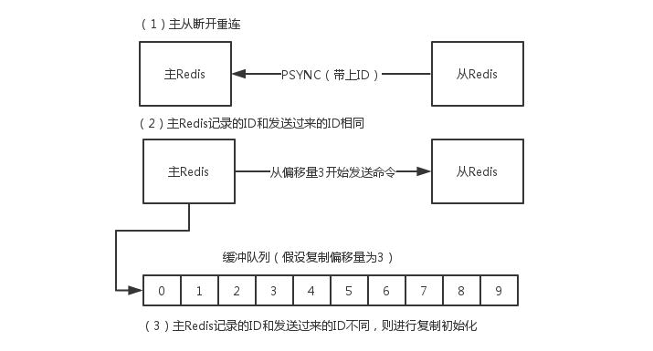
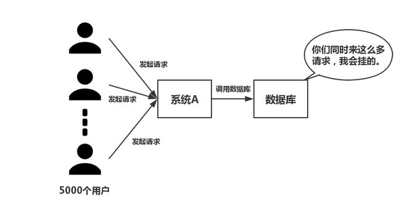
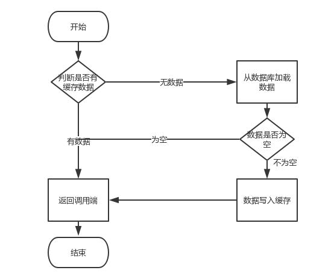

# redis
redis是一种支持Key-Value等多种数据结构的存储系统。可用于缓存、事件发布或订阅、高速队列等场景。
该数据库使用ANSI C语言编写，支持网络，提供字符串、哈希、列表、队列、集合结构直接存取，
基于内存，可持久化，支持多种开发语言。  

## redis的数据类型
支持多种数据类型：  
1.string(字符串)    
String数据结构是简单的key-value类型，value其实不仅可以是String，也可以是数字。  

常规key-value缓存应用；  
2.list(列表)    
Redis的list是每个子元素都是String类型的双向链表，可以通过push和pop操作从列表的头部或者尾部添加或者删除元素，这样List即可以作为栈，也可以作为队列。
使用List结构，我们可以轻松地实现最新消息排行等功能。     

3.hash(散列)  
Redis hash是一个string类型的field和value的映射表，hash特别适合用于存储对象。
存储部分变更的数据，如用户信息等。  

4.sets (集合)  
set就是一个集合，集合的概念就是一堆不重复值的组合。利用Redis提供的set数据结构，可以存储一些集合性的数据。set中的元素是没有顺序的。  

5.sorted set(有序集合)  
和set相比，sorted set增加了一个权重参数score，使得集合中的元素能够按score进行有序排列。  

## redis的特点
1.单线程，利用redis队列技术并将访问变为串行访问，消除了传统数据库串行控制的开销。  
2.redis具有快速和持久化的特征，速度快，因为数据存在内存中。  
3.分布式 读写分离模式。  
4.支持丰富数据类型。  
5.支持事务，操作都是原子性，所谓原子性就是对数据的更改要么全部执行，要不全部不执行。  
6.可用于缓存，消息，按key设置过期时间，过期后自动删除。  

## redis的持久化存储
Redis支持两种数据持久化方式：RDB方式和AOF方式。前者会根据配置的规则定时将内存中的数据持久化到硬盘上，
后者则是在每次执行写命令之后将命令记录下来。两种持久化方式可以单独使用，但是通常会将两者结合使用。   

### RDB持久化
原理是将Reids在内存中的数据库记录定时dump到磁盘上的RDB持久化。  
指定的时间间隔内将内存中的数据集快照写入磁盘，实际操作过程是fork一个子进程，
先将数据集写入临时文件，写入成功后，再替换之前的文件，用二进制压缩存储。    

  

### AOF(append only file)持久化
原理是将Reids的操作日志以追加的方式写入文件。  
以日志的形式记录服务器所处理的每一个写、删除操作，
查询操作不会记录，以文本的方式记录，可以打开文件看到详细的操作记录。  

  

# redis的应用场景
1、最全页面缓存  
如果你使用的是服务器端内容渲染，你又不想为每个请求重新渲染每个页面，就可以使用 Redis 把常被请求的内容缓存起来，能够大大的降低页面请求的延迟。  

2.排行榜/计数  
Redis 基于内存，可以非常快速高效的处理增加和减少的操作，相比于使用 SQL 请求的处理方式，性能的提升是非常巨大的。  
Redis可以实现快速计数、查询缓存的功能，同时数据可以异步落地到其他数据源。    

典型应用场景：  
1）播放数计数的基础组件，用户每播放一次视频，相应的视频播放数就会自增1。  

2）排行榜：按照时间、按照数量、按照获得的赞数等排行。  

3、共享Session  
典型应用场景：用户登陆信息，Redis将用户的Session进行集中管理，每次用户更新或查询登陆信息都直接从Redis中集中获取。  

4、消息队列  
例如 email 的发送队列、等待被其他应用消费的数据队列，Redis 可以轻松而自然的创建出一个高效的队列。  

5、发布/订阅  
pub/sub 是 Redis 内置的一个非常强大的特性，例如可以创建一个实时的聊天系统、社交网络中的通知触发器等等。  
 
# Redis的高并发和快速原因
第一个原因是redis是基于内存的，内存的读写速度非常快。  
第二个原因是redis是单线程的，省去了很多上下文切换线程的时间。  
第三个原因是redis使用多路复用技术，可以处理并发的连接。非阻塞IO 内部实现采用epoll，
采用了epoll+自己实现的简单的事件框架。epoll中的读、写、关闭、连接都转化成了事件，
然后利用epoll的多路复用特性，绝不在io上浪费一点时间。  

为什么redis是单线程的？  
1.官方答案  
因为Redis是基于内存的操作，CPU不是Redis的瓶颈，Redis的瓶颈最有可能是机器内存的大小或者网络带宽。既然单线程容易实现，而且CPU不会成为瓶颈，那就顺理成章地采用单线程的方案了。  

2.性能指标  
关于redis的性能，官方网站也有，普通笔记本轻松处理每秒几十万的请求。  

3.详细原因  

1）不需要各种锁的性能消耗    
Redis的数据结构并不全是简单的Key-Value，还有list，hash等复杂的结构，这些结构有可能会进行很细粒度的操作，比如在很长的列表后面添加一个元素，在hash当中添加或者删除
一个对象。这些操作可能就需要加非常多的锁，导致的结果是同步开销大大增加。      
总之，在单线程的情况下，就不用去考虑各种锁的问题，不存在加锁释放锁操作，没有因为可能出现死锁而导致的性能消耗。    

2）单线程多进程集群方案    
单线程的威力实际上非常强大，多线程自然是可以比单线程有更高的性能上限，但是在今天的计算环境中，即使是单机多线程的上限也往往不能满足需要了，需要进一步摸索的是多服务器集群化的方案，这些方案中多线程的技术照样是用不上的。  
所以单线程、多进程的集群不失为一个时髦的解决方案。  

3）CPU消耗
采用单线程，避免了不必要的上下文切换和竞争条件，也不存在多进程或者多线程导致的切换而消耗 CPU。  
但是如果CPU成为Redis瓶颈，或者不想让服务器其他CUP核闲置，那怎么办？  
可以考虑多起几个Redis进程，Redis是key-value数据库，不是关系数据库，数据之间没有约束。只要客户端分清哪些key放在哪个Redis进程上就可以了。    

Redis单线程的优劣势  
1.单进程单线程优势  
 代码更清晰，处理逻辑更简单  
 不用去考虑各种锁的问题，不存在加锁释放锁操作，没有因为可能出现死锁而导致的性能消耗  
 不存在多进程或者多线程导致的切换而消耗CPU  
 
2.单进程单线程弊端  
无法发挥多核CPU性能，不过可以通过在单机开多个Redis实例来完善；  

IO多路复用技术  
redis 采用网络IO多路复用技术来保证在多连接的时候， 系统的高吞吐量。  
多路-指的是多个socket连接，复用-指的是复用一个线程。多路复用主要有三种技术：select，poll，epoll。epoll是最新的也是目前最好的多路复用技术。   
这里“多路”指的是多个网络连接，“复用”指的是复用同一个线程。采用多路I/O
复用技术可以让单个线程高效的处理多个连接请求（尽量减少网络IO的时间消耗），且Redis在内存中操作数据的速度非常快（内存内的操作不会成为这里的性能瓶颈），主要以上两点造就了Redis具有很高的吞吐量。   
1. Redis是纯内存数据库，一般都是简单的存取操作，线程占用的时间很多，时间的花费主要集中在IO上，所以读取速度快。  
2. 再说一下IO，Redis使用的是非阻塞IO，IO多路复用，使用了单线程来轮询描述符，将数据库的开、关、读、写都转换成了事件，减少了线程切换时上下文的切换和竞争带来的cpu开销。  
3. Redis采用了单线程的模型，保证了每个操作的原子性，也减少了线程的上下文切换和竞争带来的cpu消耗。   
4. 另外，数据结构也帮了不少忙，Redis全程使用hash结构，读取速度快，还有一些特殊的数据结构，对数据存储进行了优化，如压缩表，对短数据进行压缩存储，再如，跳表，使用有序的数据结构加快读取的速度。  
5. 还有一点，Redis采用自己实现的事件分离器，效率比较高，内部采用非阻塞的执行方式，吞吐能力比较大。  

# RedisTemplate 和 StringRedisTemplate 对比
RedisTemplate 看这个类的名字后缀是 Template，如果了解过 Spring 如何连接关系型数据库的，大概不会难猜出这个类是做什么的 ，
它跟 JdbcTemplate 一样，JdbcTemplate 封装了对数据库的常用操作，而 RedisTemplate 封装了对Redis的一些常用的操作，
当然 StringRedisTemplate 跟 RedisTemplate 功能类似那么肯定就会有人问，为什么会需要两个Template呢，
一个不就够了吗？其实他们两者之间的区别主要在于他们使用的序列化类。  
RedisTemplate 使用的是 JdkSerializationRedisSerializer 序列化对象，而且对象必须
实现序列化接口。  

## StringRedisTemplate  
主要用来存储字符串和序列化字符串，StringRedisSerializer 的泛型指定的是 String。当存入对象时，会报错 ：can not cast into String。   
可见性强，更易维护。如果都是通过字符串存储可考虑用 StringRedisTemplate。  

## RedisTemplate 
在微服务都是以HTTP接口的形式暴露自身服务的，因此在调用远程服务时就必须使用HTTP客户端。
我们可以使用JDK原生的URLConnection、Apache的Http Client、Netty的异步HTTP Client, Spring的RestTemplate。
这里介绍的是RestTemplate。RestTemplate底层用还是HttpClient，对其做了封装，使用起来更简单。   
RestTemplate是Spring提供的用于访问Rest服务的客户端，RestTemplate提供了多种便捷访问远程Http服务的方法,能够大大提高客户端的编写效率。 
调用RestTemplate的默认构造函数，RestTemplate对象在底层通过使用java.net包下的实现创建HTTP 请求，
可以通过使用ClientHttpRequestFactory指定不同的HTTP请求方式。  
ClientHttpRequestFactory接口主要提供了两种实现方式  
一种是SimpleClientHttpRequestFactory，使用J2SE提供的方式（既java.net包提供的方式）创建底层的Http请求连接。  
一种方式是使用HttpComponentsClientHttpRequestFactory方式，底层使用HttpClient访问远程的Http服务，使用HttpClient可以配置连接池和证书等信息。  
可以用来存储对象并序列化对象，但是要实现Serializable接口。 
其实spring并没有真正的去实现底层的http请求（3次握手），而是集成了别的http请求，spring只是在原有的各种http请求进行了规范标准，
让开发者更加简单易用，底层默认用的是jdk的http请求。     
以二进制数组方式存储，内容没有可读性。  

## RestTemplate的优缺点
优点：连接池、超时时间设置、支持异步、请求和响应的编解码。  
缺点：依赖别的spring版块、参数传递不灵活。  
RestTemplate默认是使用SimpleClientHttpRequestFactory，内部是调用jdk的HttpConnection，默认超时为-1。  

## RedisTemplate 序列化方式比较
那有没有办法，可以序列化对象，可读性又强呢？  
1、手动转化成json串再存储。取出数据需要反序列化。  
2、使用其他序列化方式。  

spring-data-redis 提供如下几种选择：  
GenericToStringSerializer: 可以将任何对象泛化为字符串并序列化  
Jackson2JsonRedisSerializer: 跟 JacksonJsonRedisSerializer 实际上是一样的  
JacksonJsonRedisSerializer: 序列化object对象为json字符串  
JdkSerializationRedisSerializer: 序列化java对象  
StringRedisSerializer: 简单的字符串序列化  

## 几种序列化方式的性能比较
经过使用 RedisSerialTests 单元测试后， 发现JdkSerializationRedisSerializer序列化后长度最小，Jackson2JsonRedisSerializer效率最高。  
如果综合考虑效率和可读性，牺牲部分空间，推荐key使用StringRedisSerializer，保持的key简明易读；value可以使用Jackson2JsonRedisSerializer。  
如果空间比较敏感，效率要求不高，推荐key使用StringRedisSerializer，保持的key简明易读；value可以使用JdkSerializationRedisSerializer。  
相关的配置请参考 RedisConfig 这个类。  

# redis集群的高可用
## 哨兵机制
谈到Redis服务器的高可用，如何保证备份的机器是原始服务器的完整备份呢？这时候就需要哨兵和复制。  
哨兵(Sentinel)：可以管理多个Redis服务器，它提供了监控，提醒以及自动的故障转移的功能。  
复制(Replication)：则是负责让一个Redis服务器可以配备多个备份的服务器。  
Redis正是利用这两个功能来保证Redis的高可用。  

### 哨兵
哨兵是Redis集群架构中非常重要的一个组件，哨兵的出现主要是解决了主从复制出现故障时需要人为干预的问题。  
1.Redis哨兵主要功能  
（1）集群监控：负责监控Redis master和slave进程是否正常工作  
（2）消息通知：如果某个Redis实例有故障，那么哨兵负责发送消息作为报警通知给管理员  
（3）故障转移：如果master node挂掉了，会自动转移到slave node上  
（4）配置中心：如果故障转移发生了，通知client客户端新的master地址  

#### Redis哨兵的高可用
原理：当主节点出现故障时，由Redis Sentinel自动完成故障发现和转移，并通知应用方，实现高可用性。   

   

1、哨兵机制建立了多个哨兵节点(进程)，共同监控数据节点的运行状况。  
2、同时哨兵节点之间也互相通信，交换对主从节点的监控状况。  
3、每隔1秒每个哨兵会向整个集群：Master主服务器+Slave从服务器+其他Sentinel（哨兵）进程，发送一次ping命令做一次心跳检测。  
这个就是哨兵用来判断节点是否正常的重要依据，涉及两个新的概念：主观下线和客观下线。   

1.主观下线：一个哨兵节点判定主节点down掉是主观下线。  
2.客观下线：只有半数哨兵节点都主观判定主节点down掉，此时多个哨兵节点交换主观判定结果，才会判定主节点客观下线。  
3.原理：基本上哪个哨兵节点最先判断出这个主节点客观下线，就会在各个哨兵节点中发起投票机制Raft算法（选举算法），最终被投为领导者的哨兵节点完成主从自动化切换的过程。  

## redis 复制
①从数据库向主数据库发送sync(数据同步)命令。  

②主数据库接收同步命令后，会保存快照，创建一个RDB文件。  

③当主数据库执行完保持快照后，会向从数据库发送RDB文件，而从数据库会接收并载入该文件。  

④主数据库将缓冲区的所有写命令发给从服务器执行。  

⑤以上处理完之后，之后主数据库每执行一个写命令，都会将被执行的写命令发送给从数据库。  

注意：在Redis2.8之后，主从断开重连后会根据断开之前最新的命令偏移量进行增量复制。  

   

Redis 主从复制、哨兵和集群这三个有什么区别？  
1.主从模式：读写分离，备份，一个Master可以有多个Slaves。  
2.哨兵sentinel：监控，自动转移，哨兵发现主服务器挂了后，就会从slave中重新选举一个主服务器。  
3.集群：为了解决单机Redis容量有限的问题，将数据按一定的规则分配到多台机器，内存/QPS不受限于单机，可受益于分布式集群高扩展性。  
哨兵作用于高可用，集群提高并发量。  

# redis 缓存与mysql数据库一致性方案的详解
## 需求起因
在高并发的业务场景下，数据库大多数情况都是用户并发访问最薄弱的环节。
所以，就需要使用redis做一个缓冲操作，让请求先访问到redis，而不是直接访问MySQL等数据库。  

   

这个业务场景，主要是解决读数据从Redis缓存中读，一般都是按照下图的流程来进行业务操作。   

    

读取缓存步骤一般没有什么问题，但是一旦涉及到数据更新：数据库和缓存更新，就容易出现缓存(Redis)和数据库（MySQL）间的数据一致性问题。  
不管是先写MySQL数据库，再删除Redis缓存；还是先删除缓存，再写库，都有可能出现数据不一致的情况。举一个例子：  
1.如果删除了缓存Redis，还没有来得及写库MySQL，另一个线程就来读取，发现缓存为空，则去数据库中读取数据写入缓存，此时缓存中为脏数据。  
2.如果先写了库，在删除缓存前，写库的线程宕机了，没有删除掉缓存，则也会出现数据不一致情况。  
因为写和读是并发的，没法保证顺序,就会出现缓存和数据库的数据不一致的问题。  
如来解决？这里给出两个解决方案，先易后难，结合业务和技术代价选择使用。  

## 解决方案

### 采用延时双删策略
在写库前后都进行redis.del(key)操作，并且设定合理的超时时间。  
伪代码如下：  
```
public void write(String key,Object data){
 redis.delKey(key);
 db.updateData(data);
 Thread.sleep(500);
 redis.delKey(key);
 }
 ```
2.具体的步骤就是：  
1）先删除缓存  
2）再写数据库  
3）休眠500毫秒  
4）再次删除缓存  
那么，这个500毫秒怎么确定的，具体该休眠多久呢？  
需要评估自己的项目的读数据业务逻辑的耗时。这么做的目的，就是确保读请求结束，写请求可以删除读请求造成的缓存脏数据。  
`当然这种策略还要考虑redis和数据库主从同步的耗时`。最后的的写数据的休眠时间：
则在读数据业务逻辑的耗时基础上，加几百ms即可。比如：休眠1秒。  

3.设置缓存过期时间  
从理论上来说，给缓存设置过期时间，是保证最终一致性的解决方案。所有的写操作以数据库为准，只要到达缓存过期时间，
则后面的读请求自然会从数据库中读取新值然后回填缓存。  

4.该方案的弊端  
结合双删策略+缓存超时设置，这样最差的情况就是在超时时间内数据存在不一致，而且又增加了写请求的耗时。  

### 异步更新缓存(基于订阅binlog的同步机制)
1.技术整体思路：  
MySQL binlog增量订阅消费+消息队列+增量数据更新到redis。  
1）读Redis：热数据基本都在Redis    
2）写MySQL:增删改都是操作MySQL    
3）更新Redis数据：MySQ的数据操作binlog，来更新到Redis    

2.Redis更新  
1）数据操作主要分为两大块：  
 一个是全量(将全部数据一次写入到redis)  
 一个是增量（实时更新）  
这里说的是增量,指的是mysql的update、insert、delate变更数据。  
2）读取binlog后分析 ，利用消息队列,推送更新各台的redis缓存数据。  
这样一旦MySQL中产生了新的写入、更新、删除等操作，就可以把binlog相关的消息推送至Redis，Redis再根据binlog中的记录，对Redis进行更新。  
其实这种机制，很类似MySQL的主从备份机制，因为MySQL的主备也是通过binlog来实现的数据一致性。  
这里可以结合使用canal(阿里的一款开源框架)，通过该框架可以对MySQL的binlog进行订阅，而canal正是模仿了mysql的slave数据库的备份请求，使得Redis的数据更新达到了相同的效果。  
当然，这里的消息推送工具你也可以采用别的第三方：kafka、rabbitMQ等来实现推送更新Redis。  


