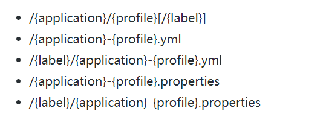
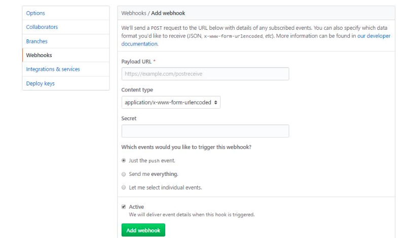
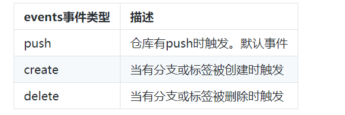
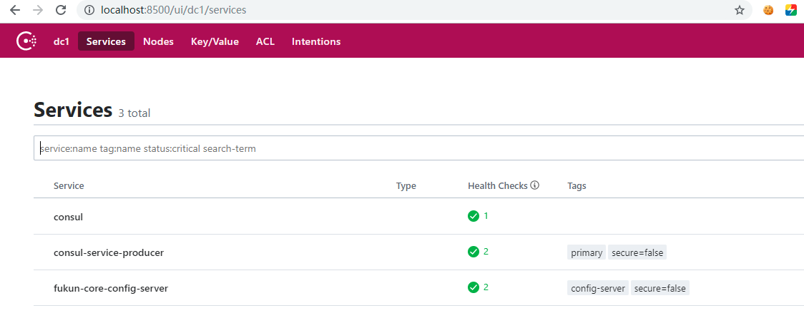
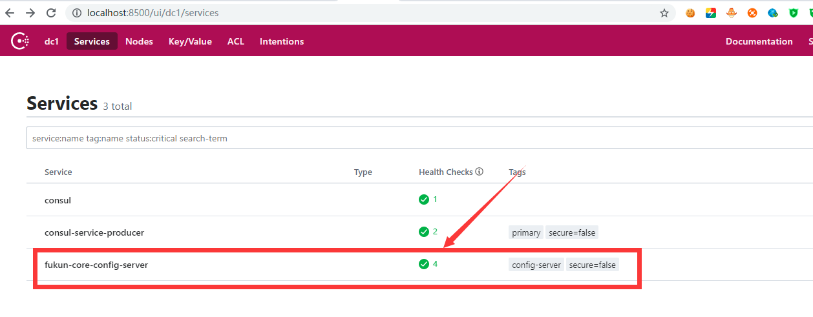

随着线上项目变的日益庞大，每个项目都散落着各种配置文件，如果采用分布式的开发模式，需要的配置文件随着服务增加而不断增多。某一个基础服务信息变更，都会引起一系列的更新和重启，运维苦不堪言也容易出错。
配置中心便是解决此类问题的灵丹妙药。  

市面上开源的配置中心有很多，BAT每家都出过，360的QConf、淘宝的diamond、百度的disconf都是解决这类问题。国外也有很多开源的配置中心Apache Commons Configuration、owner、cfg4j等等。
这些开源的软件以及解决方案都很优秀，但是我最钟爱的却是Spring Cloud Config，因为它功能全面强大，可以无缝的和spring体系相结合，够方便够简单颜值高我喜欢。  

# Spring Cloud Config
在我们了解spring cloud config之前，我可以想想一个配置中心提供的核心功能应该有什么  

1、提供服务端和客户端支持    
2、集中管理各环境的配置文件    
3、配置文件修改之后，可以快速的生效  
4、可以进行版本管理  
5、支持大的并发查询  
6、支持各种语言  

Spring Cloud Config可以完美的支持以上所有的需求。  

Spring Cloud Config项目是一个解决分布式系统的配置管理方案。它包含了Client和Server两个部分，server提供配置文件的存储、
以接口的形式将配置文件的内容提供出去，client通过接口获取数据、并依据此数据初始化自己的应用。Spring cloud使用git或svn存放配置文件，
默认情况下使用git，我们先以git为例做一套示例。  

首先在github上面创建了一个文件夹config-repo用来存放配置文件，为了模拟生产环境，我们创建以下三个配置文件：  
fukun-config-dev.properties    
fukun-config-test.properties    
fukun-config-prod.properties   
每个配置文件中都写一个属性fukun.env,属性值分别是 dev/test/pro 。  
但是访问外国的GitHub网站由于网络的原因（网络连接超时）导致访问失败，所以我这里就使用我之前码云上的config-repo。  
如下： 
 
  

下面我们开始配置server端   

## server 端
### 1、添加依赖 
 
```
 <dependency>
            <groupId>org.springframework.cloud</groupId>
            <artifactId>spring-cloud-config-server</artifactId>
 </dependency>
```
只需要加入spring-cloud-config-server包引用既可。  

### 2、配置文件 

``` 
spring:
  cloud:
    config:
      server:
        git:
          uri: https://gitee.com/tangyifei/micro-service-architecture.git    # 配置git仓库的地址
          search-paths: config-repo                             # git仓库地址下的相对地址，可以配置多个，用,分割。
          username:                                             # git仓库的账号
          password:                                             # git仓库的密码
```
Spring Cloud Config也提供本地存储配置的方式。我们只需要设置属性spring.profiles.active=native，Config Server会默认从应用的src/main/resource目录下检索配置文件。
也可以通过spring.cloud.config.server.native.searchLocations=file:E:/properties/属性来指定配置文件的位置。虽然Spring Cloud Config提供了这样的功能，
但是为了支持更好的管理内容和版本控制的功能，还是推荐使用git的方式。  

### 3、启动类  
启动类添加@EnableConfigServer，激活对配置中心的支持
  
```
package com.fukun.config;

import org.springframework.boot.SpringApplication;
import org.springframework.boot.autoconfigure.SpringBootApplication;
import org.springframework.cloud.client.discovery.EnableDiscoveryClient;
import org.springframework.cloud.config.server.EnableConfigServer;

/**
 * 分布式配置中心服务端
 *
 * @author tangyifei
 * @since 2019年6月25日17:07:24
 */
@SpringBootApplication
@EnableDiscoveryClient
@EnableConfigServer
public class ConfigApplication {

    public static void main(String[] args) {
        SpringApplication.run(ConfigApplication.class, args);
    }

}
```
到此server端相关配置已经完成  

### 4、测试  
首先我们先要测试server端是否可以读取到github上面的配置信息，直接访问：http://localhost:8889/tang-config/dev   
返回信息如下：  
```  
{
	"name": "tang-config",
	"profiles": ["dev"],
	"label": null,
	"version": "92e1c5d89bdc1e321475bb8193cf156342d78b19",
	"state": null,
	"propertySources": [{
		"name": "https://gitee.com/tangyifei/micro-service-architecture.git/config-repo/tang-config-dev.properties",
		"source": {
			"neo.hello": "hello tangyifei06",
			"spring.datasource.type": "com.alibaba.druid.pool.DruidDataSource",
			"spring.datasource.url": "jdbc:mysql://182.254.241.24:3306/micro-service-architecture?useUnicode=true&characterEncoding=utf-8&allowMultiQueries=true",
			"spring.datasource.username": "root",
			"spring.datasource.password": "##!zggc5055",
			"spring.datasource.driverClassName": "com.mysql.jdbc.Driver",
			"spring.datasource.initialSize": "5  ",
			"spring.datasource.minIdle": "5  ",
			"spring.datasource.maxActive": "20  ",
			"spring.datasource.maxWait": "60000  ",
			"spring.datasource.timeBetweenEvictionRunsMillis": "60000  ",
			"spring.datasource.minEvictableIdleTimeMillis": "300000  ",
			"spring.datasource.validationQuery": "SELECT 1 FROM DUAL ",
			"spring.datasource.testWhileIdle": "true ",
			"spring.datasource.testOnBorrow": "false ",
			"spring.datasource.testOnReturn": "false ",
			"spring.datasource.poolPreparedStatements": "true ",
			"spring.datasource.maxPoolPreparedStatementPerConnectionSize": "20",
			"spring.datasource.filters": "stat,wall,log4j2",
			"spring.datasource.connectionProperties": "druid.stat.mergeSql=true;druid.stat.slowSqlMillis=5000 ",
			"authority.datasource.druid.first.url": "jdbc:mysql://182.254.241.24:3306/micro-service-architecture?useUnicode=true&characterEncoding=utf-8&allowMultiQueries=true",
			"authority.datasource.druid.first.username": "root",
			"authority.datasource.druid.first.password": "##!zggc5055",
			"authority.datasource.druid.second.url": "jdbc:mysql://localhost:3306/micro-service-architecture?useUnicode=true&characterEncoding=utf-8&allowMultiQueries=true",
			"authority.datasource.druid.second.username": "root",
			"authority.datasource.druid.second.password": "root",
			"authority.datasource.druid.initialSize": "10",
			"authority.datasource.druid.maxActive": "10",
			"authority.datasource.druid.minIdle": "10",
			"authority.datasource.druid.maxWait": "10",
			"authority.datasource.druid.poolPreparedStatements": "true",
			"authority.datasource.druid.maxPoolPreparedStatementPerConnectionSize": "20",
			"authority.datasource.druid.timeBetweenEvictionRunsMillis": "60000",
			"authority.datasource.druid.minEvictableIdleTimeMillis": "300000",
			"authority.datasource.druid.testWhileIdle": "true",
			"authority.datasource.druid.testOnBorrow": "false",
			"authority.datasource.druid.testOnReturn": "false",
			"authority.datasource.druid.statViewServlet.enabled": "true",
			"authority.datasource.druid.statViewServlet.url-pattern": "/druid/*",
			"authority.datasource.druid.filter.stat.log-slow-sql": "1000",
			"authority.datasource.druid.filter.stat.slowSqlMillis": "1000",
			"authority.datasource.druid.filter.stat.mergeSql": "false",
			"authority.datasource.druid.filter.wall.config.multi-statement-allow": "true",
			"mongodb.host": "115.159.201.120",
			"mongodb.port": "27017",
			"mongodb.db": "admin",
			"mongodb.username": "root",
			"mongodb.password": "##!zggc5055",
			"redis.hostName": "115.159.201.120",
			"redis.port": "6379",
			"redis.password": "##!zggc5055",
			"redis.timeout": "10000",
			"redis.maxIdle": "300",
			"redis.maxActive": "600",
			"redis.maxTotal": "1000",
			"redis.maxWaitMillis": "1000",
			"redis.minEvictableIdleTimeMillis": "300000",
			"redis.numTestsPerEvictionRun": "1024",
			"redis.timeBetweenEvictionRunsMillis": "30000",
			"redis.testOnBorrow": "true",
			"redis.testWhileIdle": "true"
		}
	}]
}
```
上述的返回的信息包含了配置文件的位置、版本、配置文件的名称以及配置文件中的具体内容，说明server端已经成功获取了git仓库的配置信息。  
如果直接查看配置文件中的配置信息可访问：http://localhost:8889/tang-config-dev.properties。  
修改配置文件tang-config-dev.properties中配置信息为：neo.hello=hello tangyifei08,再次在浏览器访问http://localhost:8889/tang-config-dev.properties，
如果neo.hello的value返回为最新的值hello tangyifei08。说明server端会自动读取最新提交的内容。如下：  

  

仓库中的配置文件会被转换成web接口，访问可以参照以下的规则： 
 
 

以tang-config-dev.properties为例子，它的application是tang-config，profile是dev。client会根据填写的参数来选择读取对应的配置。  

## client 端

主要展示如何在业务项目中去获取server端的配置信息。  

### 添加依赖   
在fukun-core-consul-producer1项目中添加如下依赖。  
```
 <dependency>
            <groupId>org.springframework.cloud</groupId>
            <artifactId>spring-cloud-starter-config</artifactId>
 </dependency>
 
```  
### 配置文件
添加一个配置文件，bootstrap.properties，添加如下内容： 
```
# 下面这些与spring-cloud相关的属性必须配置在bootstrap.properties中，
# config部分内容才能被正确加载。因为config的相关配置会先于application.properties，
# 而bootstrap.properties的加载也是先于application.properties。
spring.cloud.config.name=tang-config
# 对应{profile}部分
spring.cloud.config.profile=dev
# 配置中心的具体地址
spring.cloud.config.uri=http://localhost:8889/
# 对应git的分支。如果配置中心使用的是本地存储，则该参数无用
spring.cloud.config.label=master
# 指定配置中心的service-id，便于扩展为高可用配置集群。
spring.cloud.config.discovery.service-id=fukun-core-config-server 
```
### 测试
使用@Value注解来获取server端参数的值  

```
@RestController
class HelloController {

    @Value("${neo.hello}")
    
    private String hello;
   
    @RequestMapping("/config")
    public String getConfigDetail() {
        return this.hello;
    }
}
```
启动项目后访问： http://localhost:8501/config，返回：hello tangyifei08，
说明已经正确的从server端获取到了参数。到此一个完整的服务端提供配置服务，
客户端获取配置参数的例子就完成了。  

## 主动感知配置中心服务端的配置信息内容的变化
我们在进行一些小实验，手动修改tang-config-dev.properties中配置信息为：neo.hello=hello tangyifei09提交到github,
再次在浏览器访问http://localhost:8501/config，返回：hello tangyifei08，说明获取的信息还是旧的参数，
这是为什么呢？因为springboot项目只有在启动的时候才会获取配置文件的值，修改github信息后，client端并没有再次去获取，
所以导致这个问题。如何去解决这个问题呢？  
Spring Cloud Config分服务端和客户端，服务端负责将git（svn）中存储的配置文件发布成REST接口，客户端可以从服务端REST接口获取配置。
但客户端并不能主动感知到配置的变化，从而主动去获取新的配置。客户端如何去主动获取新的配置信息呢，
SpringCloud已经给我们提供了解决方案，每个客户端通过POST方法触发各自的/refresh。  
修改fukun-core-consul-producer1项目已到达可以refresh的功能。   

### 添加依赖
```
<dependency>
  <groupId>org.springframework.boot</groupId>
  <artifactId>spring-boot-starter-actuator</artifactId>
</dependency>
```
增加了spring-boot-starter-actuator包，spring-boot-starter-actuator是一套监控的功能，可以监控程序在运行时状态，其中就包括/refresh的功能。  

###  开启更新机制
需要给加载变量的类上面加载@RefreshScope，在客户端执行/refresh的时候就会更新此类下面的变量值。
因为@RefreshScope这个注解会在接到SpringCloud配置中心配置刷新的时候，自动将新的配置更新到该类对应的字段中。  
```
@RestController
@RefreshScope // 使用该注解的类，会在接到SpringCloud配置中心配置刷新的时候，自动将新的配置更新到该类对应的字段中。
class HelloController {

    @Value("${neo.hello}")
    private String hello;

    @RequestMapping("/hello")
    public String from() {
        return this.hello;
    }
}
```
### 测试
springboot 2.X 以上默认禁用了所有端点的配置，所以需要在配置文件application.properties添加以下配置    
```
management.endpoints.web.exposure.include=*

```
如果是springboot 1.5.X 以上，默认开通了安全认证，所以需要在配置文件application.properties添加以下配置  

```
management.security.enabled=false
```
OK 这样就改造完了，以post请求的方式来访问http://localhost:8501/actuator/refresh 就会更新修改后的配置文件。  
比如先启动fukun-core-consul-producer1这个项目，然后进入git版本仓库更新neo.hello的值为hello tangyifei09，然后执行
curl -X POST http://localhost:8501/actuator/refresh，当返回
```
["config.client.version","neo.hello"]

```
说明已经更新了neo.hello的值。我们再次访问http://localhost:8501/config，返回：hello tangyifei09，客户端已经得到了最新的值。  
每次手动刷新客户端也很麻烦，有没有什么办法只要提交代码就自动调用客户端来更新呢，github的webhook是一个好的办法。  

### WebHook
WebHook是当某个事件发生时，通过发送http post请求的方式来通知信息接收方。Webhook来监测你在Github.com上的各种事件，最常见的莫过于push事件。  
如果你设置了一个监测push事件的WebHook，那么每当你的这个项目有了任何提交，这个Webhook都会被触发，这时Github就会发送一个HTTP POST请求到你配置好的地址。  
如此一来，你就可以通过这种方式去自动完成一些重复性工作，比如，你可以用Webhook来自动触发一些持续集成（CI）工具的运作，比如Travis CI；
又或者是通过 Webhook 去部署你的线上服务器。下图就是github上面的webhook配置。  

   

Payload URL ：触发后回调的URL  
Content type ：数据格式，两种一般使用json  
Secret ：用作给POST的body加密的字符串。采用HMAC算法  
events ：触发的事件列表。 
 
 

svn也有类似的hook机制，每次提交后会触发post-commit脚本，我们可以在这里写一些post请求  

这样我们就可以利用hook的机制去触发客户端的更新，但是当客户端越来越多的时候hook支持的已经不够优雅，另外每次增加客户端都需要改动hook也是不现实的。其实Spring Cloud给了我们更好解决方案，下面
我们来介绍。  

## Spring Cloud Config服务端配置高可用
客户端都是直接调用配置中心的server端来获取配置文件信息。这样就存在了一个问题，客户端和服务端的耦合性太高，
如果server端要做集群，客户端只能通过原始的方式来路由，server端改变IP地址的时候，
客户端也需要修改配置，不符合springcloud服务治理的理念。springcloud提供了这样的解决方案，
我们只需要将server端当做一个服务注册到eureka中，client端去eureka中去获取配置中心server端的服务既可。  

### 添加依赖
引入服务中心的相关的依赖包，添加对consul的支持。  
```
 <dependency>
            <groupId>org.springframework.cloud</groupId>
            <artifactId>spring-cloud-starter-consul-discovery</artifactId>
 </dependency>
```
### 配置文件 
配置文件的修改只是增加consul的相关的配置项，这里就不展示了，详情请查看application.properties属性文件内容。  

### 启动类 
启动类添加consul服务中心的相关注解@EnableDiscoveryClient即可。  

### 修改客户端
客户端fukun-core-consul-producer1也需要consul的服务中心。修改bootstrap.properties属性文件，注释掉spring.cloud.config.uri=http://localhost:8889/，如下：  
```
# 下面这些与spring-cloud相关的属性必须配置在bootstrap.properties中，
# config部分内容才能被正确加载。因为config的相关配置会先于application.properties，
# 而bootstrap.properties的加载也是先于application.properties。
spring.cloud.config.name=tang-config
# 对应{profile}部分
spring.cloud.config.profile=dev
# 配置中心的具体地址
#spring.cloud.config.uri=http://localhost:8889/
# 对应git的分支。如果配置中心使用的是本地存储，则该参数无用
spring.cloud.config.label=master
#开启Config服务发现支持
spring.cloud.config.discovery.enabled=true
# 指定配置中心的service-id，也就是server端spring.application.name的值，便于扩展为高可用配置集群。
spring.cloud.config.discovery.service-id=fukun-core-config-server

```
上面去掉了spring.cloud.config.uri直接指向server端地址的配置，增加了最后的两个配置：  
spring.cloud.config.discovery.enabled ：开启Config服务发现支持  
spring.cloud.config.discovery.serviceId ：指定server端的name,也就是server端spring.application.name的值  
注意：这两个配置都需要放到bootstrap.properties的配置中   

分别启动Spring Cloud Config 服务端fukun-core-config-server和Spring Cloud Config 客户端fukun-core-consul-producer1，打开consul
的监控平台，发现都注册成功，如下：  

 

然后访问http://localhost:8501/config，返回hello tangyifei09的相关内容。

### 测试高可用
增加一个fukun-core-config-server，修改端口8887，名称为fukun-core-config-server01，其他的配置
都跟fukun-core-config-server一样，然后启动它，访问consul的监控平台，如下：  

 

如上图就可发现会有两个server端同时提供配置中心的服务，防止某一台down掉之后影响整个系统的使用。  
我们先单独测试服务端，分别访问：http://localhost:8889/tang-config/dev、http://localhost:8887/tang-config/dev返回信息：  
```
{
	"name": "tang-config",
	"profiles": ["dev"],
	"label": null,
	"version": "e1cb661b2432ef058b42ede3a5a349ffc0a8786e",
	"state": null,
	"propertySources": [{
		"name": "https://gitee.com/tangyifei/micro-service-architecture.git/config-repo/tang-config-dev.properties",
		"source": {
			"neo.hello": "hello tangyifei09",
			"spring.datasource.type": "com.alibaba.druid.pool.DruidDataSource",
			"spring.datasource.url": "jdbc:mysql://182.254.241.24:3306/micro-service-architecture?useUnicode=true&characterEncoding=utf-8&allowMultiQueries=true",
			"spring.datasource.username": "root",
			"spring.datasource.password": "##!zggc5055",
			"spring.datasource.driverClassName": "com.mysql.jdbc.Driver",
			"spring.datasource.initialSize": "5  ",
			"spring.datasource.minIdle": "5  ",
			"spring.datasource.maxActive": "20  ",
			"spring.datasource.maxWait": "60000  ",
			"spring.datasource.timeBetweenEvictionRunsMillis": "60000  ",
			"spring.datasource.minEvictableIdleTimeMillis": "300000  ",
			"spring.datasource.validationQuery": "SELECT 1 FROM DUAL ",
			"spring.datasource.testWhileIdle": "true ",
			"spring.datasource.testOnBorrow": "false ",
			"spring.datasource.testOnReturn": "false ",
			"spring.datasource.poolPreparedStatements": "true ",
			"spring.datasource.maxPoolPreparedStatementPerConnectionSize": "20",
			"spring.datasource.filters": "stat,wall,log4j2",
			"spring.datasource.connectionProperties": "druid.stat.mergeSql=true;druid.stat.slowSqlMillis=5000 ",
			"authority.datasource.druid.first.url": "jdbc:mysql://182.254.241.24:3306/micro-service-architecture?useUnicode=true&characterEncoding=utf-8&allowMultiQueries=true",
			"authority.datasource.druid.first.username": "root",
			"authority.datasource.druid.first.password": "##!zggc5055",
			"authority.datasource.druid.second.url": "jdbc:mysql://localhost:3306/micro-service-architecture?useUnicode=true&characterEncoding=utf-8&allowMultiQueries=true",
			"authority.datasource.druid.second.username": "root",
			"authority.datasource.druid.second.password": "root",
			"authority.datasource.druid.initialSize": "10",
			"authority.datasource.druid.maxActive": "10",
			"authority.datasource.druid.minIdle": "10",
			"authority.datasource.druid.maxWait": "10",
			"authority.datasource.druid.poolPreparedStatements": "true",
			"authority.datasource.druid.maxPoolPreparedStatementPerConnectionSize": "20",
			"authority.datasource.druid.timeBetweenEvictionRunsMillis": "60000",
			"authority.datasource.druid.minEvictableIdleTimeMillis": "300000",
			"authority.datasource.druid.testWhileIdle": "true",
			"authority.datasource.druid.testOnBorrow": "false",
			"authority.datasource.druid.testOnReturn": "false",
			"authority.datasource.druid.statViewServlet.enabled": "true",
			"authority.datasource.druid.statViewServlet.url-pattern": "/druid/*",
			"authority.datasource.druid.filter.stat.log-slow-sql": "1000",
			"authority.datasource.druid.filter.stat.slowSqlMillis": "1000",
			"authority.datasource.druid.filter.stat.mergeSql": "false",
			"authority.datasource.druid.filter.wall.config.multi-statement-allow": "true",
			"mongodb.host": "115.159.201.120",
			"mongodb.port": "27017",
			"mongodb.db": "admin",
			"mongodb.username": "root",
			"mongodb.password": "##!zggc5055",
			"redis.hostName": "115.159.201.120",
			"redis.port": "6379",
			"redis.password": "##!zggc5055",
			"redis.timeout": "10000",
			"redis.maxIdle": "300",
			"redis.maxActive": "600",
			"redis.maxTotal": "1000",
			"redis.maxWaitMillis": "1000",
			"redis.minEvictableIdleTimeMillis": "300000",
			"redis.numTestsPerEvictionRun": "1024",
			"redis.timeBetweenEvictionRunsMillis": "30000",
			"redis.testOnBorrow": "true",
			"redis.testWhileIdle": "true"
		}
	}]
}
```
说明两个server端都正常读取到了配置信息。  

再次访问：http://localhost:8501/config，返回：hello tangyifei09。说明客户端已经读取到了server端的内容，
我们随机停掉一台server端的服务，再次访问http://localhost:8501/config，
返回：hello tangyifei09，说明达到了高可用的目的。   

 


  


 


    
        


  
 


