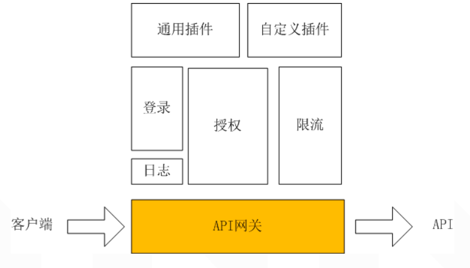
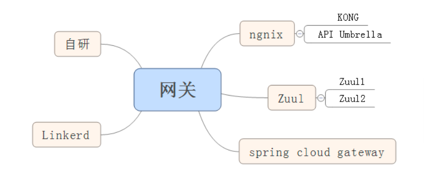

# 网关
API 网关出现的原因是微服务架构的出现，不同的微服务一般会有不同的网络地址，而外部客户端可能需要调用多个服务的接口才能完成一个业务需求，
如果让客户端直接与各个微服务通信，会有以下的问题：  

1、客户端会多次请求不同的微服务，增加了客户端的复杂性。  
2、存在跨域请求，在一定场景下处理相对复杂。  
3、认证复杂，每个服务都需要独立认证。  
4、难以重构，随着项目的迭代，可能需要重新划分微服务。例如，可能将多个服务合并成一个或者将一个服务拆分成多个。
如果客户端直接与微服务通信，那么重构将会很难实施。    
5、某些微服务可能使用了防火墙 / 浏览器不友好的协议，直接访问会有一定的困难。  

以上这些问题可以借助 API 网关解决。 API 网关是介于客户端和服务器端之间的中间层，
所有的外部请求都会先经过 API 网关这一层。也就是说，API 的实现方面更多的考虑业务逻辑，而安全、性能、监控可以交由 API 网关来做，
这样既提高业务灵活性又不缺安全性，典型的架构图如图所示：   

 
 
使用API网关后的优点如下：  
1、易于监控。可以在网关收集监控数据并将其推送到外部系统进行分析。  

2、易于认证。可以在网关上进行认证，然后再将请求转发到后端的微服务，而无须在每个微服务中进行认证。  

3、减少了客户端与各个微服务之间的交互次数，因为可以在网关层合并用户的请求。  

# API 网关选型
业界的情况：  
 
   

spring cloud gateway处理request请求的流程如下所示：  

 

即在最前端，启动一个netty server（默认端口为8080）接受请求，
然后通过Routes（每个Route由Predicate(等同于HandlerMapping)和Filter(等同于HandlerAdapter)）处理后通过Netty Client发给响应的微服务。  
Predicate和Filter的各个实现定义了spring-cloud-gateway拥有的功能（权限验证等）。  

# Spring Cloud Gateway与zuul的区别
Zuul（1.x） 基于 Servlet，使用阻塞API，它不支持任何长连接，如 WebSockets。  
Spring Cloud Gateway 使用非阻塞 API，支持 WebSockets，支持限流等新特性。   

# Spring Cloud Gateway
Spring Cloud Gateway 是 Spring Cloud 的一个全新项目，该项目是基于 Spring 5.0，Spring Boot 2.0 和 Project Reactor 等技术开发的网关，
它旨在为微服务架构提供一种简单有效的统一的API路由管理方式。   

Spring Cloud Gateway 作为 Spring Cloud 生态系统中的网关，目标是替代 Netflix Zuul，
其不仅提供统一的路由方式，并且基于 Filter 链的方式提供了网关基本的功能，例如：安全，监控/指标，和限流。  

## 相关概念
Route（路由）：这是网关的基本构建块。它由一个 ID，一个目标 URI，一组断言（predicates）和一组过滤器（filters）定义。如果断言为真，则路由匹配。  
Predicate（断言）：这是一个 Java 8 的 Predicate。输入类型是一个 ServerWebExchange。我们可以使用它来匹配来自 HTTP 请求的任何内容，例如 headers 或参数。 
Filter（过滤器）：这是org.springframework.cloud.gateway.filter.GatewayFilter的实例，我们可以使用它修改请求和响应。  

## 工作流程

   

客户端向Spring Cloud Gateway发出请求。如果 Gateway Handler Mapping 中找到与请求相匹配的路由，将其发送到 Gateway Web Handler。
Handler 再通过指定的过滤器链来将请求发送到我们实际的服务执行业务逻辑，然后返回。 
过滤器之间用虚线分开是因为过滤器可能会在发送代理请求之前（“pre”）或之后（“post”）执行业务逻辑。  

Spring Cloud Gateway 的特征：  
1、基于Spring Framework 5，Project Reactor和Spring Boot 2.0  
2、动态路由  
3、Predicates和Filters作用于特定路由  
4、集成Hystrix断路器  
5、集成Spring Cloud DiscoveryClient  
6、易于编写的Predicates和Filters  
7、限流  
8、路径重写  

# 使用
Spring Cloud Gateway 网关路由有两种配置方式：    
1、在配置文件yml中配置  
2、通过@Bean自定义RouteLocator，在启动主类Application中配置    

这两种方式是等价的，建议使用yml方式进行配置。  
使用 Spring Cloud Finchley 版本，Finchley 版本依赖于 Spring Boot 2.0.6.RELEASE。
```    
<parent>
	<groupId>org.springframework.boot</groupId>
	<artifactId>spring-boot-starter-parent</artifactId>
	<version>2.0.6.RELEASE</version>
	<relativePath/> <!-- lookup parent from repository -->
</parent>

<dependencyManagement>
	<dependencies>
		<dependency>
			<groupId>org.springframework.cloud</groupId>
			<artifactId>spring-cloud-dependencies</artifactId>
			<version>Finchley.SR2</version>
			<type>pom</type>
			<scope>import</scope>
		</dependency>
	</dependencies>
</dependencyManagement>
```
经测试 Finchley.RELEASE 有bug多次请求会报空指针异常，SR2 是 Spring Cloud 的最新版本。  
添加项目需要使用的依赖包    
```
<dependency>
	<groupId>org.springframework.cloud</groupId>
	<artifactId>spring-cloud-starter-gateway</artifactId>
</dependency>
```
Spring Cloud Gateway 是使用 netty+webflux 实现因此不需要再引入 web 模块。  


  

 


 


