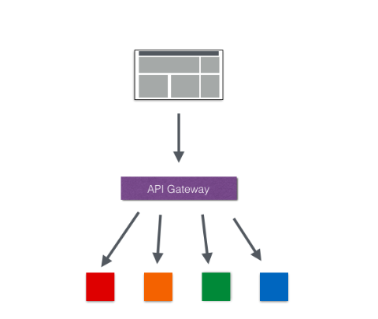
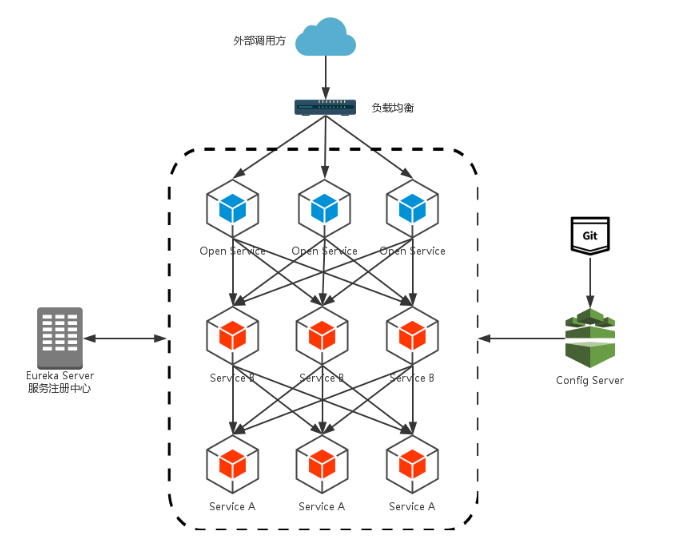

consul用于服务的注册与服务发现，Feign支持服务的调用以及均衡负载，Hystrix处理服务的熔断防止故障扩散，Spring Cloud Config服务集群配置中心，似乎一个微服务框架已经完成了。 
我们还是少考虑了一个问题，外部的应用如何来访问内部各种各样的微服务呢？在微服务架构中，后端服务往往不直接开放给调用端，而是通过一个API网关根据请求的url，路由到相应的服务。
当添加API网关后，在第三方调用端和服务提供方之间就创建了一面墙，这面墙直接与调用方通信进行权限控制，后将请求均衡分发给后台服务端。   

# 为什么需要API Gateway

## 1、简化客户端调用复杂度

在微服务架构模式下后端服务的实例数一般是动态的，对于客户端而言很难发现动态改变的服务实例的访问地址信息。因此在基于微服务的项目中为了简化前端的调用逻辑，
通常会引入API Gateway作为轻量级网关，同时API Gateway中也会实现相关的认证逻辑从而简化内部服务之间相互调用的复杂度。  

   

## 2、数据裁剪以及聚合

通常而言不同的客户端在显示时对于数据的需求是不一致的，比如手机端或者Web端又或者在低延迟的网络环境或者高延迟的网络环境。  

因此为了优化客户端的使用体验，API Gateway可以对通用性的响应数据进行裁剪以适应不同客户端的使用需求。同时还可以将多个API调用逻辑进行聚合，
从而减少客户端的请求数，优化客户端用户体验。  

## 3、多渠道支持

当然我们还可以针对不同的渠道和客户端提供不同的API Gateway,对于该模式的使用由另外一个大家熟知的方式叫Backend for front-end, 
在Backend for front-end模式当中，我们可以针对不同的客户端分别创建其BFF。  

  

## 4、遗留系统的微服务化改造

对于系统而言进行微服务改造通常是由于原有的系统存在或多或少的问题，比如技术债务，代码质量，可维护性，可扩展性等等。
API Gateway的模式同样适用于这一类遗留系统的改造，通过微服务化的改造逐步实现对原有系统中的问题的修复，从而提升对于原有业务响应力的提升。
通过引入抽象层，逐步使用新的实现替换旧的实现。 
 
  

在Spring Cloud体系中， Spring Cloud Zuul就是提供负载均衡、反向代理、权限认证的一个API gateway。  

Spring Cloud Zuul路由是微服务架构的不可或缺的一部分，提供动态路由，监控，弹性，安全等的边缘服务。Zuul是Netflix出品的一个基于JVM路由和服务端的负载均衡器。  

# Zuul简介

Zuul的主要功能是路由转发和过滤器。路由功能是微服务的一部分，比如／api/user转发到到user服务，/api/shop转发到到shop服务。zuul默认和Ribbon结合实现了负载均衡的功能。    

服务网关是微服务架构中一个不可或缺的部分。通过服务网关统一向外系统提供REST API的过程中，除了具备服务路由、均衡负载功能之外，它还具备了权限控制等功能。     
Spring Cloud Netflix中的Zuul就担任了这样的一个角色，为微服务架构提供了前门保护的作用，同时将权限控制这些较重的非业务逻辑内容迁移到服务路由层面，
使得服务集群主体能够具备更高的可复用性和可测试性。  

 

zuul有以下功能：  
  Authentication  
  Insights  
  Stress Testing  
  Canary Testing  
  Dynamic Routing  
  Service Migration   
  Load Shedding  
  Security  
  Static Response handling  
  Active/Active traffic management  
  
## Zuul服务网关使用的架构图示    

 

#  路径匹配规则  

　/api-a/?　　　 可以匹配 /api-a/ 之后拼接一个任务字符的路径 , 比如 /api-a/a , /api-a/b , /api-a/c  

  /api-a/*　　　 可以匹配 /api-a/ 之后拼接任意字符的路径, 比如 /api-a/a, /api-a/aaa, /api-a/bbb . 但它无法匹配 /api-a/a/b 这种多级目录路径  

  /api-a/**　　　可以匹配 /api-a/* 包含的内容之外, 还可以匹配形如 /api-a/a/b 的多级目录路径  
  
# 路由匹配顺序  

随着版本的迭代, 我们需要对一个服务做一些功能拆分, 将原属于 api-a 服务的某些功能拆分到另一个全新的服务 api-a-part 中, 而这些拆分的外部调用 URL 路径希望能够符合规则 /api-a/part/** .  
```
  zuul.routes.api-a.path=/api-a/**  
　zuul.routes.api-a.service-id=api-a  

　zuul.routes.api-a-part.path=/api-a/part/**  
　zuul.routes.api-a-part.service-id=api-a-part  

```
在源码中, 路由规则是通过 LinkedHashMap 保存的, 也就是说, 路由规则的保存时有序的, 而内容的加载是通过遍历配置文件中路由规则依次加入的, 所以导致问题的根本原因是对配置文件中内容的读取, 但上述properties配置无法保证路由规则加载顺序, 
我们需要使用 YML 文件来配置, 以实现有序的路由规则.   

```
zuul:  
    routes:  
        api-a-part:  
            path=/api-a/part/**  
            service-id=api-a-part　  
        api-a:  
            path=/api-a/**  
            service-id=api-a  

```
# 本地跳转

```　  
zuul.routes.api-c.path=/api-c/**
zuul.routes.api-c.url=forward:/api-c
```
以上配置使用了本地跳转,当 url 符合 /api-c/** 规则时,会被网关转发到 自己本身 服务的对应接口.  


