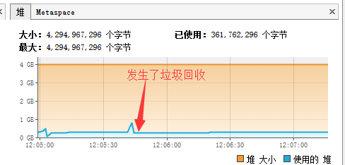
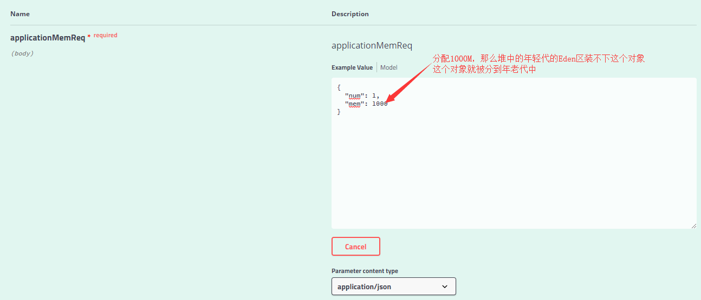
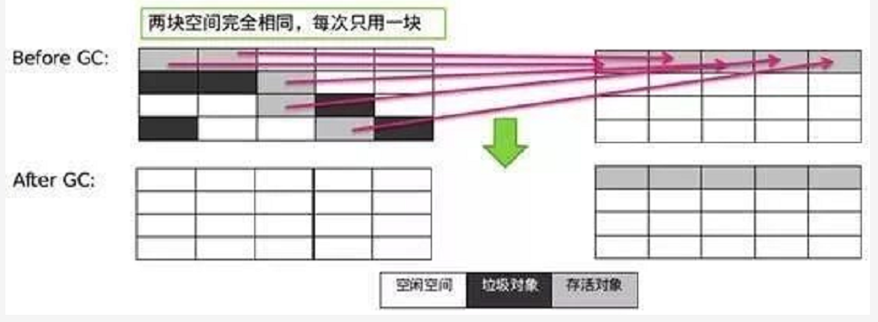
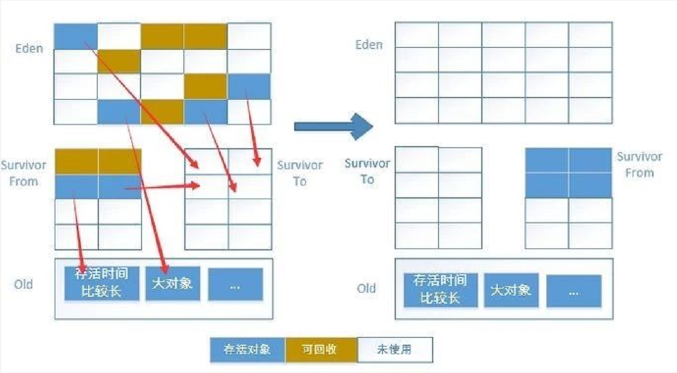
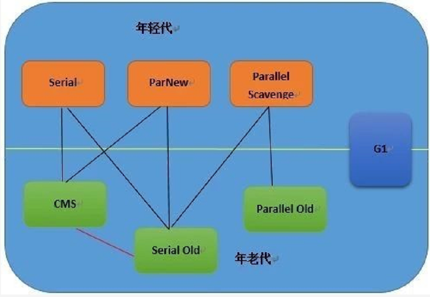
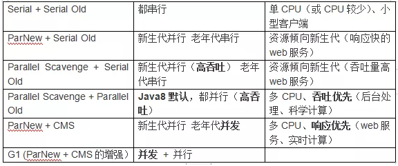

问题1：对于 IndexController 中的 allocationMem 中的局部变量 mem 引入的对象是否在该方法执行完毕之后就被垃圾回收呢？  
回答：首先idea安装VisualVM Launcher的java性能分析插件，具体配置步骤请参考
[IDEA Java性能分析插件VisualVM Launcher 配置](https://blog.csdn.net/wngpenghao/article/details/82884874)  
idea安装完成后，idea中会出现如下的两个按钮：   
    
然后启动程序，注意点击上面那个红色底纹的启动按钮，随着程序的启动，Java VisualVM 也随之开启。   
    
然后打开idea的终端，使用jps查看启动的jvm的进程号，或者在 Java VisualVM 也能看到进程号，用 jstat 查看内存布局，输入命令    
jstat -gcutil 15264 200 3   
结果如下：  
 
然后访问swagger页面执行请求，如下：  
   
再次执行 jstat -gcutil 15264 200 3 命令，如下：  
  
不管是 YGC,FGC 都没有，minorGC 与 majorGC 并没有发生变化，只是 Eden 区的使用占比有所增加，
毕竟分配了 250M 内存，就是说并没有进行相应的垃圾回收，那么方法执行完成后并不是相关的对象被立即回收了，
查看 Java VisualVM 的监控平台，一直保持在这个水位。同时左边的 GC 也没有任何的反应。    

问题2：那怎样才会回收呢？  
回答：我再次分配了两个 250M 之后观察 Java VisualVM 内存曲线。如下：  
  
然后输入命令 jstat -gcutil 4340 200 3，执行结果如下：  
  
这时候当 Eden 区域达到一定的比例的时候，再次分配对象的时候，就发生了年轻代的垃圾回收，同时内存曲线也得到了下降。    
这个换算过程如下：  
  
由于初始化的堆内存为 4G，所以算出来的 Eden 区大概为 1092M 内存。  
加上应用启动 Spring 之类消耗的大约 20% 内存，所以分配 3 次 250M 内存就会导致 YGC。 

问题3：mem 引入的对象既然在方法执行完毕后不会回收，那什么时候回收呢？  
回答：对象都需要垃圾回收器发生 GC 时才能回收；不管这个对象是局部变量还是全局变量。  
通过刚才的实验也发现了，当 Eden 区空间不足时就会产生 YGC 并且才会回收掉我们创建的 mem 对象。  
但这里其实还有一个隐藏条件：那就是这个对象是局部变量。如果该对象是全局变量那依然不能被回收，
因为针对全局变量，有很多地方引用它，根据可达性分析法判定对象是不是垃圾对象，因为是全局变量，它是
可达的，所以全局变量不被被回收，不可达的对象在 GC 发生时就会被认为是需要回收的对象从而进行回收。  

问题4：为什么有些人会认为方法执行完毕后局部变量会被回收呢？ 
回答：其实方法执行完毕后回收的是栈帧，就是说方法执行完毕，栈帧出栈，调用方法的时候，栈帧入栈，由于
栈帧出栈，释放了资源，mem引用的对象由于栈帧出栈了，局部变量表中的mem就不存在了，mem引用的这个对象没有
任何地方引用它，但是任何地方没有引用它不代表该对象会被马上回收，只有`需要产生 GC 才会回收`。    

问题4：优先在 Eden 区分配对象吗？  
回答：其实从上面的例子中可以看出对象是优先分配在新生代中 Eden 区的，但有个前提就是对象不能太大。  

    

问题5：大对象直接进入老年代吗？  
回答; 而大对象则是直接分配到老年代中（至于多大算大，可以通过参数配置）。  

  

然后执行jstat -gcutil 8736 200 3命令，如下：  
  
  

可以看到 Eden 区几乎没有变动，但是老年代却涨了 37% ，
根据之前计算的老年代内存 2730M 算出来也差不多是 1000M 的内存。  

JVM由三个主要的子系统构成：  
1.类加载器子系统  
2.运行时数据区（内存）  
3.执行引擎  

Java运行的时候，编译源码(.java)成字节码，由jre运行。jre由java虚拟机（jvm）实现。Jvm分析字节码，后解释并执行。  

  

问题6：如何识别垃圾，判定对象是否可被回收？    
回答：引用计数法：给每个对象添加一个计数器，当有地方引用该对象时计数器加1，当引用失效时计数器减1。用对象计数器是否为0来判断对象是否可被回收。
缺点：无法解决循环引用的问题。  
根搜索算法：也称可达性分析法，通过“GC ROOTs”的对象作为搜索起始点，通过引用向下搜索，所走过的路径称为引用链。
通过对象是否有到达引用链的路径来判断对象是否可被回收（可作为GC ROOTs的对象：虚拟机栈中引用的对象，
方法区中类静态属性引用的对象，方法区中常量引用的对象，本地方法栈中JNI引用的对象）。     

问题7：Java 中的堆是 GC 收集垃圾的主要区域，GC 分为两种：Minor GC、Full GC ( 或称为 Major GC )，简单说说这两种垃圾收集？    
回答：Minor GC：新生代（Young Gen）空间不足时触发收集，由于Java 中的大部分对象通常不需长久存活，新生代是GC收集频繁区域，所以采用`复制算法`。    
Full GC：老年代（Old Gen ）空间不足或元空间达到高水位线执行收集动作，由于存放大对象及长久存活下的对象，占用内存空间大，
回收效率低，所以采用`标记-清除算法`。     

问题8：有哪些垃圾收集算法？  
回答：按照回收策略划分为：标记-清除算法，标记-整理算法，复制算法。    
标记-清除算法：分为两阶段“标记”和“清除”。首先标记出哪些对象可被回收，在标记完成之后统一回收所有被标记的对象所占用的内存空间。
不足之处：1.无法处理循环引用的问题、 2.效率不高、 3.产生大量内存碎片（ps：空间碎片太多可能会导致以后在分配大对象的时候而无法申请到足够的连续内存空间，导致提前触发新一轮gc）。   

  

标记-整理算法：分为两阶段“标记”和“整理”。首先标记出哪些对象可被回收，在标记完成后，将对象向一端移动，然后直接清理掉边界以外的内存。    

  

复制算法：把内存空间划为两个相等的区域，每次只使用其中一个区域。gc时遍历当前使用区域，把正在使用中的对象复制到另外一个区域中。算法每次只处理正在使用中的对象，因此复制成本比较小，
同时复制过去以后还能进行相应的内存整理，不会出现“碎片”问题。不足之处：1.内存利用率问题2.在对象存活率较高时，其效率会变低。    

  

按分区对待可分为：增量收集算法，分代收集算法。  
增量收集:实时垃圾回收算法，即：在应用进行的同时进行垃圾回收，理论上可以解决传统分代方式带来的问题。增量收集把对堆空间划分成一系列内存块，
使用时先使用其中一部分，垃圾收集时把之前用掉的部分中的存活对象再放到后面没有用的空间中，这样可以实现一直边使用边收集的效果，
避免了传统分代方式整个使用完了再暂停的回收的情况。   

分代收集:（商用默认）基于对象生命周期划分为新生代、老年代、元空间，对不同生命周期的对象使用不同的算法进行回收。    

  

按系统线程可分为：串行收集算法，并行收集算法，并发收集算法    
1.串行收集:使用单线程处理垃圾回收工作，实现容易，效率较高。不足之处：1.无法发挥多处理器的优势 2.需要暂停用户线程。   
2.并行收集:使用多线程处理垃圾回收工作，速度快，效率高。理论上CPU数目越多，越能体现出并行收集器的优势。不足之处：需要暂停用户线程。  
3.`并发收集:垃圾线程与用户线程同时工作。系统在垃圾回收时不需要暂停用户线程`。   

GC收集器常用组合  
 
    

   

理解GC日志  

   

```
[GC [PSYoungGen: 8192K->1000K(9216K)] 16004K->14604K(29696K), 0.0317424 secs] [Times: user=0.06 sys=0.00, real=0.03 secs]
[GC [PSYoungGen: 9192K->1016K(9216K)] 22796K->20780K(29696K), 0.0314567 secs] [Times: user=0.06 sys=0.00, real=0.03 secs]
[Full GC [PSYoungGen: 8192K->8192K(9216K)] [ParOldGen: 20435K->20435K(20480K)] 28627K->28627K(29696K), [Metaspace: 8469K->8469K(1056768K)], 0.1307495 secs] [Times: user=0.50 sys=0.00, real=0.13 secs]
[Full GC [PSYoungGen: 8192K->8192K(9216K)] [ParOldGen: 20437K->20437K(20480K)] 28629K->28629K(29696K), [Metaspace: 8469K->8469K(1056768K)], 0.1240311 secs] [Times: user=0.42 sys=0.00, real=0.12 secs]

```


 


 


 


       
       
        
       
       