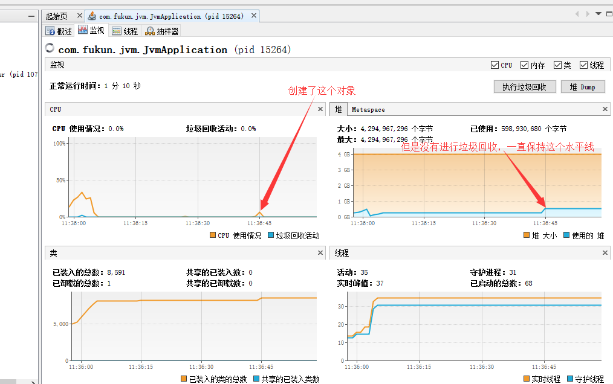
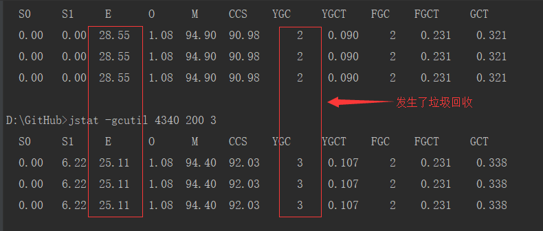
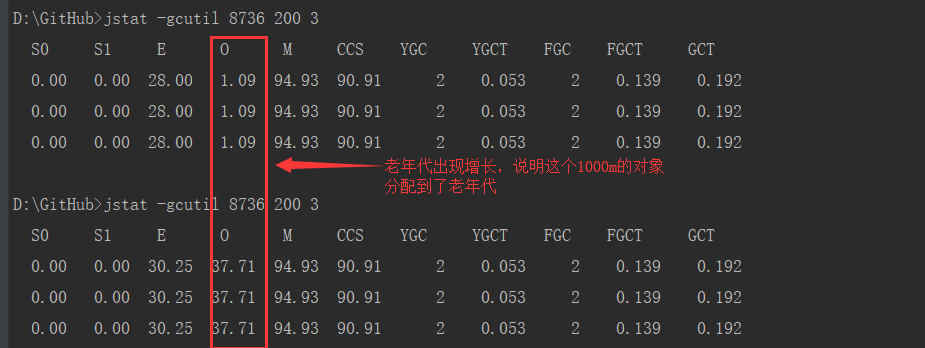

问题1：对于 IndexController 中的 allocationMem 中的局部变量 mem 引入的对象是否在该方法执行完毕之后就被垃圾回收呢？  
回答：首先idea安装VisualVM Launcher的java性能分析插件，具体配置步骤请参考
[IDEA Java性能分析插件VisualVM Launcher 配置](https://blog.csdn.net/wngpenghao/article/details/82884874)  
idea安装完成后，idea中会出现如下的两个按钮：   
    
然后启动程序，注意点击上面那个红色底纹的启动按钮，随着程序的启动，Java VisualVM 也随之开启。   
    
然后打开idea的终端，使用jps查看启动的jvm的进程号，或者在 Java VisualVM 也能看到进程号，用 jstat 查看内存布局，输入命令    
jstat -gcutil 15264 200 3   
结果如下：  
 
然后访问swagger页面执行请求，如下：  
   
再次执行 jstat -gcutil 15264 200 3 命令，如下：  
  
不管是 YGC,FGC 都没有，minorGC 与 majorGC 并没有发生变化，只是 Eden 区的使用占比有所增加，
毕竟分配了 250M 内存，就是说并没有进行相应的垃圾回收，那么方法执行完成后并不是相关的对象被立即回收了，
查看 Java VisualVM 的监控平台，一直保持在这个水位。同时左边的 GC 也没有任何的反应。    

问题2：那怎样才会回收呢？  
回答：我再次分配了两个 250M 之后观察 Java VisualVM 内存曲线。如下：  
  
然后输入命令 jstat -gcutil 4340 200 3，执行结果如下：  
  
这时候当 Eden 区域达到一定的比例的时候，再次分配对象的时候，就发生了年轻代的垃圾回收，同时内存曲线也得到了下降。    
这个换算过程如下：  
  
由于初始化的堆内存为 4G，所以算出来的 Eden 区大概为 1092M 内存。  
加上应用启动 Spring 之类消耗的大约 20% 内存，所以分配 3 次 250M 内存就会导致 YGC。 

问题3：mem 引入的对象既然在方法执行完毕后不会回收，那什么时候回收呢？  
回答：对象都需要垃圾回收器发生 GC 时才能回收；不管这个对象是局部变量还是全局变量。  
通过刚才的实验也发现了，当 Eden 区空间不足时就会产生 YGC 并且才会回收掉我们创建的 mem 对象。  
但这里其实还有一个隐藏条件：那就是这个对象是局部变量。如果该对象是全局变量那依然不能被回收，
因为针对全局变量，有很多地方引用它，根据可达性分析法判定对象是不是垃圾对象，因为是全局变量，它是
可达的，所以全局变量不被被回收，不可达的对象在 GC 发生时就会被认为是需要回收的对象从而进行回收。  

问题4：为什么有些人会认为方法执行完毕后局部变量会被回收呢？ 
回答：其实方法执行完毕后回收的是栈帧，就是说方法执行完毕，栈帧出栈，调用方法的时候，栈帧入栈，由于
栈帧出栈，释放了资源，mem引用的对象由于栈帧出栈了，局部变量表中的mem就不存在了，mem引用的这个对象没有
任何地方引用它，但是任何地方没有引用它不代表该对象会被马上回收，只有`需要产生 GC 才会回收`。    

问题4：优先在 Eden 区分配对象吗？  
回答：其实从上面的例子中可以看出对象是优先分配在新生代中 Eden 区的，但有个前提就是对象不能太大。  
    
问题5：大对象直接进入老年代吗？  
回答; 而大对象则是直接分配到老年代中（至于多大算大，可以通过参数配置）。  
  
然后执行jstat -gcutil 8736 200 3命令，如下：  
  
可以看到 Eden 区几乎没有变动，但是老年代却涨了 37% ，
根据之前计算的老年代内存 2730M 算出来也差不多是 1000M 的内存。  

 

 

       
       
        
       
       