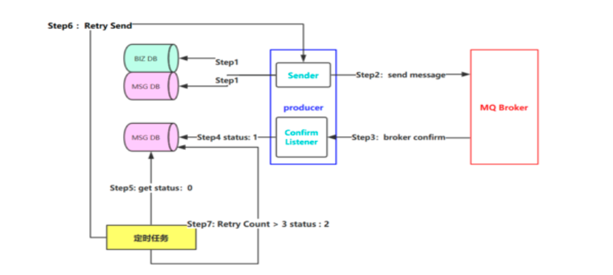

# 实现消息的可靠性投递
怎么保证核心的业务的消息不丢失，，接下来我们看一个可靠性投递的流程图，说明可靠性投递的概念：  

    

Step 1： 首先把消息信息(业务数据）存储到数据库中，紧接着，我们再把这个消息记录也存储到一张消息记录表里（或者另外一个同源数据库的消息记录表）。  
Step 2：发送消息到MQ Broker节点（采用confirm方式发送，会有异步的返回结果）。  
Step 3、4：生产者端接受MQ Broker节点返回的Confirm确认消息结果，然后进行更新消息记录表里的消息状态。比如默认Status = 0 当收到消息确认成功后，更新为1即可。  
Step 5：但是在消息确认这个过程中可能由于网络闪断、MQ Broker端异常等原因导致 回送消息失败或者异常。这个时候就需要发送方（生产者）对消息进行可靠性投递了，保障消息不丢失，100%的投递成功！（有一种极限情况是闪断，Broker返回的成功确认消息，但是生产端由于网络闪断没收到，这个时候重新投递可能会造成消息重复，需要消费端去做幂等处理）所以我们需要有一个定时任务，（比如每5分钟拉取一下处于中间状态的消息，当然这个消息可以设置一个超时时间，比如超过1分钟 Status = 0 ，也就说明了1分钟这个时间窗口内，我们的消息没有被确认，那么会被定时任务拉取出来）。  
Step 6：接下来我们把中间状态的消息进行重新投递 retry send，继续发送消息到MQ ，当然也可能有多种原因导致发送失败。  
Step 7：我们可以采用设置最大努力尝试次数，比如投递了3次，还是失败，那么我们可以将最终状态设置为Status = 2 ，最后 交由人工解决处理此类问题（或者把消息转储到失败表中）。  

