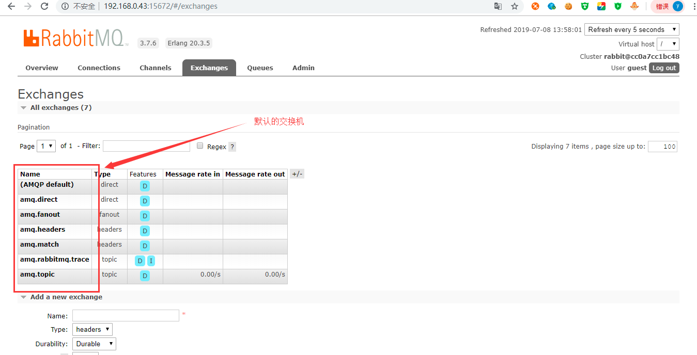
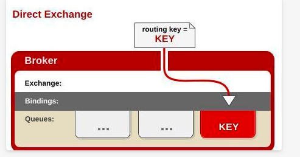
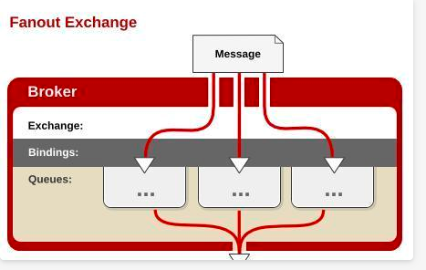
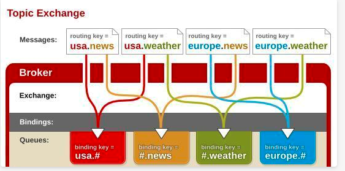
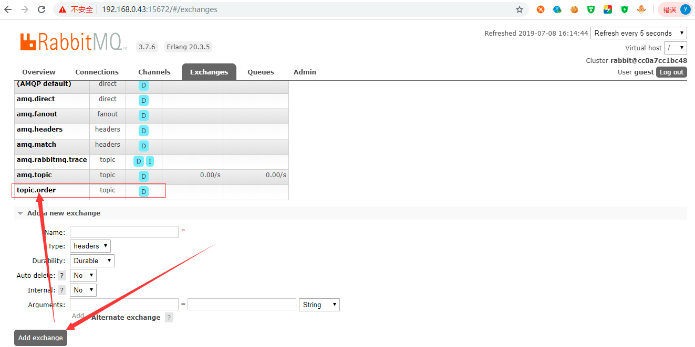
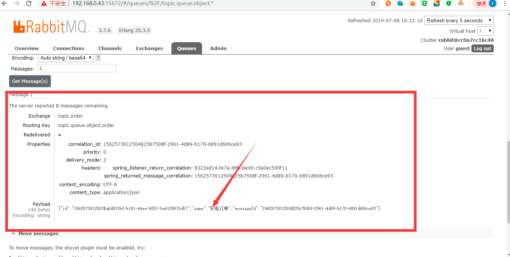
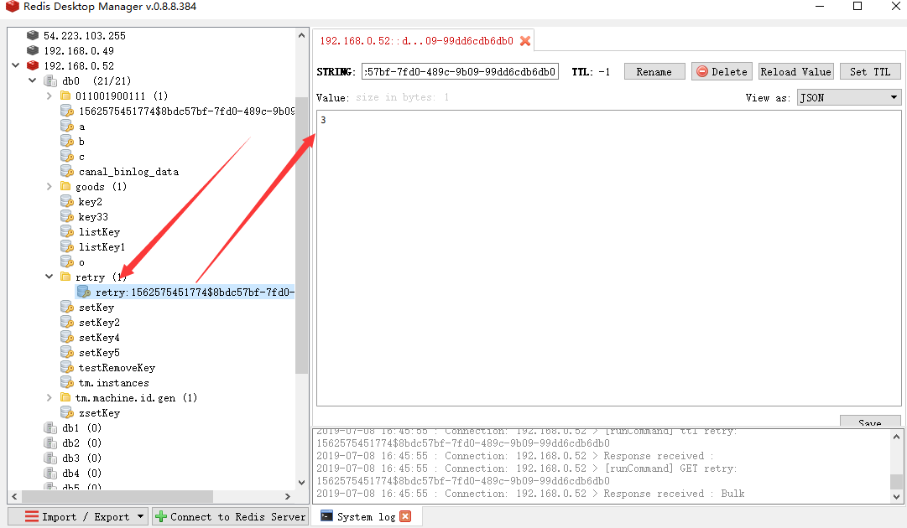
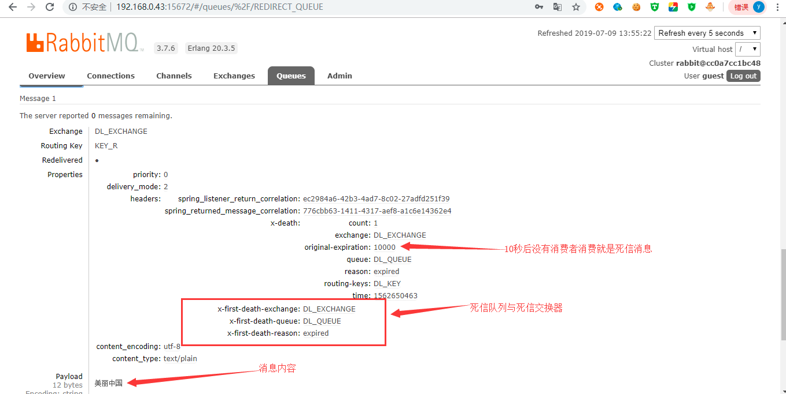

# 实现生产端到mq的消息可靠性投递
怎么保证核心的业务的消息不丢失，，接下来我们看一个可靠性投递的流程图，说明可靠性投递的概念：  

    

Step 1： 首先把消息信息(业务数据）存储到数据库中，紧接着，我们再把这个消息记录也存储到一张消息记录表里（或者另外一个同源数据库的消息记录表）。  
Step 2：发送消息到MQ Broker节点（采用confirm方式发送，会有异步的返回结果）。  
Step 3、4：生产者端接受MQ Broker节点返回的Confirm确认消息结果，然后进行更新消息记录表里的消息状态。比如默认Status = 0 当收到消息确认成功后，更新为1即可。  
Step 5：但是在消息确认这个过程中可能由于网络闪断、MQ Broker端异常等原因导致 回送消息失败或者异常。这个时候就需要发送方（生产者）对消息进行可靠性投递了，保障消息不丢失，100%的投递成功！（有一种极限情况是闪断，Broker返回的成功确认消息，但是生产端由于网络闪断没收到，这个时候重新投递可能会造成消息重复，需要消费端去做幂等处理）所以我们需要有一个定时任务，（比如每5分钟拉取一下处于中间状态的消息，当然这个消息可以设置一个超时时间，比如超过1分钟 Status = 0 ，也就说明了1分钟这个时间窗口内，我们的消息没有被确认，那么会被定时任务拉取出来）。  
Step 6：接下来我们把中间状态的消息进行重新投递 retry send，继续发送消息到MQ ，当然也可能有多种原因导致发送失败。  
Step 7：我们可以采用设置最大努力尝试次数，比如投递了3次，还是失败，那么我们可以将最终状态设置为Status = 2 ，最后 交由人工解决处理此类问题（或者把消息转储到失败表中）。  

上面的是生产端到mq的消息不丢失的实现机制，等一会我进行步骤说明，下面我说一下rabbitmq的四种交换机。  

# rabbitmq的交换机类型

在RabbitMQ中，生产者不是直接将消息发送给消费者，生产者根本不知道这个消息要传递给哪些队列，实际上，
生产者只是将消息发送到交换机。交换机收到消息后，根据交换机的类型和配置来处理消息，有如下几种情况：  
将消息传送到特定的队列  
有可能发送到多个队列中  
也有可能丢弃消息  
RabbitMQ各个组件的功能重新归纳一下：  
生产者：发送消息  
交换机：将收到的消息根据路由规则路由到特定队列  
队列：用于存储消息  
消费者：收到消息并消费  
rabbitMq定义了一些交换机，如下所示：  

    

还有一类特殊的交换机：Dead Letter Exchange（死信交换机）  

## Direct exchange（直连交换机）
直连型交换机（direct exchange）是根据消息携带的路由键（routing key）将消息投递给对应队列，步骤如下：  
1、将一个队列绑定到某个交换机上，同时赋予绑定的一个路由键（routing key）。  
2、当一个携带着路由值为R的消息被发送给直连交换机时，交换机会把它路由给绑定值同样为R的队列，而且该消息携带的
路由key与一个队列和交换机绑定的路由键完全匹配，即这是一个完整的匹配。
如果一个队列绑定到该交换机上要求路由键 “abc”，则只有被标记为“abc”的消息才被转发，不会转发abc.def，也不会转发dog.ghi，只会转发abc。  

    

## Fanout exchange（扇型交换机）
扇型交换机（funout exchange）将消息路由给绑定到该扇型交换机自己的所有队列。不同于直连交换机，
路由键在此类型上不启任何作用。如果N个队列绑定到某个扇型交换机上，当有消息发送给此扇型交换机时，
交换机会将消息发送给该扇型交换机绑定的N个队列。  

也就是说不处理路由键。你只需要简单的将队列绑定到交换机上。一个发送到交换机的消息都会被转发到与该交换机绑定的所有队列上。
很像子网广播，每台子网内的主机都获得了一份复制的消息。Fanout交换机转发消息是最快的。  
 
   
 
## Topic exchange（主题交换机）
主题交换机（topic exchanges）中，队列通过路由键绑定到交换机上，然后，交换机根据消息里的路由值，将消息路由给一个或多个绑定队列。 
扇型交换机和主题交换机异同：  
对于扇型交换机路由键是没有意义的，只要有消息，它都发送到它绑定的所有队列上  
对于主题交换机，路由规则由路由键决定，只有满足路由键的规则，消息才可以路由到对应的队列上  
将路由键和某模式进行匹配。此时队列需要绑定要一个模式上。符号“#”匹配一个或多个词，符号“”匹配不多不少一个词。因此“abc.#”能够匹配到“abc.def.ghi”，但是“abc.” 只会匹配到“abc.def”。   

   

## Headers exchange（头交换机）
类似主题交换机，但是头交换机使用多个消息属性来代替路由键建立路由规则，就是根据发送的消息内容中的headers属性进行匹配。
在绑定Queue与Exchange时指定一组键值对；当消息发送到RabbitMQ时会取到该消息的headers与Exchange绑定时指定的键值对进行匹配；
如果完全匹配则消息会路由到该队列，否则不会路由到该队列。headers属性是一个键值对，可以是Hashtable，
键值对的值可以是任何类型。而fanout，direct，topic 的路由键都需要要字符串形式的。
通过判断消息头的值能否与指定的绑定相匹配来确立路由规则。   
此交换机有个重要参数：”x-match”  
当”x-match”为“any”时，消息头的任意一个值被匹配就可以满足条件，即表示只要有键值对匹配就能接受到消息。  
当”x-match”设置为“all”的时候，就需要消息头的所有值都匹配成功，即表示所有的键值对都匹配才能接受到消息。  

## 默认定义的交换机（default exchange）
默认交换机（default exchange）实际上是一个由RabbitMQ预先声明好的名字为空字符串的直连交换机（direct exchange）。
它有一个特殊的属性使得它对于简单应用特别有用处：那就是每个新建队列（queue）都会自动绑定到默认交换机上，绑定的路由键（routing key）名称与队列名称相同。
如：当你声明了一个名为”hello”的队列，RabbitMQ会自动将其绑定到默认交换机上，绑定（binding）的路由键名称也是为”hello”。因此，
当携带名为”hello”的路由键的消息被发送到默认交换机的时候，此消息会被默认交换机路由至名为”hello”的队列中。
即默认交换机看起来貌似能够直接将消息投递给队列。  

## 类似amq.*的名称的交换机
这些是RabbitMQ默认创建的交换机。这些队列名称被预留做RabbitMQ内部使用，不能被应用使用，否则抛出403 (ACCESS_REFUSED)错误。  

## Dead Letter Exchange（死信交换机）
在默认情况，如果消息在投递到交换机时，交换机发现此消息没有匹配的队列，则这个消息将被悄悄丢弃。
为了解决这个问题，RabbitMQ中有一种交换机叫死信交换机。当消费者不能处理接收到的消息时，
将这个消息重新发布到另外一个队列中，等待重试或者人工干预。
这个过程中的exchange和queue就是所谓的”Dead Letter Exchange 和 Queue”。  

# 交换机的属性
除交换机类型外，在声明交换机时还可以附带许多其他的属性，其中最重要的几个分别是：
Name：交换机名称  
Durability：是否持久化。如果持久化了，则RabbitMQ重启后，交换机还存在  
Auto-delete：当所有与之绑定的消息队列都完成了对此交换机的使用后，删掉它  
Arguments：扩展参数  

上面说了一下交换机的类型和属性，下面来具体说说生产者到mq的消息不丢失的实现策略。 
之前说了一种通过数据库中持久化消息记录，并且使用定时任务进行重发确保消息不丢失的
实现策略。其实我们还可以通过redis实现，使用redis实现要确保redis的HA。  
下面我们结合这两种进行实现生产者到mq的消息不丢失的策略。  

# 确保生产者到mq的消息不丢失的代码实现步骤

## 添加依赖

```
  <dependency>
            <groupId>org.springframework.boot</groupId>
            <artifactId>spring-boot-starter-amqp</artifactId>
  </dependency>
```
## 修改配置文件
添加rabbitmq的配置，如下：  

```
spring:
  profiles:
    active: dev
  application:
     name: fukun-message-queue-rabbitmq-producer
  rabbitmq:
     addresses: 192.168.0.43:5672
     host: 192.168.0.43
     port: 5672
     username: guest
     password: guest
     virtual-host: /
     connection-timeout: 15000
     #消息发送到交换机确认机制,是否确认回调
     publisher-confirms: true
     #消息发送到交换机确认机制,是否返回回馈
     publisher-returns: true
```

## 添加 rabbitmq 相关的配置类 

```
package com.fukun.rabbitmq.config.rabbitmq;

import com.fukun.rabbitmq.constant.Constants;
import com.fukun.rabbitmq.producer.MsgSendConfirmCallBack;
import com.fukun.rabbitmq.producer.MsgSendReturnCallback;
import lombok.extern.slf4j.Slf4j;
import org.springframework.amqp.core.*;
import org.springframework.amqp.rabbit.connection.ConnectionFactory;
import org.springframework.amqp.rabbit.core.RabbitTemplate;
import org.springframework.amqp.support.converter.MessageConversionException;
import org.springframework.amqp.support.converter.MessageConverter;
import org.springframework.amqp.support.converter.SimpleMessageConverter;
import org.springframework.beans.factory.config.ConfigurableBeanFactory;
import org.springframework.context.annotation.Bean;
import org.springframework.context.annotation.Configuration;
import org.springframework.context.annotation.Scope;

import javax.annotation.Resource;

/**
 * rabbitmq 配置类
 *
 * @author tangyifei
 * @date 2019年7月5日14:05:26
 */
@Configuration
@Slf4j
public class RabbitMqConfiguration {

    @Resource
    private ConnectionFactory connectionFactory;

    @Bean
    public MessageConverter messageConverter() {
        return new SimpleMessageConverter() {
            @Override
            protected Message createMessage(Object object, MessageProperties messageProperties) throws MessageConversionException {
                Message message = super.createMessage(object, messageProperties);
                if (log.isInfoEnabled()) {
                    log.info("使用自定义的MessageConvert转换消息");
                }
                return message;
            }
        };
    }

    /**
     * 如果想将消息进行持久化，只需要将交换机和队列持久化就可以了
     * 1. 设置交换机类型
     * 2. 将队列绑定到交换机
     * FanoutExchange: 将消息分发到所有的绑定队列，无routingkey的概念
     * HeadersExchange ：通过添加属性key-value匹配
     * DirectExchange:按照routingkey分发到指定队列
     * TopicExchange:多关键字匹配
     */
    @Bean
    TopicExchange topicExchange() {
        return new TopicExchange(Constants.TOPIC_EXCHANGE_NAME);
    }

    /**
     * 如果想将消息进行持久化，只需要将交换机和队列持久化就可以了
     * 当我们在创建队列时指定durable = true，当服务重启的时候这个队列将会存活。也就是说队列被持久化了。
     * 同样的，交换机的durable也和队列同理
     * durable="true" 持久化消息队列 ， rabbitmq重启的时候不需要创建新的队列
     * auto-delete 表示消息队列没有在使用时将被自动删除 默认是false
     * exclusive  表示该消息队列是否只在当前connection生效,默认是false
     */
    @Bean
    public Queue topicBasicQueue() {
//        Map<String, Object> arguments = new HashMap<>();
//        arguments.put("x-message-ttl", 60000);//60秒自动删除
//        return new Queue(QUEUE_NAME3,true,false,true,arguments);
        // 队列持久化
        return new Queue(Constants.TOPIC_QUEUE_NAME_BASIC, true);
    }

    @Bean
    public Queue topicObjectQueue() {
        // 队列持久化
        return new Queue(Constants.TOPIC_QUEUE_NAME_OBJECT, true);
    }

    @Bean
    public Binding topicBasicBinding() {
        return BindingBuilder.bind(topicBasicQueue()).to(topicExchange()).with(Constants.TOPIC_ROUTING_KEY_BASIC);
    }

    @Bean
    public Binding topicObjectBinding() {
        return BindingBuilder.bind(topicObjectQueue()).to(topicExchange()).with(Constants.TOPIC_ROUTING_KEY_OBJECT);
    }

    /**
     * 定义rabbit template用于数据的接收和发送,可以设置消息确认机制和回调:
     * 在生产者需要消息发送后的回调，需要对rabbitTemplate设置ConfirmCallback对象，
     * 由于不同的生产者需要对应不同的ConfirmCallback，如果rabbitTemplate设置为单例bean，则所有的rabbitTemplate
     * 实际的ConfirmCallback为最后一次申明的ConfirmCallback。
     * 通过使用RabbitTemplate来对开发者提供API操作, 因为要设置回调类，所以应是prototype类型，
     * 如果是singleton类型，则回调类为最后一次设置
     *
     * @return
     */
    @Bean
    @Scope(ConfigurableBeanFactory.SCOPE_PROTOTYPE)
    public RabbitTemplate rabbitTemplate() {
        if (log.isInfoEnabled()) {
            log.info("加载rabbit模板类开始！");
        }
        RabbitTemplate template = new RabbitTemplate(connectionFactory);
        // 可以自定义消息转换器  默认使用的JDK的，所以消息对象需要实现Serializable
        template.setMessageConverter(messageConverter());
        // template.setMessageConverter(new Jackson2JsonMessageConverter());

        // 若使用confirm-callback或return-callback，
        // 必须要配置publisherConfirms或publisherReturns为true
        // 每个rabbitTemplate只能有一个confirm-callback和return-callback
        template.setConfirmCallback(msgSendConfirmCallBack());

        // 使用return-callback时必须设置mandatory为true，或者在配置中设置mandatory-expression的值为true，
        // 可针对每次请求的消息去确定’mandatory’的boolean值，
        // 只能在提供’return -callback’时使用，与mandatory互斥
        template.setReturnCallback(msgSendReturnCallback());
        template.setMandatory(true);
        if (log.isInfoEnabled()) {
            log.info("加载rabbit模板类结束！");
        }
        return template;
    }

    /**
     * 关于 msgSendConfirmCallBack 和 msgSendReturnCallback 的回调说明：
     * 如果消息没有到exchange,则confirm回调,ack=false
     * 如果消息到达exchange,则confirm回调,ack=true
     * exchange到queue成功,则不回调return
     * exchange到queue失败,则回调return(需设置mandatory=true,否则不回调,消息就丢了)
     * <p>
     * 消息确认机制:
     * Confirms给客户端一种轻量级的方式，能够跟踪哪些消息被broker处理，
     * 哪些可能因为broker宕掉或者网络失败的情况而重新发布。
     * 确认并且保证消息被送达，提供了两种方式：发布确认和事务。(两者不可同时使用)
     * 在channel为事务时，不可引入确认模式；同样channel为确认模式下，不可使用事务。
     *
     * @return
     */
    @Bean
    public MsgSendConfirmCallBack msgSendConfirmCallBack() {
        return new MsgSendConfirmCallBack();
    }

    @Bean
    public MsgSendReturnCallback msgSendReturnCallback() {
        return new MsgSendReturnCallback();
    }

}
```
注意针对使用的交换机的名字，如上的 Constants.TOPIC_EXCHANGE_NAME 最好不要使用rabbitmq内置的
几种交换机的名字，比如amq.topic之类的，可以使用topic.order类似的名字。  

如果你不仅使用了基于redis的实现，而且也使用了我上面的基于持久化消息记录的机制去实现，那么你需要
添加定时相关的配置类。

### 添加相关的线程池配置
注意不要显示的创建线程，应该使用线程池去创建线程。  

```
package com.fukun.rabbitmq.config.threadpool;

import com.google.common.util.concurrent.ThreadFactoryBuilder;
import lombok.Getter;
import lombok.Setter;
import org.apache.commons.lang3.concurrent.BasicThreadFactory;
import org.springframework.boot.autoconfigure.AutoConfigureAfter;
import org.springframework.boot.context.properties.ConfigurationProperties;
import org.springframework.boot.context.properties.EnableConfigurationProperties;
import org.springframework.context.annotation.Bean;
import org.springframework.context.annotation.Configuration;

import javax.annotation.Resource;
import java.util.concurrent.*;

/**
 * 线程池配置
 *
 * @author tangyifei
 * @since 2019年7月3日11:23:33
 */
@Configuration
@EnableConfigurationProperties(TreadPoolConfig.TreadPoolProperties.class)
@AutoConfigureAfter(TreadPoolConfig.TreadPoolProperties.class)
public class TreadPoolConfig {

    @Resource
    private TreadPoolProperties treadPoolProperties;

    /**
     * 消费队列线程
     *
     * @return 线程池对象
     */
    @Bean(value = "consumerQueueThreadPool")
    public ExecutorService buildConsumerQueueThreadPool() {
        ThreadFactory namedThreadFactory = new ThreadFactoryBuilder()
                .setNameFormat("consumer-queue-thread-%d").build();

        ExecutorService pool = new ThreadPoolExecutor(treadPoolProperties.getCoreSize(), treadPoolProperties.getMaxSize(), treadPoolProperties.getActiveTime(), TimeUnit.MILLISECONDS,
                new ArrayBlockingQueue(treadPoolProperties.getBlockQueueSize()), namedThreadFactory, new ThreadPoolExecutor.AbortPolicy());

        return pool;
    }

    /**
     * 调度线程池的配置
     *
     * @return 线程池对象
     */
    @Bean(value = "scheduleThreadPool", destroyMethod = "shutdown")
    public ExecutorService scheduleThreadPool() {
        ThreadFactory namedThreadFactory = new BasicThreadFactory.Builder().namingPattern("schedule-thread-%d").daemon(true)
                .build();

        ScheduledExecutorService executorService = new ScheduledThreadPoolExecutor(treadPoolProperties.getCoreSize(), namedThreadFactory);
        return executorService;
    }

    /**
     * 读取线程池相关的属性的类
     *
     * @author tangyifei
     * @since 2019年7月3日11:33:11
     */
    @ConfigurationProperties(prefix = "thread.pool")
    @Getter
    @Setter
    class TreadPoolProperties {
        private Integer coreSize;
        private Integer maxSize;
        private Long activeTime;
        private Integer blockQueueSize;
    }

}

```
### 添加调度任务配置类

```
package com.fukun.rabbitmq.config.scheduler;

import com.fukun.rabbitmq.config.threadpool.TreadPoolConfig;
import org.springframework.boot.autoconfigure.AutoConfigureAfter;
import org.springframework.context.annotation.Bean;
import org.springframework.context.annotation.Configuration;
import org.springframework.scheduling.annotation.EnableScheduling;
import org.springframework.scheduling.annotation.SchedulingConfigurer;
import org.springframework.scheduling.config.ScheduledTaskRegistrar;

import javax.annotation.Resource;
import java.util.concurrent.Executor;
import java.util.concurrent.ExecutorService;
import java.util.concurrent.Executors;

/**
 * 定时任务配置类
 *
 * @author tangyifei
 * @date 2019年7月5日16:09:53
 */
@Configuration
@EnableScheduling
@AutoConfigureAfter(TreadPoolConfig.class)
public class TaskSchedulerConfig implements SchedulingConfigurer {

    @Resource(name = "scheduleThreadPool")
    private ExecutorService scheduleThreadPool;

    @Override
    public void configureTasks(ScheduledTaskRegistrar taskRegistrar) {
        taskRegistrar.setScheduler(scheduleThreadPool);
    }

//    @Bean(destroyMethod = "shutdown")
//    public Executor taskScheduler() {
//        return Executors.newScheduledThreadPool(100);
//    }
}

```
上面的相关的属性在application.yml中，如下：  

``` 
### ThreadPoolConfig
thread:
   pool:
     core-size: 5
     max-size: 5
     active-time: 0
     block-queue-size: 5
```
上面的参数可以根据自己的业务情况进行调节。   

### 添加实现定时业务逻辑的类
这个定时逻辑就是实现消息的重发机制。  

```
package com.fukun.rabbitmq.task;

import com.alibaba.fastjson.JSON;
import com.fukun.commons.util.CollectionUtil;
import com.fukun.rabbitmq.constant.Constants;
import com.fukun.rabbitmq.mapper.BrokerMessageLogMapper;
import com.fukun.rabbitmq.model.BrokerMessageLog;
import com.fukun.rabbitmq.model.Order;
import com.fukun.rabbitmq.service.OrderService;
import lombok.extern.slf4j.Slf4j;
import org.springframework.scheduling.annotation.Scheduled;
import org.springframework.stereotype.Component;

import javax.annotation.Resource;
import java.util.Date;
import java.util.List;

import static com.fukun.rabbitmq.constant.Constants.MAX_TRY_COUNT;

/**
 * 消息重试，最大努力尝试策略（定时任务）
 *
 * @author tangyifei
 * @date 2019年7月5日17:09:23
 */
@Component
@Slf4j
public class RetryMessageTasker {

    @Resource
    private OrderService orderService;

    @Resource
    private BrokerMessageLogMapper brokerMessageLogMapper;

    @Scheduled(initialDelay = 5000, fixedDelay = 10000)
    public void reSend() {
        if (log.isInfoEnabled()) {
            log.info("定时重发开始！");
        }
        // 获取数据库中状态为发送中并且超时的消息列表
        List<BrokerMessageLog> list = brokerMessageLogMapper.query4StatusAndTimeoutMessage();
        if (CollectionUtil.isNotEmpty(list)) {
            list.forEach(messageLog -> {
                if (log.isInfoEnabled()) {
                    log.info("重发次数：{}", messageLog.getTryCount());
                }
                // 如果重试次数大于等于3次，就表示该消息彻底的发送失败了
                if (messageLog.getTryCount() >= MAX_TRY_COUNT) {
                    // 更新消息的状态为发送失败
                    brokerMessageLogMapper.changeBrokerMessageLogStatus(messageLog.getMessageId(), Constants.ORDER_SEND_FAILURE, new Date());
                } else {
                    // 更新消息的重发次数与更新时间
                    brokerMessageLogMapper.update4ReSend(messageLog.getMessageId(), new Date());
                    Order reSendOrder = JSON.parseObject(messageLog.getMessage(), Order.class);
                    try {
                        orderService.sendOrderMessage(reSendOrder);
                    } catch (Exception e) {
                        e.printStackTrace();
                        if (log.isInfoEnabled()) {
                            log.error("-----------异常处理-----------");
                        }
                    }
                }
            });
        }
    }
}

```
## 初始化 rabbitmq 引擎模板
由于之前的 rabbitmq 的相关配置类已经把 rabbitTemplate 放到 spring 容器中了，那么需要在
spring boot 容器启动并加载完后初始化这个 rabbitTemplate 引擎模板。如果直接使用 @Resource 
注解去注入 rabbitTemplate 引擎模板，可能注入不进去。如下：  

```
package com.fukun.rabbitmq.initial;

import com.fukun.rabbitmq.producer.BaseCallBack;
import lombok.extern.slf4j.Slf4j;
import org.springframework.amqp.rabbit.core.RabbitTemplate;
import org.springframework.context.ApplicationListener;
import org.springframework.context.event.ContextRefreshedEvent;

/**
 * spring boot容器启动并加载完后，开一些线程或者一些程序来干某些事情
 * 相关博客请查看 https://www.jianshu.com/p/01f7a971a4b9
 *
 * @author tangyifei
 * @date 2019年7月6日14:07:10
 */
@Slf4j
public class ApplicationStartup implements ApplicationListener<ContextRefreshedEvent> {

    @Override
    public void onApplicationEvent(ContextRefreshedEvent contextRefreshedEvent) {
        //在容器加载完毕后获取配置文件中的配置，注意这里不能使用@Resource注解获取RabbitTemplate的这个bean，可能会报空指针
        RabbitTemplate rabbitTemplate = contextRefreshedEvent.getApplicationContext().getBean(RabbitTemplate.class);
        if (null != rabbitTemplate) {
            if (log.isInfoEnabled()) {
                log.info("rabbitMq模板类：{}", rabbitTemplate.toString());
            }
        } else {
            if (log.isInfoEnabled()) {
                log.info("rabbitMq模板类没有初始化成功！");
            }
        }
        BaseCallBack.rabbitTemplate = rabbitTemplate;
    }
}

```
## 增加消息确认机制回调基类
这个类必须实现 RabbitTemplate.ConfirmCallback, RabbitTemplate.ReturnCallback 这两个接口的方法。代码如下：  

```
package com.fukun.rabbitmq.producer;

import com.fukun.rabbitmq.config.redis.RedisHandler;
import org.springframework.amqp.core.Message;
import org.springframework.amqp.rabbit.connection.CorrelationData;
import org.springframework.amqp.rabbit.core.RabbitTemplate;

import javax.annotation.Resource;

/**
 * 消息确认机制回调，确保生产者到mq的消息不丢失
 *
 * @author tangyifei
 * @date 2019年7月6日13:44:47
 */
public class BaseCallBack implements RabbitTemplate.ConfirmCallback, RabbitTemplate.ReturnCallback {

    /**
     * 自动注入RabbitTemplate模板类
     */
    public static RabbitTemplate rabbitTemplate;

    /**
     * 自动注入redis操作相关的bean
     */
    @Resource
    protected RedisHandler redisHandler;

    @Override
    public void confirm(CorrelationData correlationData, boolean ack, String cause) {

    }

    @Override
    public void returnedMessage(Message message, int replyCode, String replyText, String exchange, String routingKey) {

    }
}
```

## 定义实现消息确认机制回调基类的子类
如果不设置最大重试次数，则失败会进行不断的重发；
如果设置最大的重试次数，当达到了最大重试次数，就彻底发送失败了，这时可以
通过人工干预等措施去解决。  
第一种：生产者到交换机的消息确认回调，消息发送失败，会进行相关的重发策略，消息发送成功，修改消息记录的消息状态为成功，如果有基于
redis的实现，那么需要清除 redis 中保存的相关的消息id与message的绑定关系和相关消息的重发次数。  

```
package com.fukun.rabbitmq.producer;

import com.fukun.rabbitmq.constant.Constants;
import com.fukun.rabbitmq.mapper.BrokerMessageLogMapper;
import lombok.extern.slf4j.Slf4j;
import org.springframework.amqp.core.Message;
import org.springframework.amqp.rabbit.connection.CorrelationData;

import javax.annotation.Resource;
import java.util.Date;

import static com.fukun.rabbitmq.constant.Constants.MAX_TRY_COUNT;
import static com.fukun.rabbitmq.constant.Constants.MAX_TRY_COUNT_PREFIX_KEY;

/**
 * 消息发送到交换机确认机制
 * 如果设置了消息持久化，那么ack=true是在消息持久化完成后，就是存到硬盘上之后再发送的，
 * 确保消息已经存在硬盘上，万一消息服务挂了，消息服务恢复是能够再重发消息
 * 消息服务收到消息后，消息会处于"UNACK"的状态，直到客户端确认消息
 * 注意：一旦返回的确认消息丢失，那么消息服务会重发消息；如果你设置了autoAck= false，
 * 但又没应答 channel.baskAck，也没有应答 channel.baskNack，那么会导致非常严重的错误：
 * 消息队列会被堵塞住，可参考http://blog.sina.com.cn/s/blog_48d4cf2d0102w53t.html 所以，无论如何都必须应答
 *
 * @author tangyifei
 * @date 2019年7月6日11:53:58
 */
@Slf4j
public class MsgSendConfirmCallBack extends BaseCallBack {

    @Resource
    private BrokerMessageLogMapper brokerMessageLogMapper;

    /**
     * 当消息发送到交换机（exchange）时，该方法被调用.
     * 1.如果消息没有到exchange,则 ack=false
     * 2.如果消息到达exchange,则 ack=true
     *
     * @param correlationData 确认消息对比数据对象
     * @param ack             消息确认标志
     * @param cause           异常信息
     */
    @Override
    public void confirm(CorrelationData correlationData, boolean ack, String cause) {
        if (log.isInfoEnabled()) {
            log.info("消息的id（回调id）：{}", correlationData.getId());
        }
        if (ack) {
            if (log.isInfoEnabled()) {
                log.info("消息发送确认成功（消息发送到exchange成功）！");
            }
            brokerMessageLogMapper.changeBrokerMessageLogStatus(correlationData.getId(), Constants.ORDER_SEND_SUCCESS, new Date());
            try {
                // 如果消息发送到交换机成功，那么就清除缓存中的msgId 与 Message 的对应关系数据
                redisHandler.del(correlationData.getId());
                redisHandler.del(MAX_TRY_COUNT_PREFIX_KEY + correlationData.getId());
            } catch (Exception e) {
                if (log.isInfoEnabled()) {
                    log.error("缓存错误；{}", e);
                }
            }
        } else {
            // 如果消息发送到交换机失败，进行相关的重发机制（定时重发等机制）
            if (log.isInfoEnabled()) {
                log.error("消息发送确认失败（消息发送到exchange失败）：{}", cause);
            }
            int retryCount = (int) redisHandler.get(MAX_TRY_COUNT_PREFIX_KEY + correlationData.getId());
            if (log.isInfoEnabled()) {
                log.error("消息的重试次数：{}", retryCount);
            }
            // 如果重试次数大于小于3次，重新发送
            if (retryCount < MAX_TRY_COUNT) {
                // 增加重试次数
                redisHandler.incr(MAX_TRY_COUNT_PREFIX_KEY + correlationData.getId(), 1);
                Object cacheKey = null;
                try {
                    cacheKey = redisHandler.get(correlationData.getId());
                } catch (Exception e) {
                    if (log.isInfoEnabled()) {
                        log.error("缓存错误；{}", e);
                    }
                }
                if (null != cacheKey) {
                    Message message = (Message) cacheKey;
                    // 重新发送消息
                    rabbitTemplate.convertAndSend(Constants.TOPIC_EXCHANGE_NAME, Constants.OBJECT_ROUTING_KEY,
                            message, correlationData);
                }
            }
        }
    }

}
```
第二种： 交换机到队列的消息确认回调，exchange到queue成功,则不回调return，
exchange 到 queue 失败,则回调return(需设置mandatory=true,否则不回调,消息就丢了)。 

```
package com.fukun.rabbitmq.producer;

import com.fukun.rabbitmq.constant.Constants;
import lombok.extern.slf4j.Slf4j;
import org.springframework.amqp.core.Message;

/**
 * exchange到queue成功,则不回调return
 * exchange到queue失败,则回调return(需设置mandatory=true,否则不回调,消息就丢了)
 *
 * @author tangyifei
 * @date 2019年7月6日13:52:49
 */
@Slf4j
public class MsgSendReturnCallback extends BaseCallBack {

    /**
     * 当消息从交换机到队列失败时，该方法被调用。（若成功，则不调用）
     * confirmcallback用来确认消息是否有送达消息队列的判定标志
     * 如果消息没有到exchange,则confirm回调,ack=false 如果消息到达exchange,则confirm回调,ack=true 但如果是找不到exchange，则会先触发returncallback
     * 需要注意的是：该方法调用后，MsgSendConfirmCallBack中的confirm方法也会被调用，且ack = true
     *
     * @param message    消息实体
     * @param replyCode  回复状态码
     * @param replyText  回复文本
     * @param exchange   交换机
     * @param routingKey 路由KEY
     */
    @Override
    public void returnedMessage(Message message, int replyCode, String replyText, String exchange, String routingKey) {
        if (log.isInfoEnabled()) {
            log.info("MsgSendReturnCallback [消息从交换机到队列失败]  message：{}", message);
            log.info("send message failed: replyCode：{}，replyText：{}", replyCode, replyText);
        }
        // 重新发送消息，可以使用定时机制重发消息等
        rabbitTemplate.convertAndSend(Constants.TOPIC_EXCHANGE_NAME, Constants.OBJECT_ROUTING_KEY, message);
        // rabbitTemplate.send(message);
    }

}
``` 
## 添加订单逻辑
添加实现订单的业务逻辑，这里主要实现添加订单信息入库，添加消息记录入库，
将 msgId 与 Message 的关系保存起来,例如放到缓存中。然后redis中保存重试
次数，然后实现消息的发送。  

```
package com.fukun.rabbitmq.service;

import com.alibaba.fastjson.JSON;
import com.fukun.rabbitmq.constant.Constants;
import com.fukun.rabbitmq.mapper.BrokerMessageLogMapper;
import com.fukun.rabbitmq.mapper.OrderMapper;
import com.fukun.rabbitmq.model.BrokerMessageLog;
import com.fukun.rabbitmq.model.Order;
import com.fukun.rabbitmq.producer.BaseCallBack;
import com.google.gson.Gson;
import lombok.extern.slf4j.Slf4j;
import org.apache.commons.lang3.time.DateUtils;
import org.springframework.amqp.core.Message;
import org.springframework.amqp.core.MessageBuilder;
import org.springframework.amqp.core.MessageProperties;
import org.springframework.amqp.rabbit.connection.CorrelationData;
import org.springframework.stereotype.Service;
import org.springframework.transaction.annotation.Transactional;

import javax.annotation.Resource;
import java.util.Date;
import java.util.Map;
import java.util.UUID;

import static com.fukun.rabbitmq.constant.Constants.MAX_TRY_COUNT_PREFIX_KEY;

/**
 * 订单的业务逻辑
 *
 * @author tangyifei
 * @date 2019年7月5日16:34:21
 */
@Service
@Slf4j
public class OrderService extends BaseCallBack {

    @Resource
    private OrderMapper orderMapper;

    @Resource
    private BrokerMessageLogMapper brokerMessageLogMapper;

    /**
     * 创建订单
     *
     * @param order 订单实体
     */
    @Transactional(rollbackFor = Exception.class)
    public void createOrder(Order order) {
        String orderId = System.currentTimeMillis() + "$" + UUID.randomUUID().toString();
        String msgId = System.currentTimeMillis() + "$" + UUID.randomUUID().toString();
        // 使用当前时间当做订单创建时间（为了模拟一下简化）
        Date orderTime = new Date();
        order.setId(orderId);
        order.setMessageId(msgId);
        orderMapper.insert(order);
        // 插入消息记录表数据
        BrokerMessageLog brokerMessageLog = new BrokerMessageLog();
        // 消息唯一ID
        brokerMessageLog.setMessageId(msgId);
        // 保存消息整体 转为JSON 格式存储入库
        brokerMessageLog.setMessage(JSON.toJSONString(JSON.toJSON(order)));
        // 设置消息状态为0 表示发送中
        brokerMessageLog.setStatus("0");
        // 设置消息未确认超时时间窗口为一分钟
        brokerMessageLog.setNextRetry(DateUtils.addMinutes(orderTime, Constants.ORDER_TIMEOUT));
        brokerMessageLog.setCreateTime(new Date());
        brokerMessageLog.setUpdateTime(new Date());
        brokerMessageLogMapper.insert(brokerMessageLog);
        // 发送消息
        sendOrderMessage(order);
    }

    /**
     * 发送消息
     *
     * @param order 订单实体
     */
    public void sendOrderMessage(Order order) {
        String msgId = order.getMessageId();
        Gson gson = new Gson();
        String json = gson.toJson(order);
        // 构建Message ,主要是使用 msgId 将 message 和 CorrelationData 关联起来。
        // 这样当消息发送到交换机失败的时候，在 MsgSendConfirmCallBack 中就可以根据
        // correlationData.getId()即 msgId,知道具体是哪个message发送失败,进而进行处理。
        // 将 msgId和 message绑定
        Message message = MessageBuilder.withBody(json.getBytes()).setContentEncoding("UTF-8")
                .setContentType(MessageProperties.CONTENT_TYPE_JSON).setCorrelationId(msgId).build();
        // 将 msgId和 CorrelationData绑定
        CorrelationData correlationData = new CorrelationData(msgId);
        // 将 msgId 与 Message 的关系保存起来,例如放到缓存中.
        try {
            redisHandler.set(msgId, gson.fromJson(gson.toJson(message), Map.class));
            redisHandler.set(MAX_TRY_COUNT_PREFIX_KEY + msgId, 0);
        } catch (Exception e) {
            if (log.isInfoEnabled()) {
                log.error("缓存错误：{}", e);
            }
        }
        // 当 MsgSendReturnCallback回调时（消息从交换机到队列失败）,进行处理 {@code MsgSendReturnCallback}.
        // 当 MsgSendConfirmCallBack回调时,进行处理 {@code MsgSendConfirmCallBack}.
        // 定时检查这个绑定关系列表,如果发现一些已经超时(自己设定的超时时间)未被处理,则手动处理这些消息.
        // 发送消息
        // 指定消息交换机  "amq.topic"
        // 指定队列key    "direct.queue"
        rabbitTemplate.convertAndSend(Constants.TOPIC_EXCHANGE_NAME, Constants.OBJECT_ROUTING_KEY,
                message, correlationData);
        if (log.isInfoEnabled()) {
            log.info("订单相关的消息发送完成，消息的id是: {}，发送的经过编码的消息是：{}，等待mq发送确认消息。", msgId, message);
        }
    }
}

```
下面是控制层，如下： 
``` 
package com.fukun.rabbitmq.web;

import com.fukun.commons.web.annotations.ResponseResult;
import com.fukun.rabbitmq.constant.Constants;
import com.fukun.rabbitmq.model.Order;
import com.fukun.rabbitmq.producer.BaseCallBack;
import com.fukun.rabbitmq.service.OrderService;
import io.swagger.annotations.Api;
import io.swagger.annotations.ApiOperation;
import io.swagger.annotations.ApiParam;
import lombok.extern.slf4j.Slf4j;
import org.springframework.amqp.rabbit.connection.CorrelationData;
import org.springframework.web.bind.annotation.*;

import javax.annotation.Resource;
import java.util.UUID;

/**
 * 消息发送方
 *
 * @author tangyifei
 * @date 2019年7月6日14:36:38
 */
@ResponseResult
@RestController("RabbitMqController")
@RequestMapping("/producer")
@Slf4j
@Api(value = "fukun-message-queue-rabbitmq-producer", tags = {"fukun-message-queue-rabbitmq-producer"})
public class RabbitMqController extends BaseCallBack {

    @Resource
    private OrderService orderService;

    @ApiOperation(value = "测试消息", httpMethod = "POST", notes = "测试消息")
    @PostMapping("/text")
    public void callbak(@RequestParam("message") @ApiParam(required = true, name = "message", value = "消息") String message) {
        CorrelationData correlationData = new CorrelationData(UUID.randomUUID().toString());
        if (log.isInfoEnabled()) {
            log.info("消息的id：{}", correlationData.getId());
        }
        // 用RabbitMQ发送MQTT需将exchange配置为amq.topic
        rabbitTemplate.convertAndSend(Constants.TOPIC_EXCHANGE_NAME, Constants.BASIC_ROUTING_KEY, message, correlationData);
    }

    /**
     * 保存 order , 发送订单消息到消息队列，同时需要向库存服务发送通知减库存
     *
     * @param order 订单实体
     * @return 返回结果
     */
    @ApiOperation(value = "保存订单", httpMethod = "POST", notes = "保存订单")
    @PostMapping
    public void saveOrder(@RequestBody @ApiParam(value = "json格式", name = "订单对象", required = true) Order order) {
        orderService.createOrder(order);
    }

}
```

## 测试
启动项目进行测试，项目启动成功后，访问rabbitmq的控制台，添加一个交换机，
名字为topic.order，如下：  

    

然后进入swagger首页进行测试，如下：  

  

点击Execute按钮，执行成功，访问rabbitmq的控制台，选择Queues选项卡，点击名称为
topic.queue.object.*的队列，点击下面的Get Message(s)，如下：  

    

消息已经成功发送到指定的队列中，然后查看数据库的消息记录状态如下：

 

发现消息记录的状态为1，说明生产者到队列中的消息发送成功。  
在rabbitmq的控制台删除这个名称为topic.order交换机，然后修改订单名称为洗衣机订单，然后提交。
过一段时间再次查看数据库的相关的消息记录状态，如下：  

 

发现消息重发三次还是重发失败，消息状态为2就表示生产者到队列的消息发送失败，因为没有指定的交换机。  

再次查看redis，发现redis也重发了3次。如下：  

 

好了，整个生产者到队列的消息不丢失的实现策略就说完了，大家有什么好的建议可以提出来，谢谢！

# 实现mq到消费端的消息可靠性投递

## Rabbitmq 重消费处理

### 死信队列介绍    
死信队列&死信交换器：DLX，dead-letter-exchange,称之为死信交换器，
当消息变成一个死信之后，如果这个消息所在的队列存在x-dead-letter-exchange参数，
那么它会被发送到x-dead-letter-exchange对应值的交换器上，这个交换器就称之为死信交换器，
与这个死信交换器绑定的队列就是死信队列。
 
利用DLX，当消息在一个队列中变成死信 (dead message) 之后，
它能被重新publish到另一个Exchange，这个Exchange就是DLX。  
    
消息变成死信（死信消息）有以下几种情况  
消息被拒绝(basic.reject / basic.nack)，并且不再重新投递requeue = false  
消息TTL过期  
队列达到最大长度，队列超载  

变成了“死信”后，被重新投递（publish）到另一个Exchange，该Exchange就是DLX
然后该Exchange根据绑定规则转发到对应的队列上，监听该队列就可以重新消费，
说白了就是没有被消费的消息换个地方重新被消费。  

生产者   -->  消息 --> 交换机  --> 队列  --> 变成死信  --> DLX交换机 -->队列 --> 消费者    


过期消息    
在 rabbitmq 中存在2种方可设置消息的过期时间，第一种通过对队列进行设置，这种设置后，该队列中所有的消息都存在相同的过期时间，
第二种通过对消息本身进行设置，那么每条消息的过期时间都不一样。如果同时使用这2种方法，那么以过期时间小的那个数值为准。
当消息达到过期时间还没有被消费，那么那个消息就成为了一个死信消息。  
队列设置：在队列申明的时候使用 x-message-ttl 参数，单位为 毫秒  
单个消息设置：是设置消息属性的 expiration 参数的值，单位为 毫秒  

延时队列
在rabbitmq中不存在延时队列，但是我们可以通过设置消息的过期时间和死信队列来模拟出延时队列。
消费者监听死信交换器绑定的队列，而不要监听消息发送的队列。

死信处理过程  
DLX也是一个正常的Exchange，和一般的Exchange没有区别，它能在任何的队列上被指定，实际上就是设置某个队列的属性。    
当这个队列中有死信时，RabbitMQ就会自动的将这个消息重新发布到设置的Exchange上去，进而被路由到另一个队列。   
可以监听这个队列中的消息做相应的处理。  

### 业务需求  
需求：用户在系统中发送一个消息（比如创建订单的消息），如果10s后，消费者没有消费（用户没有进行支付），
那么消息就会进入到死信队列中（自动取消订单）。    
分析：
        1、上面这个情况，我们就适合使用延时队列来实现，那么延时队列如何创建    
        2、延时队列可以由 过期消息+死信队列 来实现     
        3、过期消息通过队列中设置 x-message-ttl 参数实现或者单个消息设置expiration属性。    
        4、死信队列通过在队列申明时，给队列设置 x-dead-letter-exchange 参数，然后另外申明一个队列绑定x-dead-letter-exchange对应的交换器。    
        
### 代码实现步骤
下面测试死信队列的代码实现步骤   
生产端的 RabbitMqConfiguration 中添加如下内容：   
    
```
 
    /**
     * 死信队列跟交换机类型没有关系 不一定为directExchange  不影响该类型交换机的特性.
     *
     * @return the exchange
     */
    @Bean("deadLetterExchange")
    public Exchange deadLetterExchange() {
        return ExchangeBuilder.directExchange(RabbitMqConstants.DEAD_LETTER_EXCHANGE_NAME).durable(true).build();
    }

    /**
     * 声明一个死信队列.
     * x-dead-letter-exchange   对应  死信交换机
     * x-dead-letter-routing-key  对应 死信队列
     * x-dead-letter-exchange 来标识一个交换机  x-dead-letter-routing-key  来标识一个绑定键（RoutingKey）
     * 这个绑定键 是分配给 标识的交换机的   如果没有特殊指定 声明队列的原routingkey ,
     * 如果有队列通过此绑定键 绑定到交换机    那么死信会被该交换机转发到 该队列上  通过监听 可对消息进行消费
     *
     * @return the queue
     */
    @Bean("deadLetterQueue")
    public Queue deadLetterQueue() {
        Map<String, Object> args = new HashMap<>(2);
//       x-dead-letter-exchange    声明  死信交换机
        args.put("x-dead-letter-exchange", RabbitMqConstants.DEAD_LETTER_EXCHANGE_NAME);
//       x-dead-letter-routing-key    声明 死信路由键
        args.put("x-dead-letter-routing-key", RabbitMqConstants.DEAD_LETTER_REDIRECT_ROUTING_KEY);
        return QueueBuilder.durable(RabbitMqConstants.DEAD_LETTER_QUEUE_NAME).withArguments(args).build();
    }

    /**
     * 定义死信队列转发队列.
     *
     * @return the queue
     */
    @Bean("redirectQueue")
    public Queue redirectQueue() {
        return QueueBuilder.durable(RabbitMqConstants.DEAD_LETTER_REDIRECT_QUEUE_NAME).build();
    }

    /**
     * 死信路由通过 DL_KEY 绑定键绑定到死信队列上.
     *
     * @return the binding
     */
    @Bean
    public Binding deadLetterBinding() {
        return new Binding(RabbitMqConstants.DEAD_LETTER_QUEUE_NAME, Binding.DestinationType.QUEUE, RabbitMqConstants.DEAD_LETTER_EXCHANGE_NAME, RabbitMqConstants.DEAD_LETTER_ROUTING_KEY, null);

    }

    /**
     * 死信路由通过 KEY_R 绑定键绑定到死信队列上.
     *
     * @return the binding
     */
    @Bean
    public Binding redirectBinding() {
        return new Binding(RabbitMqConstants.DEAD_LETTER_REDIRECT_QUEUE_NAME, Binding.DestinationType.QUEUE, RabbitMqConstants.DEAD_LETTER_EXCHANGE_NAME, RabbitMqConstants.DEAD_LETTER_REDIRECT_ROUTING_KEY, null);
    }
``` 
然后启动生产端，访问swagger首页并发送消息，然后在rabbitmq控制台查看消息内容。  

相关的死信交换器  

          
 
 相关的死信队列和死信转发队列  
 
  

消息内容  

  

消费端的代码很简单，最主要的就是RabbitMqConsumer这个类，这个类的内容如下：  

```
package com.fukun.consumer.consumer;

import com.fukun.commons.constants.RabbitMqConstants;
import com.fukun.consumer.model.Order;
import com.fukun.consumer.service.StockService;
import com.google.gson.Gson;
import com.rabbitmq.client.Channel;
import lombok.extern.slf4j.Slf4j;
import org.springframework.amqp.core.Message;
import org.springframework.amqp.rabbit.annotation.RabbitListener;
import org.springframework.stereotype.Component;

import javax.annotation.Resource;
import java.io.IOException;

/**
 * rabbitMq消费端的消费消息的逻辑
 *
 * @author tangyifei
 * @date 2019年7月9日10:07:25
 */
@Component
@Slf4j
public class RabbitMqConsumer {

    @Resource
    private StockService stockService;

    /**
     * queues 指定从哪个队列（queue）订阅消息
     * 第一个参数 deliveryTag：就是接受的消息的deliveryTag,可以通过msg.getMessageProperties().getDeliveryTag()获得
     * 第二个参数 multiple：如果为true，确认之前接受到的消息；如果为false，只确认当前消息。
     * 如果为true就表示连续取得多条消息才会发确认，和计算机网络的中tcp协议接受分组的累积确认十分相似，
     * 能够提高效率。
     * 同样的，如果要nack或者拒绝消息（reject）的时候，
     * 也是调用channel里面的basicXXX方法就可以了（要指定tagId）。
     * 注意：如果抛异常或nack（并且requeue为true），消息会重新入队列，
     * 并且会造成消费者不断从队列中读取同一条消息的假象。
     *
     * @param message 消息
     * @param channel 通道
     */
    @RabbitListener(queues = {RabbitMqConstants.TOPIC_QUEUE_NAME_BASIC})
    public void handleBasicMessage(Message message, Channel channel) throws IOException {
        try {
            // 处理消息
            if (log.isInfoEnabled()) {
                log.info("消费者处理消息成功，消息是：{}", new String(message.getBody(), "UTF-8"));
            }
            // 执行减库存操作，注意保证减库存接口的幂等性
            stockService.reduceStock(new Gson().fromJson(new String(message.getBody()), Order.class));

            // 确认消息
            // 如果 channel.basicAck   channel.basicNack  channel.basicReject 这三个方法都不执行，消息也会被确认 【这个其实并没有在官方看到，不过自己测试的确是这样哈】
            // 所以，正常情况下一般不需要执行 channel.basicAck
            channel.basicAck(message.getMessageProperties().getDeliveryTag(), true);
        } catch (Exception e) {
            if (log.isInfoEnabled()) {
                log.error("消费者处理消息失败，消息是：{}，异常是：{}", new String(message.getBody(), "UTF-8"), e);
            }
            // 处理消息失败，将消息重新放回队列，但是消费端处理失败的消息无法进入死信队列中
            channel.basicNack(message.getMessageProperties().getDeliveryTag(), false, true);
        }
    }

    @RabbitListener(queues = {RabbitMqConstants.TOPIC_QUEUE_NAME_OBJECT})
    public void handleObjectMessage(Message message, Channel channel) throws IOException {
        try {
            if (log.isInfoEnabled()) {
                // 处理消息
                log.info("消费者处理消息成功，消息是：{}", new String(message.getBody()));
            }
            // 执行减库存操作，注意保证减库存接口的幂等性
            if (null != message) {
                stockService.reduceStock(new Gson().fromJson(new String(message.getBody()), Order.class));
            }
            // 确认消息
            // 如果 channel.basicAck   channel.basicNack  channel.basicReject 这三个方法都不执行，消息也会被确认 【这个其实并没有在官方看到，不过自己测试的确是这样哈】
            // 所以，正常情况下一般不需要执行 channel.basicAck
            channel.basicAck(message.getMessageProperties().getDeliveryTag(), true);
        } catch (Exception e) {
            if (log.isInfoEnabled()) {
                log.error("消费者处理消息失败，消息是：{}，异常是：{}", new String(message.getBody()), e);
            }
            // 处理消息失败，将消息重新放回队列，但是消费端处理失败的消息无法进入死信队列中
            channel.basicNack(message.getMessageProperties().getDeliveryTag(), false, true);
        }
    }

    /**
     * 监听替补队列 来验证死信.
     *
     * @param message the message
     * @param channel the channel
     * @throws IOException the io exception  这里异常需要处理
     */
    @RabbitListener(queues = {RabbitMqConstants.DEAD_LETTER_REDIRECT_QUEUE_NAME})
    public void redirect(Message message, Channel channel) throws IOException {
        channel.basicAck(message.getMessageProperties().getDeliveryTag(), false);
        if (log.isInfoEnabled()) {
            log.info("dead message  10s 后 消费消息 {}", new String(message.getBody()));
        }
    }

}
```
然后启动消费者，查看控制台，如下：  

  

消费端成功消费消息，再次查看rabbitmq的控制台，获取死信队列相关的转发队列中的消息，如下：   
 
    

消息为空，说明此消息被消费者成功消费。  


    
  


