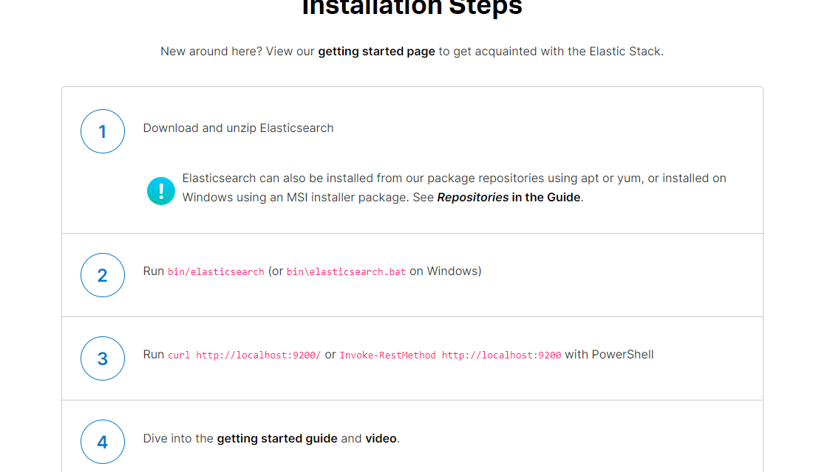
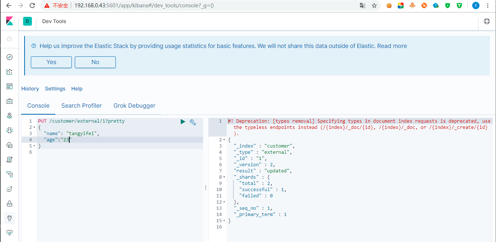
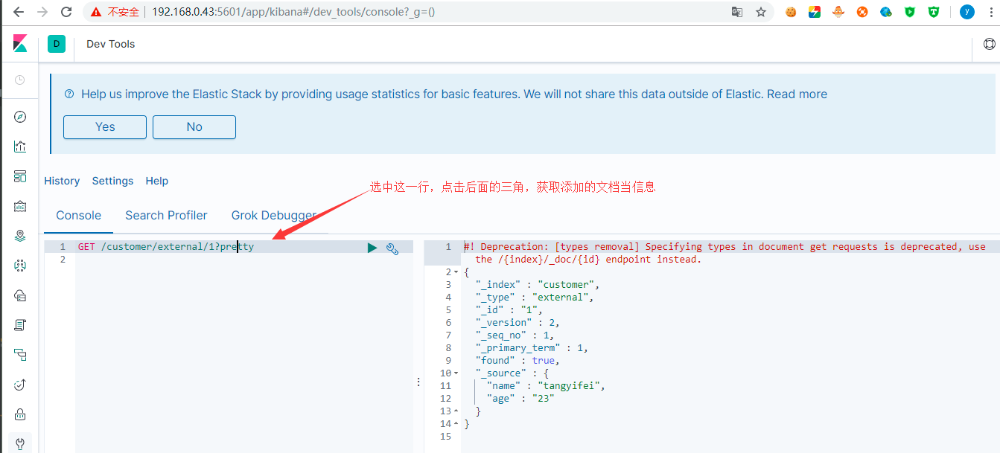

# ElasticSearch 介绍
全文搜索属于最常见的需求，开源的 Elasticsearch （以下简称 Elastic）是目前全文搜索引擎的首选。  
它可以快速地储存、搜索和分析海量数据。维基百科、Stack Overflow、Github 都采用它。  
ElasticSearch 的底层是开源库 Lucene。但是，你没法直接用 Lucene，必须自己写代码去调用它的接口。Elastic 是 Lucene 的封装，提供了 REST API 的操作接口，开箱即用。     

# 安装 ElasticSearch 
ElasticSearch 需要 Java 8 环境，所以安装 ElasticSearch 之前需要安装java环境。  
进入 [ElasticSearch 中文官网](https://www.elastic.co/cn/products/elasticsearch) 下载对应版本的安装包。  
  
最新的es到2019年6月26日已经更新到了7.2.0版本，如下所示：  
  

进入到 es 的下载页面，该页面提供了详细的安装步骤，如下：  
    

下面以在 linux 系统中安装 es 为例进行说明。  
使用wget命令进行下载 es，如下：  

```
wget https://artifacts.elastic.co/downloads/elasticsearch/elasticsearch-7.2.0-linux-x86_64.tar.gz  
```
  

这个下载要等一段时间，就看自己所处的网络情况了。  
下载成功，如下：  
  

然后使用 tar -zxvf elasticsearch-7.2.0-linux-x86_64.tar.gz 进行解压。  

解压成功，使用 cd elasticsearch-7.2.0 进入解压后的目录，如下：  
   

现在可以启动节点和单个集群，进入 bin 目录，使用 ./elasticsearch -d -p es.pid 运行es，如果需要在
es启动的过程中指定集群名字和节点的名字，执行 ./elasticsearch -d -p es.pid -Ecluster.name=fukun_es -Enode.name=fukun_es_1， 
-d 表示以守护进程启动，-p 表示指向进程id的文件，如果启动的过程中，出现如下的错误：    
  

表明elasticsearch是不允许使用root用户启动的，解决办法如下：  
1、使用 cd /home/tang/ 切换到es相关的目录，将 elasticsearch-7.2.0 重命名为 elasticsearch。  
2、使用 groupadd es 增加用户组，名为es。  
3、使用 useradd es -g es -p elasticsearch 创建一个用户es并加入es这个用户组中。  
4、使用 chown -R es:es  elasticsearch 更改 elasticsearch 文件夹及内部文件的所属用户及组为 es:es。  
5、使用 su es 切换到es用户再次使用 ./elasticsearch -d -p es.pid 启动，并进入 logs 目录，查看 es 相关的日志。  

启动完成，因为启动的时候我指定了集群的名称fukun_es，所以进入logs目录查看fukun_es.log，而不是elasticsearch.log，如下：  
```
[2019-07-22T11:03:50,889][INFO ][o.e.h.AbstractHttpServerTransport] [fukun_es_1] publish_address {172.17.0.1:9200}, bound_addresses {[::]:9200}
[2019-07-22T11:03:50,890][INFO ][o.e.n.Node               ] [fukun_es_1] started

```
我们可以看到我们的节点叫做fukun_es_1（每个人遇到的名称都不相同，因为启动es时指定的节点名称不同）已经被启动并且选定它自己作为主节点在一个集群里。  
这时 elasticsearch 就会在默认的9200端口运行，即Elasticsearch默认使用9200端口来提供REST API访问，如果有必要它是可以配置的。    

这时，打开另一个命令行窗口，请求该端口，使用 curl http://localhost:9200/ 会得到说明信息，如果出现如下的
响应，说明启动成功，如下：  
```
{
  "name" : "fukun_es_1",
  "cluster_name" : "fukun_es",
  "cluster_uuid" : "l_u3tVbfQnqkHiHLHhgb_g",
  "version" : {
    "number" : "7.2.0",
    "build_flavor" : "default",
    "build_type" : "tar",
    "build_hash" : "508c38a",
    "build_date" : "2019-06-20T15:54:18.811730Z",
    "build_snapshot" : false,
    "lucene_version" : "8.0.0",
    "minimum_wire_compatibility_version" : "6.8.0",
    "minimum_index_compatibility_version" : "6.0.0-beta1"
  },
  "tagline" : "You Know, for Search"
}
```
上面代码中，请求9200端口，Elastic 返回一个 JSON 对象，包含当前节点、集群、版本等信息。  
按下 Ctrl + C，Elastic 就会停止运行。  
默认情况下，Elastic 只允许本机访问，如果需要远程访问，可以修改 Elastic 安装目录的config/elasticsearch.yml文件，去掉network.host的注释，将它的值改成0.0.0.0，然后重新启动 Elastic。  
```
network.host: 0.0.0.0
```
上面代码中，设成0.0.0.0让任何人都可以访问。线上服务不要这样设置，要设成具体的 IP。  

重启ES后，如果报下面的错误，需要切换到root用户修改 /etc/sysctl.conf 文件，在该文件的最后一行添加
vm.max_map_count=262144 保存后，执行：sysctl -p，即可永久修改。  
   

如果报下面的错误，如下：  

```
the default discovery settings are unsuitable for production use; at least one of [discovery.seed_hosts, discovery.seed_providers, cluster.initial_master_nodes] must be configured
```
解决办法：  
因为不是集群，所以需要修改 elasticsearch.yml 文件中的 cluster.initial_master_nodes 如下：  
```
cluster.initial_master_nodes: ["node-1"] 
```
在 elasticsearch.yml 最后加上这两句，要不然，外面浏览器就访问不了。  
```
http.cors.enabled: true
http.cors.allow-origin: "*"
```
再次重启ES，启动成功。   
在浏览器中输入 http://192.168.0.43:9200/ 看一看外面浏览器能否成功访问，如下：  
```
{
  "name" : "fukun_es_1",
  "cluster_name" : "fukun_es",
  "cluster_uuid" : "l_u3tVbfQnqkHiHLHhgb_g",
  "version" : {
    "number" : "7.2.0",
    "build_flavor" : "default",
    "build_type" : "tar",
    "build_hash" : "508c38a",
    "build_date" : "2019-06-20T15:54:18.811730Z",
    "build_snapshot" : false,
    "lucene_version" : "8.0.0",
    "minimum_wire_compatibility_version" : "6.8.0",
    "minimum_index_compatibility_version" : "6.0.0-beta1"
  },
  "tagline" : "You Know, for Search"
}
```
出现如上的结果说明外面浏览器成功访问了43这台机器中的的es。 
 
关闭 es，找到 es.pid 文件，我使用 ./elasticsearch -d -p es.pid 启动 es 后，es.pid 生成路径在解压后的 elasticsearch
目录下，如下：  
  

使用 pkill -F es.pid 关闭es，发现关闭 es 后，es.pid 就消失了，如下：  
  

上面的步骤在[Install Elasticsearch from archive on Linux or MacOS](https://www.elastic.co/guide/en/elasticsearch/reference/current/targz.html)中有说明。  

# 安装 Kibana
进入[Download Kibana](https://www.elastic.co/cn/downloads/kibana) 页面，下载对应版本的kibana，我这里下载7.2.0版本。  
该页面有对应的安装步骤，如下：  
   
 
我还是在 /home/tang/ 目录下下载kibana相关的包，使用 
 
```
 wget https://artifacts.elastic.co/downloads/kibana/kibana-7.2.0-linux-x86_64.tar.gz
```
执行以上命令，一定要切换到root用户去执行，如果之前安装es的时候，使用创建的es用户去执行上面命令会报443错误。  
这个过程很慢，就看你所处网络的速度了。  
解压 kibana-7.2.0-linux-x86_64.tar.gz 并重命名为 kibana，然后进入kibana/config目录，修改  kibana.yml 文件，
修改kibana端口号，host和连接es的配置信息，如下：  
```
server.port: 5601    
server.host: "192.168.0.43"  
elasticsearch.hosts: ["http://192.168.0.43:9200"]  
kibana.index: ".kibana"

```
然后进入bin目录，前台启动使用./kibana即可，
后台启动使用 nohup ./kibana >> kibana.log 2>&1 &，如果出现如下的错误：  
```
Error: EACCES: permission denied, open '/home/tang/kibana/optimize/.babelcache.json'
    at Object.openSync (fs.js:439:3)
    at Object.writeFileSync (fs.js:1190:35)
    at save (/home/tang/kibana/node_modules/@babel/register/lib/cache.js:52:15)
    at process._tickCallback (internal/process/next_tick.js:61:11)
    at Function.Module.runMain (internal/modules/cjs/loader.js:745:11)
    at startup (internal/bootstrap/node.js:283:19)
    at bootstrapNodeJSCore (internal/bootstrap/node.js:743:3)
```
要检查你启动kibana的用户是否有此文件夹的权限，进入/home/tang，在root用户下对es用户赋予权限，如下：  
chown -R es:es kibana  
然后切换到es用户模式，进入kibana的bin目录再次执行 nohup ./kibana >> kibana.log 2>&1 &，成功启动。   
然后在浏览器的地址栏中输入 http://192.168.0.43:5601 进入到kibana的首页，如下：  
   
 
# es的基本概念
## Node 与 Cluster
Elastic 本质上是一个分布式数据库，允许多台服务器协同工作，每台服务器可以运行多个 Elastic 实例。  
单个 Elastic 实例称为一个节点（node）。一组节点构成一个集群（cluster）。  
## Index
Elastic 会索引所有字段，经过处理后写入一个反向索引（Inverted Index）。查找数据的时候，直接查找该索引。  
所以，Elastic 数据管理的顶层单位就叫做 Index（索引）。它是单个数据库的同义词。**`每个 Index （即数据库）的名字必须是小写`**。  
下面的命令可以查看当前节点的所有 Index。  
```
curl -X GET http://192.168.0.43:9200/_cat/indices?v
```
返回如下的信息：  
health status index uuid pri rep docs.count docs.deleted store.size pri.store.size    
这表明我们还没有索引在集群中。  

通过以下的API我们可以看到集群中的节点列表。  
```
curl -X GET http://192.168.0.43:9200/_cat/nodes?v  
```
返回信息如下：  
```  
ip         heap.percent ram.percent cpu load_1m load_5m load_15m node.role master name
172.17.0.1           13          96   3    0.00    0.04     0.05 mdi       *      fukun_es_1

```
如果es启动的时候没有设置es节点名称，默认es节点名是localhost.localdomain，我们的节点叫做"fukun_es_1"，目前我们集群里唯一的一个节点。    


# 与es集群进行沟通
Elasticsearch提供了一个非常全面和强大的REST API，你可以通过它来与你的集群相互沟通。下面这些事情可以通过API来完成：  
检查你的集群，节点和索引的健康情况，状态还可以统计。  
管理你的集群，节点，索引和元数据。  
对你的索引执行CRUD（增删改查）和检索操作。  
执行高级检索操作例如分页，排序，过滤，脚本，聚合等等。  
## 集群健康
使用 curl -X GET http://192.168.0.43:9200/_cat/health?v 命令检查集群的健康状况。  
返回的结果是：  
```  
epoch      timestamp cluster  status node.total node.data shards pri relo init unassign pending_tasks max_task_wait_time active_shards_percen
t
1563766131 03:28:51  fukun_es green           1         1      0   0    0    0        0             0                  -                100.0%
```
我们可以看到我们的集群叫做"fukun_es"，并且状态是绿色。  
无论何时我们去请求集群的健康状态我们会得到：green, yellow, 或者 red。green意味着所有功能都是完好的，yellow意味着所有数据是可用的，
但是一些副本还没有被分配，red代表一些数据由于某些原因已经不可用。
注意，尽管一个集群是red状态，它仍然可以提供部分服务（比如，它会继续从可用的切片数据里搜索），但是在你失去部分数据后，你需要尽你最快的速度去修复它。  

## 创建索引
curl -X PUT http://192.168.0.43:9200/customer?pretty  
通过PUT请求，我们创建了一个叫做"customer"的索引。pretty参数表示输出格式良好的JSON响应（如果存在）。     

再次使用 curl -X GET http://192.168.0.43:9200/_cat/indices?v 获取索引列表，如下：  

```
health status index    uuid                   pri rep docs.count docs.deleted store.size pri.store.size
yellow open   customer ezirYJS5TBWkmjihsLLo6g   1   1          0            0       230b           230b
```
我们这个"customer"索引有1个主切片和一份复制，它里面有0个document。  
你可能也注意到了"customer"索引的健康状态是yellow。yellow意味着一些副本还没有被分配。原因是目前集群里只有一个节点，副本暂时不能被分配（为了高可用性），
直到另一个节点加入到集群中后。一旦副本被分配到另一个节点后这个索引的状态也将变为green。    

## 索引与查询文档

### 在索引中创建文档和获取创建后的文档
让我们往"customer"索引里放点东西。记住，为了索引一个文档，我们必须告诉Elasticsearch这个文档的type。  
让我们索引一个简单的customer文档到customer索引，external类型，ID是1，这里我使用kibana可视化界面去操作
kibana的安装请参考安装kibana这一节，进入kibana界面。点击左边栏中的Dev Tools，然后选择Console选项，
在里面可以发送相关的请求和参数远程对es进行操作，如下：  
   
下面我们使用它来向es的customer索引中添加相应的文档，添加请求uri与参数后，点击右边的三角去执行，
如下：  
   
Elasticsearch并不要求你创建一个索引后才能向里面放入文档。如果es事先不存在的话，Elasticsearch会自动创建"customer"索引。    

添加成功，然后使用  GET /customer/external/1?pretty 获取customer索引中添加的文档，如下：  
  
也可以在终端中直接访问es，看一下获取的文档信息是不是跟kibana中获取的文档信息一样，如下：  
```
D:\GitHub>curl -X GET http://192.168.0.43:9200/customer/external/1?pretty
{
  "_index" : "customer",
  "_type" : "external",
  "_id" : "1",
  "_version" : 2,
  "_seq_no" : 1,
  "_primary_term" : 1,
  "found" : true,
  "_source" : {
    "name" : "tangyifei",
    "age" : "23"
  }
}

```
发现一样，使用kibana可视化界面操作es的确很方便。  

### 删除索引
DELETE /customer?pretty  
  
表示删除成功，

通过以上测试的api可以发现有以下的规律：  
<REST Verb> /<Index>/<Type>/<ID>   
<REST Verb>是rest请求的类型，<Index>是索引名，<Type>是文档类型，<ID>是文档ID。   

## 修改你的数据
Elasticsearch提供了数据操纵和搜索的能力，几乎是实时的。从你index/update/delete数据到它出现在你的搜索结果里， 一般会有一秒的延迟（刷新间隔）。
这个与其他平台像SQL数据库是一个重要的区别。     

### 创建与替换文档
其实我在上面的操作中，在索引customer中执行了两次添加文档的操作且id都相同，一次只添加姓名为John Doe的文档信息，另一次添加姓名为tangyifei，年龄为23的
文档信息，但是发现后一个文档信息会覆盖前一个文档信息，就是说Elasticsearch将会把已经存在的ID为1的文档替换为新文档。  
如果我们使用一个不同的ID，一个新文档将被建立，ID为1的文档将不受影响。  
创建文档时，ID部分是可选的。如果不指定，Elasticsearch将会生成一个随机的ID，这个ID在API的返回结果里可以看到，不指定id时，使用POST方式创建文档
指定id时，使用PUT方式，如下：  
```
POST /customer/external?pretty
{
  "name": "limingcheng"
}
```
  

### 更新文档
注意实际上Elasticsearch并不在内部更新文档，不论何时你更新一个文档时，Elasticsearch是将旧文档删除，然后创建一个更新后的新文档。    
下面的例子展示了将ID为2的文档更新name字段，并且新增age字段： 
```
POST /customer/external/2/_update
{
  "doc": { "name": "liuyifei", "age": 33 }
} 
```
然后使用 GET /customer/external/2 返回如下的信息：  
```
{
  "_index" : "customer",
  "_type" : "external",
  "_id" : "2",
  "_version" : 2,
  "_seq_no" : 4,
  "_primary_term" : 1,
  "found" : true,
  "_source" : {
    "name" : "liuyifei",
    "age" : 33
  }
}
```
说明修改id为2的文档成功。  
还可以使用一些简单的脚本，下面我们把liuyifei的年龄加5：  
```
POST /customer/external/2/_update?pretty
{
  "script" : "ctx._source.age += 5"
}
```
然后使用 GET /customer/external/2 返回如下的信息：  
```
{
  "_index" : "customer",
  "_type" : "external",
  "_id" : "2",
  "_version" : 3,
  "_seq_no" : 5,
  "_primary_term" : 1,
  "found" : true,
  "_source" : {
    "name" : "liuyifei",
    "age" : 38
  }
}
```
年龄已经加上了5，变成了38岁。  
在上面这个例子里，ctx._source 引用的是当前将要被更新的文档。    

### 删除文档
删除一个文档是相当简单的：  
DELETE /customer/external/2?pretty    
返回结果：  
```
{
  "_index" : "customer",
  "_type" : "external",
  "_id" : "2",
  "_version" : 4,
  "result" : "deleted",
  "_shards" : {
    "total" : 2,
    "successful" : 1,
    "failed" : 0
  },
  "_seq_no" : 6,
  "_primary_term" : 1
}
```
其他的删除api请进入[Delete By Query API](https://www.elastic.co/guide/en/elasticsearch/reference/7.2/docs-delete-by-query.html)进行查看，
这里介绍了根据特定条件删除所有的文档。值得注意的是通过Delete By Query API删除所有的索引比删除所有文档要困难的多。  

### 批处理
除了上面介绍的对单一文档进行操作外，Elasticsearch也提供了批量处理的能力，通过使用_bulkAPI。这个功能是很重要的，它提供了不同的机制来做多个操作，减少了与服务器直接来回传递数据的次数。  
```
POST /customer/external/_bulk?pretty
{"index":{"_id":"3"}}
{"name": "John Doe" }
{"index":{"_id":"4"}}
{"name": "Jane Doe" }
```
返回信息：  
```
{
  "took" : 69,
  "errors" : false,
  "items" : [
    {
      "index" : {
        "_index" : "customer",
        "_type" : "external",
        "_id" : "3",
        "_version" : 1,
        "result" : "created",
        "_shards" : {
          "total" : 2,
          "successful" : 1,
          "failed" : 0
        },
        "_seq_no" : 7,
        "_primary_term" : 1,
        "status" : 201
      }
    },
    {
      "index" : {
        "_index" : "customer",
        "_type" : "external",
        "_id" : "4",
        "_version" : 1,
        "result" : "created",
        "_shards" : {
          "total" : 2,
          "successful" : 1,
          "failed" : 0
        },
        "_seq_no" : 8,
        "_primary_term" : 1,
        "status" : 201
      }
    }
  ]
}
```
```
POST /customer/external/_bulk?pretty
{"update":{"_id":"3"}}
{"doc": { "name": "John Doe becomes Jane Doe" } }
{"delete":{"_id":"4"}}
```
返回信息：  
```
{
  "took" : 63,
  "errors" : false,
  "items" : [
    {
      "update" : {
        "_index" : "customer",
        "_type" : "external",
        "_id" : "3",
        "_version" : 2,
        "result" : "updated",
        "_shards" : {
          "total" : 2,
          "successful" : 1,
          "failed" : 0
        },
        "_seq_no" : 9,
        "_primary_term" : 1,
        "status" : 200
      }
    },
    {
      "delete" : {
        "_index" : "customer",
        "_type" : "external",
        "_id" : "4",
        "_version" : 2,
        "result" : "deleted",
        "_shards" : {
          "total" : 2,
          "successful" : 1,
          "failed" : 0
        },
        "_seq_no" : 10,
        "_primary_term" : 1,
        "status" : 200
      }
    }
  ]
}
```
bulk API会按照顺序依次执行相关操作，如果其中某个操作发生错误，剩下的操作也会继续执行。当bulk API返回时它会提供每个操作的状态（顺序与你发送时的顺序一样），这样你就可以检查每个操作是否成功。  

其他的api相关的操作请自行进入[文档操作API](https://www.elastic.co/guide/en/elasticsearch/reference/7.2/docs.html)去学习，进入到该API界面以后，右边的Elasticsearch Reference: 选择7.2的，
其他的这里不做赘述了。    


