# 倒排索引
## 文档
文档(Document)：一般搜索引擎的处理对象是互联网网页，而文档这个概念要更宽泛些，
代表以文本形式存在的存储对象，相比网页来说，涵盖更多种形式，
比如Word，PDF，html，XML等不同格式的文件都可以称之为文档。
再比如一封邮件，一条短信，一条微博也可以称之为文档。
很多情况下会使用文档来表征文本信息。  
## 文档集合
由若干文档构成的集合称之为文档集合。比如海量的互联网网页或者说大量的电子邮件都是文档集合的具体例子。    
## 文档编号
在搜索引擎内部，会将文档集合内每个文档赋予一个唯一的内部编号，以此编号来作为这个文档的唯一标识，
这样方便内部处理，每个文档的内部编号即称之为“文档编号”。  
## 单词编号
索引擎内部以唯一的编号来表征某个单词，单词编号可以作为某个单词的唯一表征。  
## 单词—文档矩阵  
单词-文档矩阵是表达两者之间所具有的一种包含关系的概念模型，每列代表一个文档，每行代表一个单词，打对勾的位置代表包含关系，如下图所示：  
  
从纵向即文档这个维度来看，每列代表文档包含了哪些单词，比如文档1包含了词汇1和词汇4，而不包含其它单词。
从横向即单词这个维度来看，每行代表了哪些文档包含了某个单词。比如对于词汇1来说，文档1和文档4中出现过单词1，
而其它文档不包含词汇1。矩阵中其它的行列也可作此种解读。  
搜索引擎的索引其实就是实现“单词-文档矩阵”的具体数据结构。可以有不同的方式来实现上述概念模型，
比如“倒排索引”、“签名文件”、“后缀树”等方式。但是各项实验数据表明，“倒排索引”是实现单词到文档映射关系的最佳实现方式。  
## 倒排索引的概念
倒排索引是实现“单词-文档矩阵”的一种具体存储形式，通过倒排索引，可以根据单词快速获取包含这个单词的文档列表。
倒排索引主要由两个部分组成：“单词词典”和“倒排文件”。    
### 单词词典
搜索引擎的通常索引单位是单词，单词词典是由文档集合中出现过的所有单词构成的字符串集合，单词词典内每条索引项记载单词本身的一些信息以及指向“倒排列表”的指针。  
单词词典是倒排索引中非常重要的组成部分，它用来维护文档集合中出现过的所有单词的相关信息，同时用来记载某个单词对应的倒排列表在倒排文件中的位置信息。在支持搜索时，
根据用户的查询词，去单词词典里查询，就能够获得相应的倒排列表，并以此作为后续排序的基础。  
对于一个规模很大的文档集合来说，可能包含几十万甚至上百万的不同单词，能否快速定位某个单词，这直接影响搜索时的响应速度，所以需要高效的数据结构来对单词词典进行构建和查找，
常用的数据结构包括哈希加链表结构和树形词典结构。  
#### 哈希加链表数据结构的单词词典
主体部分是哈希表，每个哈希表项保存一个指针，指针指向冲突链表，在冲突链表里，相同哈希值的单词形成链表结构。之所以会有冲突链表，是因为两个不同单词获得相同的哈希值，
如果是这样，在哈希方法里被称做是一次冲突，可以将相同哈希值的单词存储在链表里，以供后续查找。  
  
##### 创建单词词典的过程
在建立索引的过程中，词典结构也会相应地被构建出来。比如在解析一个新文档的时候，对于某个在文档中出现的单词T，首先利用哈希函数获得其哈希值，
之后根据哈希值对应的哈希表项读取其中保存的指针，就找到了对应的冲突链表。如果冲突链表里已经存在这个单词，说明单词在之前解析的文档里已经出现过。
如果在冲突链表里没有发现这个单词，说明该单词是首次碰到，则将其加入冲突链表里。通过这种方式，当文档集合内所有文档解析完毕时，相应的词典结构也就建立起来了。   
##### 查询单词的过程
在响应用户查询请求时，其过程与建立词典类似，不同点在于即使词典里没出现过某个单词，也不会添加到词典内。以上图为例，假设用户输入的查询请求为单词3，
对这个单词进行哈希，定位到哈希表内的2号槽，从其保留的指针可以获得冲突链表，依次将单词3和冲突链表内的单词比较，发现单词3在冲突链表内，于是找到这个单词，
之后可以读出这个单词对应的倒排列表来进行后续的工作，如果没有找到这个单词，说明文档集合内没有任何文档包含单词，则搜索结果为空。    
#### 树形数据结构的单词词典  
B树与哈希方式查找不同，需要字典项能够按照大小排序（数字或者字符序），而哈希方式则无须数据满足此项要求。  
中间节点用于指出一定顺序范围的词典项目存储在哪个子树中，起到根据词典项比较大小进行导航的作用，最底层的叶子节点存储单词的地址信息，
根据这个地址就可以提取出单词字符串。  
  

### 倒排列表
倒排列表记载了出现过某个单词的所有文档的文档列表及单词在该文档中出现的位置信息，每条记录称为一个倒排项(Posting)，根据倒排列表，即可获知哪些文档包含某个单词。  
### 倒排文件
所有单词的倒排列表往往顺序地存储在磁盘的某个文件里，这个文件即被称之为倒排文件，倒排文件是存储倒排索引的物理文件。  
关于这些概念之间的关系，下图可以比较清晰的看出来。  
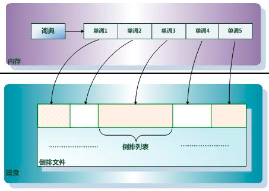  
## 倒排索引简单实例
倒排索引从逻辑结构和基本思路上来讲非常简单。下面我们通过具体实例来进行说明，使得读者能够对倒排索引有一个宏观而直接的感受。  
假设文档集合包含五个文档，每个文档内容如图3所示，在图中最左端一栏是每个文档对应的文档编号。我们的任务就是对这个文档集合建立倒排索引。 
  

中文和英文等语言不同，单词之间没有明确分隔符号，所以首先要用分词系统将文档自动切分成单词序列。
这样每个文档就转换为由单词序列构成的数据流，为了系统后续处理方便，需要对每个不同的单词赋予唯一的单词编号，
同时记录下哪些文档包含这个单词，在处理结束后，我们可以得到最简单的倒排索引，
“单词ID”一栏记录了每个单词的单词编号，第二栏是对应的单词，第三栏即每个单词对应的倒排列表。
比如单词“谷歌”，其单词编号为1，倒排列表为{1,2,3,4,5}，说明文档集合中每个文档都包含了这个单词。如下图：  
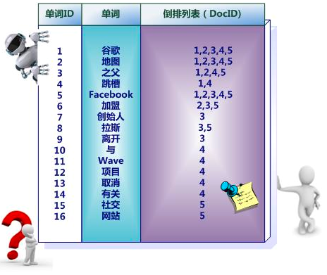   
之所以上图所示倒排索引是最简单的，是因为这个索引系统只记载了哪些文档包含某个单词，而事实上，
索引系统还可以记录除此之外的更多信息。下图是一个相对复杂些的倒排索引，与上图的基本索引系统对比，
在单词对应的倒排列表中不仅记录了文档编号，还记载了单词频率信息（TF），即这个单词在某个文档中的出现次数，
之所以要记录这个信息，是因为词频信息在搜索结果排序时，计算查询和文档相似度是很重要的一个计算因子，
所以将其记录在倒排列表中，以方便后续排序时进行分值计算。在下图的例子里，单词“创始人”的单词编号为7，
对应的倒排列表内容为：（3:1），其中的3代表文档编号为3的文档包含这个单词，
数字1代表词频信息，即这个单词在3号文档中只出现过1次，其它单词对应的倒排列表所代表含义与此相同。  
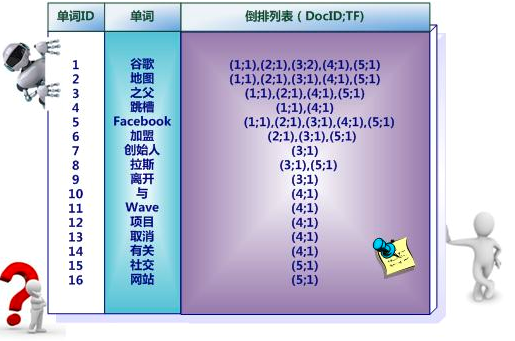   
实用的倒排索引还可以记载更多的信息，索引系统除了记录文档编号和单词频率信息外，
额外记载了两类信息，即每个单词对应的“文档频率信息”，以及在倒排列表中记录单词在某个文档出现的位置信息。  
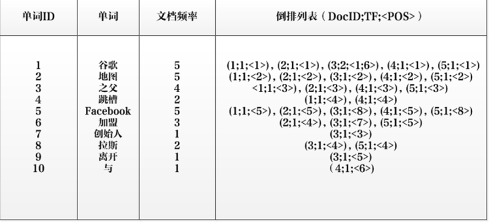    
单词ID：记录每个单词的单词编号；  
单词：对应的单词；  
文档频率：代表文档集合中有多少个文档包含某个单词；  
倒排列表：包含文档ID及其他必要信息；  
DocId：单词出现的文档id；  
TF：单词在某个文档中出现的次数；  
POS：单词在文档中出现的位置；  
以单词“加盟”为例，其单词编号为6，文档频率为3，代表整个文档集合中有三个文档包含这个单词，
对应的倒排列表为{(2;1;<4>),(3;1;<7>),(5;1;<5>)}，含义是在文档2，3，5出现过这个单词，在每个文档的出现过1次，
单词“加盟”在第一个文档的POS是4，即文档的第四个单词是“加盟”，其他的类似。
这个倒排索引已经是一个非常完备的索引系统，实际搜索系统的索引结构基本如此。    
“文档频率信息”代表了在文档集合中有多少个文档包含某个单词，之所以要记录这个信息，其原因与单词频率信息一样，
这个信息在搜索结果排序计算中是非常重要的一个因子。而单词在某个文档中出现的位置信息并非索引系统一定要记录的，在实际的索引系统里可以包含，
也可以选择不包含这个信息，之所以如此，因为这个信息对于搜索系统来说并非必需的，位置信息只有在支持“短语查询”的时候才能够派上用场。    
以单词“拉斯”为例，其单词编号为8，文档频率为2，代表整个文档集合中有两个文档包含这个单词，对应的倒排列表为：{(3;1;<4>)，(5;1;<4>)}，
其含义为在文档3和文档5出现过这个单词，单词频率都为1，单词“拉斯”在两个文档中的出现位置都是4，即文档中第四个单词是“拉斯”。  
倒排索引已经是一个非常完备的索引系统，实际搜索系统的索引结构基本如此，区别无非是采取哪些具体的数据结构来实现上述逻辑结构。  
有了这个索引系统，搜索引擎可以很方便地响应用户的查询，比如用户输入查询词“Facebook”，搜索系统查找倒排索引，从中可以读出包含这个单词的文档，
这些文档就是提供给用户的搜索结果，而利用单词频率信息、文档频率信息即可以对这些候选搜索结果进行排序，
计算文档和查询的相似性，按照相似性得分由高到低排序输出，此即为搜索系统的部分内部流程。  

# ElasticSearch 介绍
全文搜索属于最常见的需求，开源的 Elasticsearch （以下简称 Elastic）是目前全文搜索引擎的首选。  
它可以快速地储存、搜索和分析海量数据。维基百科、Stack Overflow、Github 都采用它。  
ElasticSearch 的底层是开源库 Lucene。但是，你没法直接用 Lucene，必须自己写代码去调用它的接口。Elastic 是 Lucene 的封装，提供了 REST API 的操作接口，开箱即用。     
Elasticsearch 是面向文档(document oriented)的，这意味着它可以存储整个对象或文档(document)。  
然而它不仅仅是存储，还会索引(index)每个文档的内容使之可以被搜索。在Elasticsearch中，你可以对文档（而非成行成列的数据）进行索引、搜索、排序、过滤。      
我么可以通过es将不同的对象转化为json，并作索引，就是说将对象转化json并以文档的方式在es中生成倒排索引，这样查询某个单词的时候，
就能快速的搜索到包含该单词的文档列表。 
下面举一个例子：  
比如索引员工文档，员工文档就是存储某个公司中的所有员工的数据文档，每个文档代表一个员工，听起来就像是数据库中的员工表的相关行记录，
在Elasticsearch中存储数据的行为就叫做索引，不过在索引之前，我们需要明确数据应该存储在哪里。  
在Elasticsearch中，文档归属于一种类型(type),而这些类型存在于索引(index)中， 我们可以画一些简单的对比图来类比传统关系型数据库：  

**Relational DB -> Databases -> Tables -> Rows -> Columns  
Elasticsearch -> Indices   -> Types  -> Documents -> Fields**  

Elasticsearch集群可以包含多个索引(indices)（数据库），每一个索引可以包含多个类型(types)（表），
每一个类型包含多个文档(documents)（行），然后每个文档包含多个字段(Fields)（列）。  
「索引」含义的区分  
索引（名词） ：一个索引(index)就像是传统关系数据库中的数据库，它是相关文档存储的地方，index的复数是indices 或indexes。  
索引（动词） ：「索引一个文档」表示把一个文档存储到索引（名词）里，以便它可以被检索或者查询。这很像SQL中的INSERT关键字，差别是，如果文档已经存在，新的文档将覆盖旧的文档。   
倒排索引 传统数据库为特定列增加一个索引，例如B-Tree索引来加速检索。Elasticsearch和Lucene使用一种叫做倒排索引(inverted index)的数据结构来达到相同目的。    
默认情况下，文档中的所有字段都会被索引（拥有一个倒排索引），只有这样他们才是可被搜索的。  
所以为了创建员工目录，我们将进行如下操作：  
为每个员工的文档(document)建立索引，每个文档包含了相应员工的所有信息。  
每个文档的类型为employee。  
employee类型归属于索引 fukun。  
fukun 索引存储在Elasticsearch集群中。  
实际上这些都是很容易的（尽管看起来有许多步骤）。我们能通过一个命令执行完成的操作：  

```
PUT /fukun/employee/1
{
    "first_name" : "John",
    "last_name" :  "Smith",
    "age" :        25,
    "about" :      "I love to go rock climbing",
    "interests": [ "sports", "music" ]
}
```
我们看到path:/fukun/employee/1包含三部分信息：  
fukun	索引名  
employee	类型名  
1	这个员工的ID  
请求实体（JSON文档），包含了这个员工的所有信息。他的名字叫“John Smith”，25岁，喜欢攀岩。   
如果你的es版本是7.X的，由于 Elasticsearch 7.X版本 删除type，那么请使用如下的操作添加员工：  
```
PUT /fukun/_doc/1
{
    "first_name" : "John",
    "last_name" :  "Smith",
    "age" :        25,
    "about" :      "I love to go rock climbing",
    "interests": [ "sports", "music" ]
}
```
我们通过HTTP方法GET来检索文档（GET /fukun/_doc/1），同样的，我们可以使用DELETE（DELETE /fukun/_doc/1）方法删除文档，
使用HEAD（HEAD /fukun/_doc/1）方法检查某文档是否存在。如果想更新已存在的文档，我们只需再PUT一次。    
使用 GET /fukun/_doc/1 获取结果时，响应内容的hits数组中包含了搜索的文档信息，默认情况下搜索会返回前10个结果，
Elasticsearch提供丰富且灵活的查询语言叫做DSL查询(Query DSL),它允许你构建更加复杂、强大的查询，
DSL(Domain Specific Language特定领域语言)以JSON请求体的形式出现，如下：  
```
GET /fukun/_search
{
  "query": {
    "match": {
      "last_name": "Tang"
    }
  }
}
```
## 结果相关性评分
针对以下的结果集进行说明，如下： 
``` 
 "hits": {
      "total":      2,
      "max_score":  0.16273327,
      "hits": [
         {
            ...
            "_score":         0.16273327, <1>
            "_source": {
               "first_name":  "John",
               "last_name":   "Smith",
               "age":         25,
               "about":       "I love to go rock climbing",
               "interests": [ "sports", "music" ]
            }
         },
         {
            ...
            "_score":         0.016878016, <2>
            "_source": {
               "first_name":  "Jane",
               "last_name":   "Smith",
               "age":         32,
               "about":       "I like to collect rock albums",
               "interests": [ "music" ]
            }
         }
      ]
   }
```
如果我要查询所有喜欢“rock climbing”的员工，根据以上的结果，从about字段中搜索"rock climbing"，我们得到了两个匹配文档。  
<1><2>处就代表结果相关性评分。
默认情况下，Elasticsearch根据结果相关性评分来对结果集进行排序，所谓的「结果相关性评分」就是文档与查询条件的匹配程度。很显然，排名第一的John Smith的about字段明确的写到“rock climbing”。  
但是为什么Jane Smith也会出现在结果里呢？原因是“rock”在她的abuot字段中被提及了。因为只有“rock”被提及而“climbing”没有，所以她的_score要低于John。  
这个例子很好的解释了Elasticsearch如何在各种文本字段中进行全文搜索，并且返回相关性最大的结果集。相关性(relevance)的概念在Elasticsearch中非常重要，
而这个概念在传统关系型数据库中是不可想象的，因为传统数据库对记录的查询只有匹配或者不匹配，没有相关性的概念。  

## 短语搜索
我们可以在字段中搜索单独的一个词，这挺好的，但是有时候你想要确切的匹配若干个单词或者短语(phrases)。例如我们想要查询同时包含"rock"和"climbing"（并且是相邻的）的员工记录。  
```
GET /fukun/_search
{
    "query" : {
        "match_phrase" : {
            "about" : "rock climbing"
        }
    }
}
```
该查询返回 John Smith 的文档，Jane Smith 的文档并没有被搜索到。  

## 聚合（aggregations）分析  
它允许你在数据上生成复杂的分析统计。它很像SQL中的GROUP BY但是功能更强大。  
下面按照年龄进行分组统计，如下：  
```
GET /fukun/_search
{
  "size": 0,
  "aggs": {
    "group_by_age": {
      "terms": { "field": "age" }
    }
  }
}
```
返回结果为：  
```
  "aggregations" : {
    "group_by_age" : {
      "doc_count_error_upper_bound" : 0,
      "sum_other_doc_count" : 0,
      "buckets" : [
        {
          "key" : 23,
          "doc_count" : 1
        },
        {
          "key" : 27,
          "doc_count" : 1
        }
      ]
    }
  }
```
返回结果显示是年龄23岁的1个人，年龄27岁的是1个人。   
### 分级汇总  
统计每种成绩对应的平均年龄，如下：  
```
GET /fukun/_search
{
  "size": 0,
  "aggs": {
    "group_by_grade": {
      "terms": { "field": "grade" },
        "aggs" : {
                "avg_age" : {
                    "avg" : { "field" : "age" }
                }
            }
    }
  }
}
```
返回结果如下：  
```
"aggregations" : {
    "group_by_grade" : {
      "doc_count_error_upper_bound" : 0,
      "sum_other_doc_count" : 0,
      "buckets" : [
        {
          "key" : 93,
          "doc_count" : 1,
          "avg_age" : {
            "value" : 33.0
          }
        },
        {
          "key" : 99,
          "doc_count" : 1,
          "avg_age" : {
            "value" : 37.0
          }
        }
      ]
    }
  }
 ```
上面的结果显示按成绩分组并且计算出该组成绩对应的平均年龄。  

注意：删除一个文档也不会立即从磁盘上移除，它只是被标记成已删除。Elasticsearch将会在你之后添加更多索引的时候才会在后台进行删除内容的清理。  

# 安装 ElasticSearch 
ElasticSearch 需要 Java 8 环境，所以安装 ElasticSearch 之前需要安装java环境。  
进入 [ElasticSearch 中文官网](https://www.elastic.co/cn/products/elasticsearch) 下载对应版本的安装包。  
  
最新的es到2019年6月26日已经更新到了7.2.0版本，如下所示：  
  

进入到 es 的下载页面，该页面提供了详细的安装步骤，如下：  
    

下面以在 linux 系统中安装 es 为例进行说明。  
使用wget命令进行下载 es，如下：  

```
wget https://artifacts.elastic.co/downloads/elasticsearch/elasticsearch-7.2.0-linux-x86_64.tar.gz  
```
  

这个下载要等一段时间，就看自己所处的网络情况了。  
下载成功，如下：  
  

然后使用 tar -zxvf elasticsearch-7.2.0-linux-x86_64.tar.gz 进行解压。  

解压成功，使用 cd elasticsearch-7.2.0 进入解压后的目录，如下：  
   

现在可以启动节点和单个集群，进入 bin 目录，使用 ./elasticsearch -d -p es.pid 运行es，如果需要在
es启动的过程中指定集群名字和节点的名字，执行 ./elasticsearch -d -p es.pid -Ecluster.name=fukun_es -Enode.name=fukun_es_1， 
-d 表示以守护进程启动，-p 表示指向进程id的文件，如果启动的过程中，出现如下的错误：    
  

表明elasticsearch是不允许使用root用户启动的，解决办法如下：  
1、使用 cd /home/tang/ 切换到es相关的目录，将 elasticsearch-7.2.0 重命名为 elasticsearch。  
2、使用 groupadd es 增加用户组，名为es。  
3、使用 useradd es -g es -p elasticsearch 创建一个用户es并加入es这个用户组中。  
4、使用 chown -R es:es  elasticsearch 更改 elasticsearch 文件夹及内部文件的所属用户及组为 es:es。  
5、使用 su es 切换到es用户再次使用 ./elasticsearch -d -p es.pid 启动，并进入 logs 目录，查看 es 相关的日志。  

启动完成，因为启动的时候我指定了集群的名称fukun_es，所以进入logs目录查看fukun_es.log，而不是elasticsearch.log，如下：  
```
[2019-07-22T11:03:50,889][INFO ][o.e.h.AbstractHttpServerTransport] [fukun_es_1] publish_address {172.17.0.1:9200}, bound_addresses {[::]:9200}
[2019-07-22T11:03:50,890][INFO ][o.e.n.Node               ] [fukun_es_1] started

```
我们可以看到我们的节点叫做fukun_es_1（每个人遇到的名称都不相同，因为启动es时指定的节点名称不同）已经被启动并且选定它自己作为主节点在一个集群里。  
这时 elasticsearch 就会在默认的9200端口运行，即Elasticsearch默认使用9200端口来提供REST API访问，如果有必要它是可以配置的。    

这时，打开另一个命令行窗口，请求该端口，使用 curl http://localhost:9200/ 会得到说明信息，如果出现如下的
响应，说明启动成功，如下：  
```
{
  "name" : "fukun_es_1",
  "cluster_name" : "fukun_es",
  "cluster_uuid" : "l_u3tVbfQnqkHiHLHhgb_g",
  "version" : {
    "number" : "7.2.0",
    "build_flavor" : "default",
    "build_type" : "tar",
    "build_hash" : "508c38a",
    "build_date" : "2019-06-20T15:54:18.811730Z",
    "build_snapshot" : false,
    "lucene_version" : "8.0.0",
    "minimum_wire_compatibility_version" : "6.8.0",
    "minimum_index_compatibility_version" : "6.0.0-beta1"
  },
  "tagline" : "You Know, for Search"
}
```
上面代码中，请求9200端口，Elastic 返回一个 JSON 对象，包含当前节点、集群、版本等信息。  
按下 Ctrl + C，Elastic 就会停止运行。  
默认情况下，Elastic 只允许本机访问，如果需要远程访问，可以修改 Elastic 安装目录的config/elasticsearch.yml文件，去掉network.host的注释，将它的值改成0.0.0.0，然后重新启动 Elastic。  
```
network.host: 0.0.0.0
```
上面代码中，设成0.0.0.0让任何人都可以访问。线上服务不要这样设置，要设成具体的 IP。  

重启ES后，如果报下面的错误，需要切换到root用户修改 /etc/sysctl.conf 文件，在该文件的最后一行添加
vm.max_map_count=262144 保存后，执行：sysctl -p，即可永久修改。  
   

如果报下面的错误，如下：  

```
the default discovery settings are unsuitable for production use; at least one of [discovery.seed_hosts, discovery.seed_providers, cluster.initial_master_nodes] must be configured
```
解决办法：  
因为不是集群，所以需要修改 elasticsearch.yml 文件中的 cluster.initial_master_nodes 如下：  
```
cluster.initial_master_nodes: ["node-1"] 
```
在 elasticsearch.yml 最后加上这两句，要不然，外面浏览器就访问不了。  
```
http.cors.enabled: true
http.cors.allow-origin: "*"
```
再次重启ES，启动成功。   
在浏览器中输入 http://192.168.0.43:9200/ 看一看外面浏览器能否成功访问，如下：  
```
{
  "name" : "fukun_es_1",
  "cluster_name" : "fukun_es",
  "cluster_uuid" : "l_u3tVbfQnqkHiHLHhgb_g",
  "version" : {
    "number" : "7.2.0",
    "build_flavor" : "default",
    "build_type" : "tar",
    "build_hash" : "508c38a",
    "build_date" : "2019-06-20T15:54:18.811730Z",
    "build_snapshot" : false,
    "lucene_version" : "8.0.0",
    "minimum_wire_compatibility_version" : "6.8.0",
    "minimum_index_compatibility_version" : "6.0.0-beta1"
  },
  "tagline" : "You Know, for Search"
}
```
出现如上的结果说明外面浏览器成功访问了43这台机器中的的es。 
 
关闭 es，找到 es.pid 文件，我使用 ./elasticsearch -d -p es.pid 启动 es 后，es.pid 生成路径在解压后的 elasticsearch
目录下，如下：  
  

使用 pkill -F es.pid 关闭es，发现关闭 es 后，es.pid 就消失了，如下：  
  

上面的步骤在[Install Elasticsearch from archive on Linux or MacOS](https://www.elastic.co/guide/en/elasticsearch/reference/current/targz.html)中有说明。  

# 安装 IK分词器
Elastic 的分词器称为 analyzer，对于中文需要指定中文分词器，不能使用默认的英文分词器，ElasticSearch（以下简称ES）默认的分词器是标准分词器Standard，如果直接使用，在处理中文内容的搜索时，中文词语被分成了一个一个的汉字，因此引入中文分词器IK就能解决这个问题，同时用户可以配置自己的扩展字典、远程扩展字典等。  
注意：IK分词器的版本一定要与ElasticSearch版本对应。  
进入[IK分词器](https://github.com/medcl/elasticsearch-analysis-ik/releases) 下载ik分词器，注意我使用的es版本是7.2.0，所以下载ik的版本是7.2.0的。  
如果IK与ES版本不对应，运行ES时会报错说两者版本不对，导致无法启动。  
注意：我下载了IK分词器表面是7.2.0版本的，得到的处理过后的zip解压开是7.0.0版本的，只需要修改你的路径下的pom里面的版本改成7.2.0即可。  
我的ik分词器下载到了/home/tang/目录下，在 /home/tang/elasticsearch/plugins 目录下创建analysis-ik，再次将 elasticsearch-analysis-ik-7.2.0.zip
解压到analysis-ik目录下，执行 unzip elasticsearch-analysis-ik-7.2.0.zip -d /home/tang/elasticsearch/plugins/analysis-ik即可，如下：  
 

重启ES，使用pkill -F es.pid关闭es，以前我的节点名称为fukun_es_1，现在我以fukun_es_2为节点名字启动，
执行 ./elasticsearch -d -p es.pid -Ecluster.name=fukun_es -Enode.name=fukun_es_2，查看日志 fukun_es.log，
从日志可以看出，自动加载这个新安装的插件，如下：  
 
也可以调用 curl -X GET http://192.168.0.43:9200/_cat/plugins 获取插件信息，如下：  
 ```
 D:\GitHub>curl -X GET http://192.168.0.43:9200/_cat/plugins
 fukun_es_2 analysis-ik 7.2.0
 ```
说明ik分词器配置成功，也可以使用kibana的可视化界面获取插件信息，如下：  
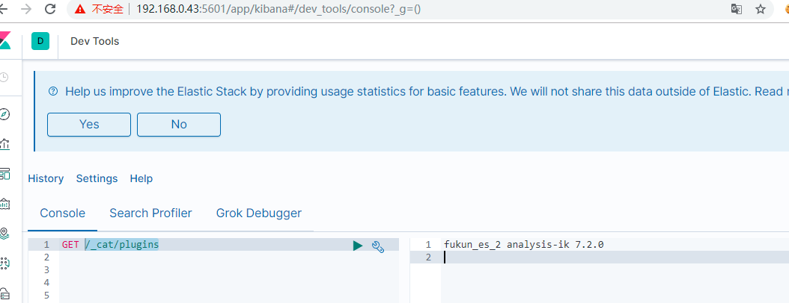 

IK分词器的两种分词模式：  
ik_max_word: 会将文本做最细粒度的拆分。  
ik_smart: 会做最粗粒度的拆分。  

## ik测试
这里使用_analyze 这个api对中文段落进行分词，使用最细粒度的拆分方式（ik_max_word）进行分词，如下：  
```
POST /_analyze
{
  "analyzer": "ik_max_word",
  "text":"中华人民共和国国歌"
}
```
如下图所示：  

 

分词的结果如下：  
```
{
  "tokens" : [
    {
      "token" : "中华人民共和国",
      "start_offset" : 0,
      "end_offset" : 7,
      "type" : "CN_WORD",
      "position" : 0
    },
    {
      "token" : "中华人民",
      "start_offset" : 0,
      "end_offset" : 4,
      "type" : "CN_WORD",
      "position" : 1
    },
    {
      "token" : "中华",
      "start_offset" : 0,
      "end_offset" : 2,
      "type" : "CN_WORD",
      "position" : 2
    },
    {
      "token" : "华人",
      "start_offset" : 1,
      "end_offset" : 3,
      "type" : "CN_WORD",
      "position" : 3
    },
    {
      "token" : "人民共和国",
      "start_offset" : 2,
      "end_offset" : 7,
      "type" : "CN_WORD",
      "position" : 4
    },
    {
      "token" : "人民",
      "start_offset" : 2,
      "end_offset" : 4,
      "type" : "CN_WORD",
      "position" : 5
    },
    {
      "token" : "共和国",
      "start_offset" : 4,
      "end_offset" : 7,
      "type" : "CN_WORD",
      "position" : 6
    },
    {
      "token" : "共和",
      "start_offset" : 4,
      "end_offset" : 6,
      "type" : "CN_WORD",
      "position" : 7
    },
    {
      "token" : "国",
      "start_offset" : 6,
      "end_offset" : 7,
      "type" : "CN_CHAR",
      "position" : 8
    },
    {
      "token" : "国歌",
      "start_offset" : 7,
      "end_offset" : 9,
      "type" : "CN_WORD",
      "position" : 9
    }
  ]
}
```
使用最粗粒度的拆分方式（ik_smart）分词，如下：  
```
POST /_analyze
{
  "analyzer": "ik_smart",
  "text":"中华人民共和国国歌"
}
```
结果如下：  
```
{
  "tokens" : [
    {
      "token" : "中华人民共和国",
      "start_offset" : 0,
      "end_offset" : 7,
      "type" : "CN_WORD",
      "position" : 0
    },
    {
      "token" : "国歌",
      "start_offset" : 7,
      "end_offset" : 9,
      "type" : "CN_WORD",
      "position" : 1
    }
  ]
}  
```
### 利用kibana插件对Elasticsearch创建映射并对相关字段指定分词器
#### 映射（mapping）
映射是创建索引的时候，可以预先定义字段的类型以及相关属性。  
Elasticsearch会根据JSON源数据的基础类型去猜测你想要的字段映射。将输入的数据变成可搜索的索引项。  
Mapping就是我们自己定义字段的数据类型，同时告诉Elasticsearch如何索引数据以及是否可以被搜索。  
作用：会让索引建立的更加细致和完善。  
类型：静态映射和动态映射。  
##### 内置类型
string类型： text,keyword(string类型在es5已经被弃用)    
数字类型：long, integer, short, byte, double, float    
日期类型： date    
bool类型： boolean    
binary类型： binary　　    
复杂类型： object ,nested    
geo类型： point , geo-shape    
专业类型: ip, competion    
mapping 限制的type  
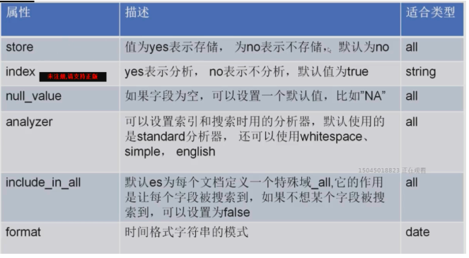  

#### 创建mapping并指定中文分词器
新建一个 Index，指定需要分词的字段，下面的命令只针对文本。基本上，凡是需要搜索的中文字段，都要单独设置一下。  
```
PUT /accounts
{
  "mappings": {
    "properties": {
      "person": {
        "properties": {
          "user": {
            "type": "text",
            "analyzer": "ik_max_word",
          "search_analyzer": "ik_max_word"
          },
          "title": {
            "type": "text",
             "analyzer": "ik_max_word",
          "search_analyzer": "ik_max_word"
          },
          "desc": {
              "type": "text",
             "analyzer": "ik_max_word",
          "search_analyzer": "ik_max_word"
          }
        }
      }
    }
  }
}
```
返回结果：  
```
{
  "acknowledged" : true,
  "shards_acknowledged" : true,
  "index" : "accounts"
}
```
上面代码中，首先新建一个名称为accounts的 Index，里面有一个名称为person的 Type。person有三个字段user、title、desc。  
这三个字段都是中文，而且类型都是文本（text），**keyword适用于不分词字段，搜索时只能完全匹配**，所以需要指定中文分词器，不能使用默认的英文分词器。  
对每个字段指定中文分词器。  
analyzer是字段文本的分词器，search_analyzer是搜索词的分词器。ik_max_word分词器是插件ik提供的，可以对文本进行最大数量的分词。  

#### 获取创建后的映射
GET accounts/_mapping  
返回如下：  
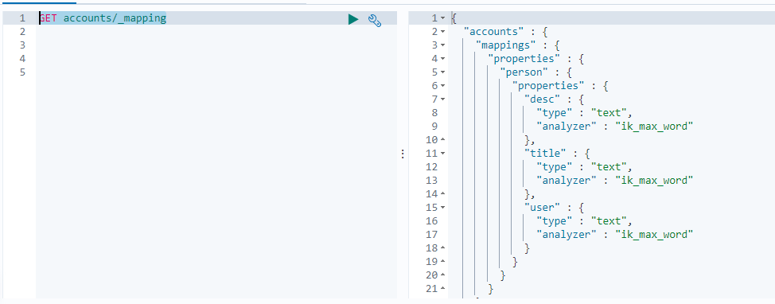  

#### 数据操作
向指定的 /Index/Type 发送 PUT 请求，就可以在 Index 里面新增一条记录。比如，向/accounts/person发送请求，就可以新增一条人员记录。  
```
PUT /accounts/_doc/1
{
  "user": "张三",
  "title": "工程师",
  "desc": "数据库管理"
}
```
服务器返回的 JSON 对象，会给出 Index、Type、Id、Version 等信息。  
```
{
  "_index" : "accounts",
  "_type" : "_doc",
  "_id" : "1",
  "_version" : 1,
  "result" : "created",
  "_shards" : {
    "total" : 2,
    "successful" : 1,
    "failed" : 0
  },
  "_seq_no" : 0,
  "_primary_term" : 1
}
```
其他的es基本操作参考当前项目中的基本操作目录 baseoperate 中的基本es操作。  

# 安装 Kibana
进入[Download Kibana](https://www.elastic.co/cn/downloads/kibana) 页面，下载对应版本的kibana，我这里下载7.2.0版本。  
该页面有对应的安装步骤，如下：  
   
 
我还是在 /home/tang/ 目录下下载kibana相关的包，使用 
 
```
 wget https://artifacts.elastic.co/downloads/kibana/kibana-7.2.0-linux-x86_64.tar.gz
```
执行以上命令，一定要切换到root用户去执行，如果之前安装es的时候，使用创建的es用户去执行上面命令会报443错误。  
这个过程很慢，就看你所处网络的速度了。  
解压 kibana-7.2.0-linux-x86_64.tar.gz 并重命名为 kibana，然后进入kibana/config目录，修改  kibana.yml 文件，
修改kibana端口号，host和连接es的配置信息，如下：  
```
server.port: 5601    
server.host: "192.168.0.43"  
elasticsearch.hosts: ["http://192.168.0.43:9200"]  
kibana.index: ".kibana"

```
然后进入bin目录，前台启动使用./kibana即可，
后台启动使用 nohup ./kibana >> kibana.log 2>&1 &，如果出现如下的错误：  
```
Error: EACCES: permission denied, open '/home/tang/kibana/optimize/.babelcache.json'
    at Object.openSync (fs.js:439:3)
    at Object.writeFileSync (fs.js:1190:35)
    at save (/home/tang/kibana/node_modules/@babel/register/lib/cache.js:52:15)
    at process._tickCallback (internal/process/next_tick.js:61:11)
    at Function.Module.runMain (internal/modules/cjs/loader.js:745:11)
    at startup (internal/bootstrap/node.js:283:19)
    at bootstrapNodeJSCore (internal/bootstrap/node.js:743:3)
```
要检查你启动kibana的用户是否有此文件夹的权限，进入/home/tang，在root用户下对es用户赋予权限，如下：  
chown -R es:es kibana  
然后切换到es用户模式，进入kibana的bin目录再次执行 nohup ./kibana >> kibana.log 2>&1 &，成功启动。   
然后在浏览器的地址栏中输入 http://192.168.0.43:5601 进入到kibana的首页，如下：  
   
 
# es的基本概念
## Node 与 Cluster
Elastic 本质上是一个分布式数据库，允许多台服务器协同工作，每台服务器可以运行多个 Elastic 实例。  
单个 Elastic 实例称为一个节点（node）。一组节点构成一个集群（cluster）。  
## Index索引
一个索引（index）一系列有类似特征的文档，
Elastic 会索引所有字段，经过处理后写入一个反向索引（Inverted Index）。查找数据的时候，直接查找该索引。  
所以，Elastic 数据管理的顶层单位就叫做 Index（索引）。它是单个数据库的同义词。**`每个 Index （即数据库）的名字必须是小写`**。  
例如，你可以为用户数据建立个索引，为产品目录建立另一个索引，再为订单数据创建另一个索引。
一个索引使用一个名字唯一标识（必须全部小写）,并且这个名字也被用来查阅索引，在执行添加索引，搜索，更新，和删除操作时防止有文档在里面。    
在一个集群里你想定义多少个索引都可以。    
下面的命令可以查看当前节点的所有 Index。  
```
curl -X GET http://192.168.0.43:9200/_cat/indices?v
```
返回如下的信息：  
health status index uuid pri rep docs.count docs.deleted store.size pri.store.size    
这表明我们还没有索引在集群中。  

通过以下的API我们可以看到集群中的节点列表。  
```
curl -X GET http://192.168.0.43:9200/_cat/nodes?v  
```
返回信息如下：  
```  
ip         heap.percent ram.percent cpu load_1m load_5m load_15m node.role master name
172.17.0.1           13          96   3    0.00    0.04     0.05 mdi       *      fukun_es_1

```
如果es启动的时候没有设置es节点名称，默认es节点名是localhost.localdomain，我们的节点叫做"fukun_es_1"，目前我们集群里唯一的一个节点。    
## 接近实时的
Near Realtime，简称NRT。Elasticsearch 是一个接近实时的搜索平台。这意味着从你添加一个索引document到它可以被搜索将会有一个轻微的延迟（通常是1秒）。  
## Document（文档）
Index 里面单条的记录称为 Document（文档）。许多条 Document 构成了一个 Index。  
一个文档(document)是你可以索引的基本信息单位。 
例如，你可以有一个document储存一个单独的用户，另一个document储存单独的产品。这个document用JSON格式来表示。  
在一个index/type里，你想存储多少个document都可以。注意尽管一个document物理上存在一个索引里，document实际上必须被indexed/assigned到索引里的一个类型。  
Document 使用 JSON 格式表示，下面是一个例子。  
```
{
  "user": "张三",
  "title": "工程师",
  "desc": "数据库管理"
}
```
同一个 Index 里面的 Document，不要求有相同的结构（scheme），但是最好保持相同，这样有利于提高搜索效率。    

## Type（类型）
在一个索引里，你可以定义一个或多个类型。一个类型是逻辑上的分类/划分，它的语义完全取决于你。总得来说，一个类型是为有一些共同域的文档（document）定义的。    
Document 可以分组，比如weather这个 Index 里面，可以按城市分组（北京和上海），也可以按气候分组（晴天和雨天）。这种分组就叫做 Type，它是虚拟的逻辑分组，用来过滤 Document。  
不同的 Type 应该有相似的结构（schema），举例来说，id字段不能在这个组是字符串，在另一个组是数值。这是与关系型数据库的表的一个区别。性质完全不同的数据（比如products和logs）应该存成两个 Index，
而不是一个 Index 里面的两个 Type（虽然可以做到）。  

下面的命令可以列出每个 Index 所包含的 Type。  
GET /_mapping?pretty    
**Elastic 6.x 版只允许每个 Index 包含一个 Type，7.x 版将会彻底移除 Type。**  

## 切片与副本
一个索引可能存储大量的数据超出单台设备的存储上限。为了解决这个问题Elasticsearch支持把你的索引再分隔成多个切片叫做shards。当你创建一个索引时，你可以简单的定义你想要的切片数量。
每一个切片在它内部都是一个功能完整和独立的"索引"，它可以被放置在集群里的任意一个节点。
切片有两个重要的功能：  

**它允许你水平切分你的内容体积  
它允许你分发和并行操作**  

一旦被切分，每个index都会有一些主切片和一些从切片（主切片的复制）。这些切片的数量可以在index被创建时一起定义。在索引被创建后，你可以在任何时候动态的改变从切片的数量，不能改变主切片的数量。    
默认的Elasticsearch中的每个index被分配了5个主切片一份复制，这意味着你集群里有两个节点，你将拥有5个主切片和另外5个从切片（一个完整的复制）。每个index一共10个切片。  
注意：  
每个Elasticsearch切片是一个Lucene index，在一个独立的Lucene index里有一个最大document数：2,147,483,519 (= Integer.MAX_VALUE - 128)。你可以使用 _cat/shards api修改切片的容量。  

# 与es集群进行沟通
Elasticsearch提供了一个非常全面和强大的REST API，你可以通过它来与你的集群相互沟通。下面这些事情可以通过API来完成：  
检查你的集群，节点和索引的健康情况，状态还可以统计。  
管理你的集群，节点，索引和元数据。  
对你的索引执行CRUD（增删改查）和检索操作。  
执行高级检索操作例如分页，排序，过滤，脚本，聚合等等。  
## 集群健康
使用 curl -X GET http://192.168.0.43:9200/_cat/health?v 命令检查集群的健康状况。  
返回的结果是：  
```  
epoch      timestamp cluster  status node.total node.data shards pri relo init unassign pending_tasks max_task_wait_time active_shards_percen
t
1563766131 03:28:51  fukun_es green           1         1      0   0    0    0        0             0                  -                100.0%
```
我们可以看到我们的集群叫做"fukun_es"，并且状态是绿色。  
无论何时我们去请求集群的健康状态我们会得到：green, yellow, 或者 red。green意味着所有功能都是完好的，yellow意味着所有数据是可用的，
但是一些副本还没有被分配，red代表一些数据由于某些原因已经不可用。
注意，尽管一个集群是red状态，它仍然可以提供部分服务（比如，它会继续从可用的切片数据里搜索），但是在你失去部分数据后，你需要尽你最快的速度去修复它。  

## 创建索引
curl -X PUT http://192.168.0.43:9200/customer?pretty  
通过PUT请求，我们创建了一个叫做"customer"的索引。pretty参数表示输出格式良好的JSON响应（如果存在）。     

再次使用 curl -X GET http://192.168.0.43:9200/_cat/indices?v 获取索引列表，如下：  

```
health status index    uuid                   pri rep docs.count docs.deleted store.size pri.store.size
yellow open   customer ezirYJS5TBWkmjihsLLo6g   1   1          0            0       230b           230b
```
我们这个"customer"索引有1个主切片和一份复制，它里面有0个document。  
你可能也注意到了"customer"索引的健康状态是yellow。yellow意味着一些副本还没有被分配。原因是目前集群里只有一个节点，副本暂时不能被分配（为了高可用性），
直到另一个节点加入到集群中后。一旦副本被分配到另一个节点后这个索引的状态也将变为green。    

## 索引与查询文档

### 在索引中创建文档和获取创建后的文档
让我们往"customer"索引里放点东西。记住，为了索引一个文档，我们必须告诉Elasticsearch这个文档的type。  
让我们索引一个简单的customer文档到customer索引，external类型，ID是1，这里我使用kibana可视化界面去操作
kibana的安装请参考安装kibana这一节，进入kibana界面。点击左边栏中的Dev Tools，然后选择Console选项，
在里面可以发送相关的请求和参数远程对es进行操作，如下：  
 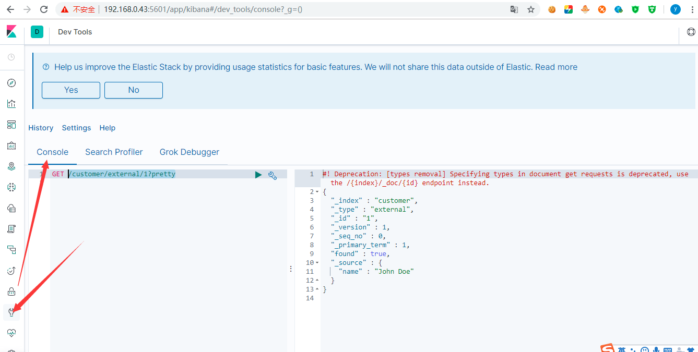  
下面我们使用它来向es的customer索引中添加相应的文档，添加请求uri与参数后，点击右边的三角去执行，
如下：  
   
Elasticsearch并不要求你创建一个索引后才能向里面放入文档。如果es事先不存在的话，Elasticsearch会自动创建"customer"索引。    

添加成功，然后使用  GET /customer/external/1?pretty 获取customer索引中添加的文档，如下：  
  
也可以在终端中直接访问es，看一下获取的文档信息是不是跟kibana中获取的文档信息一样，如下：  
```
D:\GitHub>curl -X GET http://192.168.0.43:9200/customer/external/1?pretty
{
  "_index" : "customer",
  "_type" : "external",
  "_id" : "1",
  "_version" : 2,
  "_seq_no" : 1,
  "_primary_term" : 1,
  "found" : true,
  "_source" : {
    "name" : "tangyifei",
    "age" : "23"
  }
}

```
发现一样，使用kibana可视化界面操作es的确很方便。  

### 删除索引
DELETE /customer?pretty  
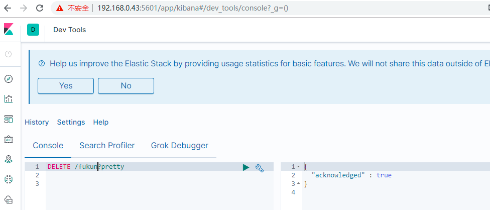  
表示删除成功，

通过以上测试的api可以发现有以下的规律：  
<REST Verb> /<Index>/<Type>/<ID>   
<REST Verb>是rest请求的类型，<Index>是索引名，<Type>是文档类型，<ID>是文档ID。   

## 修改你的数据
Elasticsearch提供了数据操纵和搜索的能力，几乎是实时的。从你index/update/delete数据到它出现在你的搜索结果里， 一般会有一秒的延迟（刷新间隔）。
这个与其他平台像SQL数据库是一个重要的区别。     

### 创建与替换文档
其实我在上面的操作中，在索引customer中执行了两次添加文档的操作且id都相同，一次只添加姓名为John Doe的文档信息，另一次添加姓名为tangyifei，年龄为23的
文档信息，但是发现后一个文档信息会覆盖前一个文档信息，就是说Elasticsearch将会把已经存在的ID为1的文档替换为新文档。  
如果我们使用一个不同的ID，一个新文档将被建立，ID为1的文档将不受影响。  
创建文档时，ID部分是可选的。如果不指定，Elasticsearch将会生成一个随机的ID，这个ID在API的返回结果里可以看到，不指定id时，使用POST方式创建文档
指定id时，使用PUT方式，如下：  
```
POST /customer/external?pretty
{
  "name": "limingcheng"
}
```
  

### 更新文档
注意实际上Elasticsearch并不在内部更新文档，不论何时你更新一个文档时，Elasticsearch是将旧文档删除，然后创建一个更新后的新文档。    
下面的例子展示了将ID为2的文档更新name字段，并且新增age字段： 
```
POST /customer/external/2/_update
{
  "doc": { "name": "liuyifei", "age": 33 }
} 
```
然后使用 GET /customer/external/2 返回如下的信息：  
```
{
  "_index" : "customer",
  "_type" : "external",
  "_id" : "2",
  "_version" : 2,
  "_seq_no" : 4,
  "_primary_term" : 1,
  "found" : true,
  "_source" : {
    "name" : "liuyifei",
    "age" : 33
  }
}
```
说明修改id为2的文档成功。  
还可以使用一些简单的脚本，下面我们把liuyifei的年龄加5：  
```
POST /customer/external/2/_update?pretty
{
  "script" : "ctx._source.age += 5"
}
```
然后使用 GET /customer/external/2 返回如下的信息：  
```
{
  "_index" : "customer",
  "_type" : "external",
  "_id" : "2",
  "_version" : 3,
  "_seq_no" : 5,
  "_primary_term" : 1,
  "found" : true,
  "_source" : {
    "name" : "liuyifei",
    "age" : 38
  }
}
```
年龄已经加上了5，变成了38岁。  
在上面这个例子里，ctx._source 引用的是当前将要被更新的文档。    

### 删除文档
删除一个文档是相当简单的：  
DELETE /customer/external/2?pretty    
返回结果：  
```
{
  "_index" : "customer",
  "_type" : "external",
  "_id" : "2",
  "_version" : 4,
  "result" : "deleted",
  "_shards" : {
    "total" : 2,
    "successful" : 1,
    "failed" : 0
  },
  "_seq_no" : 6,
  "_primary_term" : 1
}
```
其他的删除api请进入[Delete By Query API](https://www.elastic.co/guide/en/elasticsearch/reference/7.2/docs-delete-by-query.html)进行查看，
这里介绍了根据特定条件删除所有的文档。值得注意的是通过Delete By Query API删除所有的索引比删除所有文档要困难的多。  

### 批处理
除了上面介绍的对单一文档进行操作外，Elasticsearch也提供了批量处理的能力，通过使用_bulk API。这个功能是很重要的，它提供了不同的机制来做多个操作，减少了与服务器直接来回传递数据的次数。  
```
POST /customer/external/_bulk?pretty
{"index":{"_id":"3"}}
{"name": "John Doe" }
{"index":{"_id":"4"}}
{"name": "Jane Doe" }
```
返回信息：  
```
{
  "took" : 69,
  "errors" : false,
  "items" : [
    {
      "index" : {
        "_index" : "customer",
        "_type" : "external",
        "_id" : "3",
        "_version" : 1,
        "result" : "created",
        "_shards" : {
          "total" : 2,
          "successful" : 1,
          "failed" : 0
        },
        "_seq_no" : 7,
        "_primary_term" : 1,
        "status" : 201
      }
    },
    {
      "index" : {
        "_index" : "customer",
        "_type" : "external",
        "_id" : "4",
        "_version" : 1,
        "result" : "created",
        "_shards" : {
          "total" : 2,
          "successful" : 1,
          "failed" : 0
        },
        "_seq_no" : 8,
        "_primary_term" : 1,
        "status" : 201
      }
    }
  ]
}
```
```
POST /customer/external/_bulk?pretty
{"update":{"_id":"3"}}
{"doc": { "name": "John Doe becomes Jane Doe" } }
{"delete":{"_id":"4"}}
```
返回信息：  
```
{
  "took" : 63,
  "errors" : false,
  "items" : [
    {
      "update" : {
        "_index" : "customer",
        "_type" : "external",
        "_id" : "3",
        "_version" : 2,
        "result" : "updated",
        "_shards" : {
          "total" : 2,
          "successful" : 1,
          "failed" : 0
        },
        "_seq_no" : 9,
        "_primary_term" : 1,
        "status" : 200
      }
    },
    {
      "delete" : {
        "_index" : "customer",
        "_type" : "external",
        "_id" : "4",
        "_version" : 2,
        "result" : "deleted",
        "_shards" : {
          "total" : 2,
          "successful" : 1,
          "failed" : 0
        },
        "_seq_no" : 10,
        "_primary_term" : 1,
        "status" : 200
      }
    }
  ]
}
```
bulk API会按照顺序依次执行相关操作，如果其中某个操作发生错误，剩下的操作也会继续执行。当bulk API返回时它会提供每个操作的状态（顺序与你发送时的顺序一样），这样你就可以检查每个操作是否成功。  

# 使用 JAVA API 操作es

## RestHighLevelClient
针对 ES 7.X 或者以上的版本，[es官网的Transport Client](https://www.elastic.co/guide/en/elasticsearch/client/java-api/current/transport-client.html#transport-client)会有下面的一句话，如下：  

Deprecated in 7.0.0.  
The TransportClient is deprecated in favour of the Java High Level REST Client   
and will be removed in Elasticsearch 8.0. The migration guide describes all the   
steps needed to migrate.  

上面就是说在ES7.X相关的版本中，TransportClient里面有很多API都过时了，请使用Java高级别REST客户端操作es。  
但是内部仍然是基于低级客户端，它提供了更多的API，接受请求对象作为参数并返回响应对象。  
由客户端自己处理编码和解码。  
每个API都可以同步或异步调用。 同步方法返回一个响应对象，而异步方法的名称以async后缀结尾，需要一个监听器参数，一旦收到响应或错误，就会被通知（由低级客户端管理的线程池）。    
高级客户端依赖于Elasticsearch core项目。 它接受与TransportClient相同的请求参数并返回相同的响应对象。  
高级客户端需要Java 1.8并依赖于Elasticsearch core项目。**`客户端版本需要与Elasticsearch版本相同`**。它与TransportClient请求的参数和返回响应对象相同。  
如果您需要将应用程序从TransportClient迁移到新的REST客户端，请参阅[迁移指南](https://www.elastic.co/guide/en/elasticsearch/client/java-rest/current/java-rest-high-level-migration.html)。  
要能够与Elasticsearch进行通信，主版本号需要一致，次版本号不必相同，因为它是向前兼容的。次版本号小于等于elasticsearch的都可以。这意味着它支持与更高版本的Elasticsearch进行通信。  
6.0客户端能够与任何6.x Elasticsearch节点通信，而6.1客户端肯定能够与6.1,6.2和任何后来的6.x版本进行通信，但与旧版本的Elasticsearch节点通信时可能会存在不兼容的问题，例如6.1和6.0之间，可能6.1客户端支持elasticsearch 6.0还没出来的API。  

RestHighLevelClient 是操作Elasticsearch集群的高级客户端API，RestHighLevelClient实例需要低级客户端构建器来构建，如 EsConfig 类中的代码：  

```
@Bean("client")
    public RestHighLevelClient getTransportClient() {
        RestHighLevelClient client = new RestHighLevelClient(
                RestClient.builder(
                        new HttpHost(host, port, http)
                        //这里如果要用client去访问其他节点，就添加进去
                        //new HttpHost("localhost", 9200, http)
                )
        );
        return client;
    }
```
高级客户端将在内部创建低级客户端，用来执行基于提供的构建器的请求，并管理其生命周期。  
当不再需要时，需要关闭高级客户端实例，以便它所使用的所有资源以及底层的http客户端实例及其线程得到正确释放。可以通过close方法来完成，该方法将关闭内部的RestClient实例。  
client.close();  

## 支持的 API
相关的 API 操作请参考 EsUtil 类中的代码。  

在查询操作时，如果在聚合、排序时报如下的错误： 

``` 
Fielddata is disabled on text fields by default. 
Set fielddata=true on [your_field_name] in order to load 
fielddata in memory by uninverting the inverted index. 
Note that this can however use significant memory.
```
这个错误表示针对文本字段，fielddata 默认是禁用的，在进行聚合、排序等操作时，会使用 fielddata 这种数据结构，但是 fielddata 非常耗内存，一般不建议开启它。  
具体请看[fielddata](https://www.elastic.co/guide/en/elasticsearch/reference/current/fielddata.html#before-enabling-fielddata)，里面有相关的解决办法，
我的解决办法就是开启fielddata（我这里主要针对user_status字段进行降序排序），如下：   
``` 
PUT fukun_order/_mapping
{
  "properties": {
    "user_status":{
      "type":"text",
      "fielddata": true,
      "fields": {
        "keyword":{
          "type":"keyword"
        }
      }
    }
  }
}
```
然后执行查询，查询地址包含南的所有文档，并且按照user_status进行降序排序。    
我这里主要针对fukun_order数据库中的t_user表中的数据同步到es，
t_user表的记录如下： 
  
当这个表中的记录有任何变化都会同步到es，具体请查看该项目的代码实现。  
然后通过 kibana 查看数据库同步到es中的数据，如下：  
```
GET /fukun_order/_search
{
 "query": {
   "match_all": {
   }
 }
}
```
部分返回结果：  
```
      {
        "_index" : "fukun_order",
        "_type" : "_doc",
        "_id" : "111",
        "_score" : 1.0,
        "_source" : {
          "user_status" : "2",
          "address" : "南京",
          "create_time" : "2019-07-25 11:02:36",
          "phone" : "13167695369",
          "modify_time" : "2019-07-25 11:07:36",
          "name" : "张三",
          "id" : "111",
          "email" : "13167695369@163.com"
        }
      },
      {
        "_index" : "fukun_order",
        "_type" : "_doc",
        "_id" : "222",
        "_score" : 1.0,
        "_source" : {
          "user_status" : "3",
          "address" : "海南",
          "create_time" : "2019-07-25 12:02:36",
          "phone" : "15062230055",
          "modify_time" : "2019-07-25 12:07:36",
          "name" : "李四",
          "id" : "222",
          "email" : "15062230055@163.com"
        }
      },
      {
        "_index" : "fukun_order",
        "_type" : "_doc",
        "_id" : "333",
        "_score" : 1.0,
        "_source" : {
          "user_status" : "4",
          "address" : "南宁",
          "create_time" : "2019-07-25 13:02:36",
          "phone" : "13256897458",
          "modify_time" : "2019-07-25 13:07:36",
          "name" : "王五",
          "id" : "333",
          "email" : "13256897458@163.com"
        }
      }
```
下面我们通过swagger进行以上的复合条件查询，如下：  
  
查询参数：  
```
{
  "index": "fukun_order",
  "page": 0,
  "pageSize": 10,
 "queryMap": {
   "address":"南"
   },
  "sort": "user_status"
}
```
查询结果如下：  
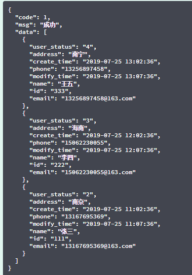   
通过查询结果可以看出是按照user_status进行降序排列，并且查询出了address包含南的所有文档。    

更多的ES相关的操作结合java API的演示请参考当前项目下面的baseoperate目录的markdown文件说明。   

运行该项目下面的单元测试进行es的相关操作，通过es的单元测试你会发现我们可以在java API中通过
XContentBuilder构造出json格式的操作参数，然后通过Request对象构造出完整的url，调用es相关的
restful API 执行相关的操作，这就如同使用kibana一样可以方便的通过es 提供的api并携带json格式的参数进行相关的操作，
比如如下的格式：  
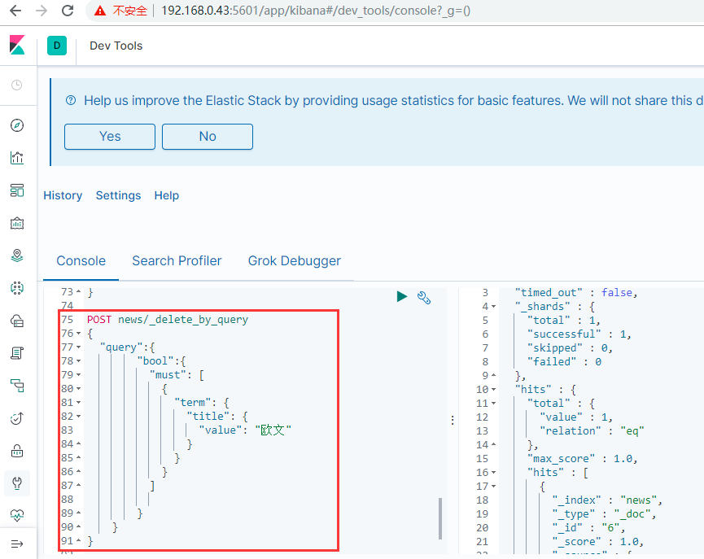    
可以通过java代码实现(详细代码请查看单元测试类中的deleteByQueryWithRestClient方法)，如下：  
```
 XContentBuilder builder;
        builder = JsonXContent.contentBuilder()
                .startObject()
                  .startObject("query")
                     .startObject("bool")
                            .startArray("must")
                              .startObject()
                                .startObject("term")
                                    .startObject("tag")
                                    .field("value", "体育")
                                    .endObject()
                                .endObject()
                              .endObject()
                            .endArray()
                     .endObject()
                  .endObject()
                .endObject();
```
**`注意：无论对于具体的索引，还是模糊的索引，都是先根据索引名称得到 Shard 列表，再将多个 Shard 的 Query 结果 Merge 到一起返回。`**  

其他的api相关的操作请自行进入[文档操作API](https://www.elastic.co/guide/en/elasticsearch/reference/7.2/docs.html)去学习，进入到该API界面以后，右边的Elasticsearch Reference: 选择7.2的，
其他的这里不做赘述了。  

es相关的中文文档，进入[ES官网](https://www.elastic.co/guide/index.html)往下拉，找到Docs in Your Native Tongue这个标题栏，点击[简体中文](https://www.elastic.co/guide/cn/index.html)即可。  
[es权威指南中文版](https://es.xiaoleilu.com/)
[JAVA API](https://www.elastic.co/guide/en/elasticsearch/client/java-api/current/index.html)


