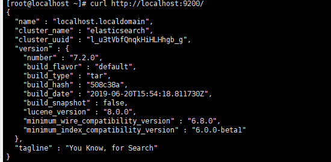

# ElasticSearch 介绍
全文搜索属于最常见的需求，开源的 Elasticsearch （以下简称 Elastic）是目前全文搜索引擎的首选。  
它可以快速地储存、搜索和分析海量数据。维基百科、Stack Overflow、Github 都采用它。  
ElasticSearch 的底层是开源库 Lucene。但是，你没法直接用 Lucene，必须自己写代码去调用它的接口。Elastic 是 Lucene 的封装，提供了 REST API 的操作接口，开箱即用。     

# 安装 ElasticSearch 
ElasticSearch 需要 Java 8 环境，所以安装 ElasticSearch 之前需要安装java环境。  
进入 [ElasticSearch 中文官网](https://www.elastic.co/cn/products/elasticsearch) 下载对应版本的安装包。  
  
最新的es到2019年6月26日已经更新到了7.2.0版本，如下所示：  
  

进入到 es 的下载页面，该页面提供了详细的安装步骤，如下：  
    

下面以在 linux 系统中安装 es 为例进行说明。  
使用wget命令进行下载 es，如下：  

```
wget https://artifacts.elastic.co/downloads/elasticsearch/elasticsearch-7.2.0-linux-x86_64.tar.gz  
```
  

这个下载要等一段时间，就看自己所处的网络情况了。  
下载成功，如下：  
  

然后使用 tar -zxvf elasticsearch-7.2.0-linux-x86_64.tar.gz 进行解压。  

解压成功，使用 cd elasticsearch-7.2.0 进入解压后的目录，如下：  
   

进入 bin 目录，使用 ./elasticsearch -d -p es.pid 运行es，-d 表示以守护进程启动，-p 表示指向进程id的文件，如下：  
  

发现报错了，elasticsearch是不允许使用root用户启动的，解决办法如下：  
1、使用 cd /home/tang/ 切换到es相关的目录，将 elasticsearch-7.2.0 重命名为 elasticsearch。  
2、使用 groupadd es 增加用户组，名为es。  
3、使用 useradd es -g es -p elasticsearch 创建一个用户es并加入es这个用户组中。  
4、使用 chown -R es:es  elasticsearch 更改 elasticsearch 文件夹及内部文件的所属用户及组为 es:es。  
5、使用 su es 切换到es用户再次使用 ./elasticsearch -d -p es.pid 启动，并进入 logs 目录，查看 es 相关的日志。  

如果启动的过程中，没有出现任何错误，这时 elasticsearch 就会在默认的9200端口运行，
这时，打开另一个命令行窗口，请求该端口，使用 curl http://localhost:9200/ 会得到说明信息，如果出现如下的
响应，说明启动成功，如下：  
   

上面代码中，请求9200端口，Elastic 返回一个 JSON 对象，包含当前节点、集群、版本等信息。  
按下 Ctrl + C，Elastic 就会停止运行。  
默认情况下，Elastic 只允许本机访问，如果需要远程访问，可以修改 Elastic 安装目录的config/elasticsearch.yml文件，去掉network.host的注释，将它的值改成0.0.0.0，然后重新启动 Elastic。  
```
network.host: 0.0.0.0
```
上面代码中，设成0.0.0.0让任何人都可以访问。线上服务不要这样设置，要设成具体的 IP。  

重启ES后，如果报下面的错误，需要切换到root用户修改 /etc/sysctl.conf 文件，在该文件的最后一行添加
vm.max_map_count=262144 保存后，执行：sysctl -p，即可永久修改。  
   

如果报下面的错误，如下：  

```
the default discovery settings are unsuitable for production use; at least one of [discovery.seed_hosts, discovery.seed_providers, cluster.initial_master_nodes] must be configured
```
解决办法：  
因为不是集群，所以需要修改 elasticsearch.yml 文件中的 cluster.initial_master_nodes 如下：  
```
cluster.initial_master_nodes: ["node-1"] 
```
在 elasticsearch.yml 最后加上这两句，要不然，外面浏览器就访问不了。  
```
http.cors.enabled: true
http.cors.allow-origin: "*"
```
再次重启ES，启动成功。   
在浏览器中输入 http://192.168.0.43:9200/ 看一看外面浏览器能否成功访问，如下：  
   

出现如上的结果说明外面浏览器成功访问了43这台机器中的的es。 
 
关闭 es，找到 es.pid 文件，我使用 ./elasticsearch -d -p es.pid 启动 es 后，es.pid 生成路径在解压后的 elasticsearch
目录下，如下：  
  

使用 pkill -F es.pid 关闭es，发现关闭 es 后，es.pid 就消失了，如下：  
  

上面的步骤在[Install Elasticsearch from archive on Linux or MacOS](https://www.elastic.co/guide/en/elasticsearch/reference/current/targz.html)中有说明。  

# 安装 Kibana
进入[Download Kibana](https://www.elastic.co/cn/downloads/kibana) 页面，下载对应版本的kibana，我这里下载7.2.0版本。  
该页面有对应的安装步骤，如下：  
   
 
我还是在 /home/tang/ 目录下下载kibana相关的包，使用 
 
```
 wget https://artifacts.elastic.co/downloads/kibana/kibana-7.2.0-linux-x86_64.tar.gz
```
执行以上命令，一定要切换到root用户去执行，如果之前安装es的时候，使用创建的es用户去执行上面命令会报443错误。  
这个过程很慢，就看你所处网络的速度了。  


